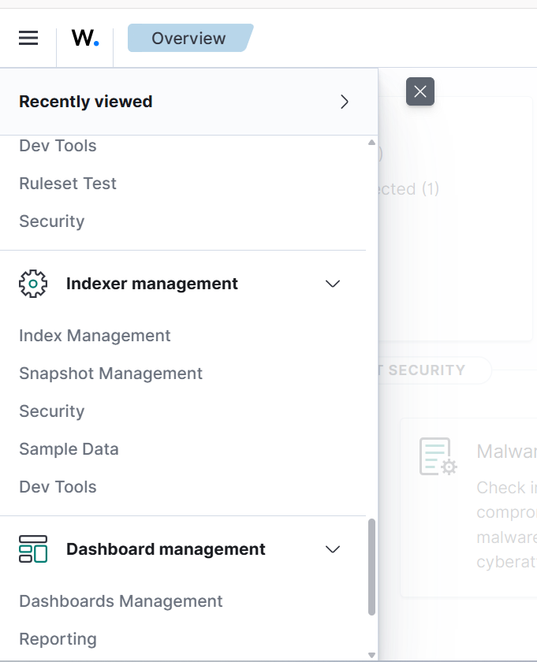
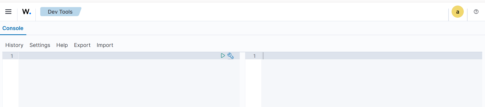
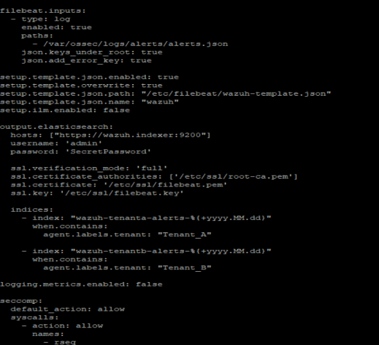
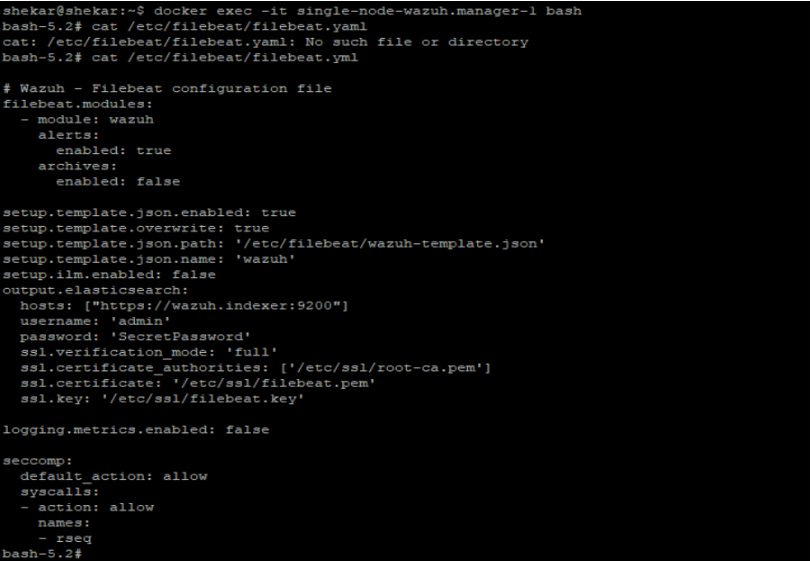
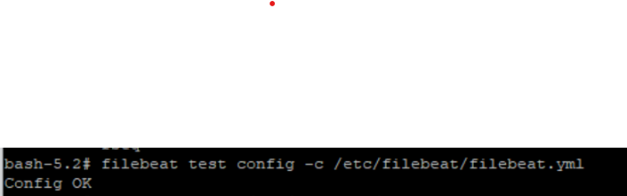

# Index Template & Filebeat Routing

## Overview

This section covers two tasks:

1. Creating the per-tenant index template in OpenSearch via Dev Tools
2. Configuring Filebeat inside the Wazuh Manager container to route alerts into the correct tenant index

---

## 2.1 Part 1 — Create the Index Template in OpenSearch

### Access Dev Tools

Login to the Wazuh Dashboard → navigate to **Indexer Management → Dev Tools**





### Run the PUT command

Run this **once** in Dev Tools before starting Filebeat. Replace `<tenant-name>` with your actual tenant name in both the template name and `index_patterns`.

```json
PUT _index_template/<tenant-name>-alerts-template
{
  "index_patterns": ["<tenant-name>-alerts*"],
  "priority": 20,
  "template": {
    "settings": {
      "number_of_shards": 3,
      "number_of_replicas": 1,
      "index.refresh_interval": "5s"
    },
    "mappings": {
      "dynamic_templates": [
        {
          "string_as_keyword": {
            "match_mapping_type": "string",
            "mapping": {
              "type": "keyword"
            }
          }
        }
      ],
      "date_detection": false,
      "properties": {
        "@timestamp":   { "type": "date" },
        "@version":     { "type": "text" },
        "GeoLocation": {
          "properties": {
            "area_code":       { "type": "long" },
            "city_name":       { "type": "keyword" },
            "continent_code":  { "type": "text" },
            "coordinates":     { "type": "double" },
            "country_code2":   { "type": "text" },
            "country_code3":   { "type": "text" },
            "country_name":    { "type": "keyword" },
            "dma_code":        { "type": "long" },
            "ip":              { "type": "keyword" },
            "latitude":        { "type": "double" },
            "location":        { "type": "geo_point" },
            "longitude":       { "type": "double" },
            "postal_code":     { "type": "keyword" },
            "real_region_name":{ "type": "keyword" },
            "region_name":     { "type": "keyword" },
            "timezone":        { "type": "text" }
          }
        },
        "agent": {
          "properties": {
            "id":   { "type": "keyword" },
            "ip":   { "type": "keyword" },
            "labels": {
              "properties": {
                "tenant": { "type": "keyword" }
              }
            },
            "name": { "type": "keyword" }
          }
        },
        "cluster": {
          "properties": {
            "name": { "type": "keyword" },
            "node": { "type": "keyword" }
          }
        },
        "command":   { "type": "keyword" },
        "full_log":  { "type": "text" },
        "host": {
          "properties": {
            "name": { "type": "keyword" }
          }
        },
        "id":        { "type": "keyword" },
        "input": {
          "properties": {
            "type": { "type": "keyword" }
          }
        },
        "location":  { "type": "keyword" },
        "manager": {
          "properties": {
            "name": { "type": "keyword" }
          }
        },
        "message":          { "type": "text" },
        "offset":           { "type": "keyword" },
        "previous_log":     { "type": "text" },
        "previous_output":  { "type": "keyword" },
        "program_name":     { "type": "keyword" },
        "title":            { "type": "keyword" },
        "type":             { "type": "text" },
        "timestamp": {
          "type":   "date",
          "format": "date_optional_time||epoch_millis"
        },
        "predecoder": {
          "properties": {
            "hostname":     { "type": "keyword" },
            "program_name": { "type": "keyword" },
            "timestamp":    { "type": "keyword" }
          }
        },
        "decoder": {
          "properties": {
            "accumulate":  { "type": "long" },
            "fts":         { "type": "long" },
            "ftscomment":  { "type": "keyword" },
            "name":        { "type": "keyword" },
            "parent":      { "type": "keyword" }
          }
        },
        "rule": {
          "properties": {
            "cis":              { "type": "keyword" },
            "cis_csc_v7":       { "type": "keyword" },
            "cis_csc_v8":       { "type": "keyword" },
            "cve":              { "type": "keyword" },
            "description":      { "type": "keyword" },
            "firedtimes":       { "type": "long" },
            "frequency":        { "type": "long" },
            "gdpr":             { "type": "keyword" },
            "gpg13":            { "type": "keyword" },
            "groups":           { "type": "keyword" },
            "hipaa":            { "type": "keyword" },
            "id":               { "type": "keyword" },
            "info":             { "type": "keyword" },
            "iso_27001-2013":   { "type": "keyword" },
            "level":            { "type": "long" },
            "mail":             { "type": "boolean" },
            "mitre": {
              "properties": {
                "id":        { "type": "keyword" },
                "tactic":    { "type": "keyword" },
                "technique": { "type": "keyword" }
              }
            },
            "mitre_mitigations": { "type": "keyword" },
            "mitre_tactics":     { "type": "keyword" },
            "mitre_techniques":  { "type": "keyword" },
            "nist_800-53":       { "type": "keyword" },
            "nist_800_53":       { "type": "keyword" },
            "nist_sp_800-53":    { "type": "keyword" },
            "pci_dss":           { "type": "keyword" },
            "soc_2":             { "type": "keyword" },
            "tsc":               { "type": "keyword" }
          }
        },
        "data": {
          "properties": {
            "action":       { "type": "keyword" },
            "command":      { "type": "keyword" },
            "data":         { "type": "keyword" },
            "dstip":        { "type": "keyword" },
            "dstport":      { "type": "keyword" },
            "dstuser":      { "type": "keyword" },
            "euid":         { "type": "keyword" },
            "extra_data":   { "type": "keyword" },
            "file":         { "type": "keyword" },
            "id":           { "type": "keyword" },
            "integration":  { "type": "keyword" },
            "logname":      { "type": "keyword" },
            "protocol":     { "type": "keyword" },
            "pwd":          { "type": "keyword" },
            "scan_id":      { "type": "keyword" },
            "srcip":        { "type": "keyword" },
            "srcport":      { "type": "keyword" },
            "srcuser":      { "type": "keyword" },
            "system_name":  { "type": "keyword" },
            "timestamp":    { "type": "date" },
            "title":        { "type": "keyword" },
            "tty":          { "type": "keyword" },
            "type":         { "type": "keyword" },
            "uid":          { "type": "keyword" },
            "url":          { "type": "keyword" },
            "YARA": {
              "properties": {
                "api_customer":    { "type": "keyword" },
                "log_type":        { "type": "keyword" },
                "reference":       { "type": "keyword" },
                "rule_author":     { "type": "keyword" },
                "rule_description":{ "type": "keyword" },
                "rule_name":       { "type": "keyword" },
                "scanned_file":    { "type": "keyword" },
                "tags":            { "type": "keyword" }
              }
            },
            "audit": {
              "properties": {
                "acct":  { "type": "keyword" },
                "arch":  { "type": "keyword" },
                "auid":  { "type": "keyword" },
                "command":{ "type": "keyword" },
                "cwd":   { "type": "keyword" },
                "dev":   { "type": "keyword" },
                "egid":  { "type": "keyword" },
                "enforcing": { "type": "keyword" },
                "euid":  { "type": "keyword" },
                "exe":   { "type": "keyword" },
                "execve": {
                  "properties": {
                    "a0": { "type": "keyword" },
                    "a1": { "type": "keyword" },
                    "a2": { "type": "keyword" },
                    "a3": { "type": "keyword" }
                  }
                },
                "exit":  { "type": "keyword" },
                "file": {
                  "properties": {
                    "inode": { "type": "keyword" },
                    "mode":  { "type": "keyword" },
                    "name":  { "type": "keyword" }
                  }
                },
                "directory": {
                  "properties": {
                    "inode": { "type": "keyword" },
                    "mode":  { "type": "keyword" },
                    "name":  { "type": "keyword" }
                  }
                },
                "fsgid":   { "type": "keyword" },
                "fsuid":   { "type": "keyword" },
                "gid":     { "type": "keyword" },
                "id":      { "type": "keyword" },
                "key":     { "type": "keyword" },
                "list":    { "type": "keyword" },
                "old-auid":{ "type": "keyword" },
                "old-ses": { "type": "keyword" },
                "old_enforcing": { "type": "keyword" },
                "old_prom":{ "type": "keyword" },
                "op":      { "type": "keyword" },
                "pid":     { "type": "keyword" },
                "ppid":    { "type": "keyword" },
                "prom":    { "type": "keyword" },
                "res":     { "type": "keyword" },
                "session": { "type": "keyword" },
                "sgid":    { "type": "keyword" },
                "srcip":   { "type": "keyword" },
                "subj":    { "type": "keyword" },
                "success": { "type": "keyword" },
                "suid":    { "type": "keyword" },
                "syscall": { "type": "keyword" },
                "tty":     { "type": "keyword" },
                "type":    { "type": "keyword" },
                "uid":     { "type": "keyword" }
              }
            },
            "aws": {
              "properties": {
                "accountId":      { "type": "keyword" },
                "bytes":          { "type": "long" },
                "createdAt":      { "type": "date" },
                "dstaddr":        { "type": "ip" },
                "end":            { "type": "date" },
                "region":         { "type": "keyword" },
                "source":         { "type": "keyword" },
                "source_ip_address": { "type": "ip" },
                "srcaddr":        { "type": "ip" },
                "start":          { "type": "date" },
                "updatedAt":      { "type": "date" },
                "log_info": {
                  "properties": {
                    "s3bucket": { "type": "keyword" }
                  }
                },
                "service": {
                  "properties": {
                    "count":          { "type": "long" },
                    "eventFirstSeen": { "type": "date" },
                    "eventLastSeen":  { "type": "date" },
                    "action": {
                      "properties": {
                        "networkConnectionAction": {
                          "properties": {
                            "remoteIpDetails": {
                              "properties": {
                                "geoLocation":  { "type": "geo_point" },
                                "ipAddressV4":  { "type": "ip" }
                              }
                            }
                          }
                        }
                      }
                    }
                  }
                },
                "resource": {
                  "properties": {
                    "instanceDetails": {
                      "properties": {
                        "launchTime": { "type": "date" },
                        "networkInterfaces": {
                          "properties": {
                            "privateIpAddress": { "type": "ip" },
                            "publicIp":         { "type": "ip" }
                          }
                        }
                      }
                    }
                  }
                }
              }
            },
            "vulnerability": {
              "properties": {
                "assigner":      { "type": "keyword" },
                "cve":           { "type": "keyword" },
                "cve_version":   { "type": "keyword" },
                "cwe_reference": { "type": "keyword" },
                "rationale":     { "type": "keyword" },
                "reference":     { "type": "keyword" },
                "severity":      { "type": "keyword" },
                "status":        { "type": "keyword" },
                "title":         { "type": "keyword" },
                "published":     { "type": "date" },
                "updated":       { "type": "date" },
                "cvss": {
                  "properties": {
                    "cvss2": {
                      "properties": {
                        "base_score":          { "type": "keyword" },
                        "exploitability_score":{ "type": "keyword" },
                        "impact_score":        { "type": "keyword" },
                        "vector": {
                          "properties": {
                            "access_complexity":     { "type": "keyword" },
                            "attack_vector":         { "type": "keyword" },
                            "authentication":        { "type": "keyword" },
                            "availability":          { "type": "keyword" },
                            "confidentiality_impact":{ "type": "keyword" },
                            "integrity_impact":      { "type": "keyword" },
                            "privileges_required":   { "type": "keyword" },
                            "scope":                 { "type": "keyword" },
                            "user_interaction":      { "type": "keyword" }
                          }
                        }
                      }
                    },
                    "cvss3": {
                      "properties": {
                        "base_score":          { "type": "keyword" },
                        "exploitability_score":{ "type": "keyword" },
                        "impact_score":        { "type": "keyword" },
                        "vector": {
                          "properties": {
                            "access_complexity":     { "type": "keyword" },
                            "attack_vector":         { "type": "keyword" },
                            "authentication":        { "type": "keyword" },
                            "availability":          { "type": "keyword" },
                            "confidentiality_impact":{ "type": "keyword" },
                            "integrity_impact":      { "type": "keyword" },
                            "privileges_required":   { "type": "keyword" },
                            "scope":                 { "type": "keyword" },
                            "user_interaction":      { "type": "keyword" }
                          }
                        }
                      }
                    }
                  }
                },
                "package": {
                  "properties": {
                    "architecture":  { "type": "keyword" },
                    "condition":     { "type": "keyword" },
                    "generated_cpe": { "type": "keyword" },
                    "name":          { "type": "keyword" },
                    "source":        { "type": "keyword" },
                    "version":       { "type": "keyword" }
                  }
                },
                "scanner": {
                  "properties": {
                    "reference": { "type": "keyword" }
                  }
                }
              }
            },
            "sca": {
              "properties": {
                "description": { "type": "keyword" },
                "failed":      { "type": "integer" },
                "file":        { "type": "keyword" },
                "invalid":     { "type": "keyword" },
                "name":        { "type": "keyword" },
                "passed":      { "type": "integer" },
                "policy":      { "type": "keyword" },
                "policy_id":   { "type": "keyword" },
                "scan_id":     { "type": "keyword" },
                "score":       { "type": "long" },
                "total_checks":{ "type": "keyword" },
                "type":        { "type": "keyword" },
                "check": {
                  "properties": {
                    "command":        { "type": "keyword" },
                    "description":    { "type": "keyword" },
                    "directory":      { "type": "keyword" },
                    "file":           { "type": "keyword" },
                    "id":             { "type": "keyword" },
                    "previous_result":{ "type": "keyword" },
                    "process":        { "type": "keyword" },
                    "rationale":      { "type": "keyword" },
                    "reason":         { "type": "keyword" },
                    "references":     { "type": "keyword" },
                    "registry":       { "type": "keyword" },
                    "remediation":    { "type": "keyword" },
                    "result":         { "type": "keyword" },
                    "title":          { "type": "keyword" },
                    "compliance": {
                      "properties": {
                        "cis":                { "type": "keyword" },
                        "cis_csc":            { "type": "keyword" },
                        "cis_csc_v7":         { "type": "keyword" },
                        "cis_csc_v8":         { "type": "keyword" },
                        "hipaa":              { "type": "keyword" },
                        "iso_27001-2013":     { "type": "keyword" },
                        "mitre_mitigations":  { "type": "keyword" },
                        "mitre_tactics":      { "type": "keyword" },
                        "mitre_techniques":   { "type": "keyword" },
                        "nist_800-53":        { "type": "keyword" },
                        "nist_800_53":        { "type": "keyword" },
                        "nist_sp_800-53":     { "type": "keyword" },
                        "pci_dss":            { "type": "keyword" },
                        "soc_2":              { "type": "keyword" },
                        "tsc":                { "type": "keyword" }
                      }
                    }
                  }
                }
              }
            },
            "virustotal": {
              "properties": {
                "description": { "type": "keyword" },
                "error":       { "type": "keyword" },
                "found":       { "type": "keyword" },
                "malicious":   { "type": "keyword" },
                "permalink":   { "type": "keyword" },
                "positives":   { "type": "keyword" },
                "scan_date":   { "type": "keyword" },
                "sha1":        { "type": "keyword" },
                "total":       { "type": "keyword" },
                "source": {
                  "properties": {
                    "alert_id": { "type": "keyword" },
                    "file":     { "type": "keyword" },
                    "md5":      { "type": "keyword" },
                    "sha1":     { "type": "keyword" }
                  }
                }
              }
            },
            "office365": {
              "properties": {
                "Actor": {
                  "properties": {
                    "ID": { "type": "keyword" }
                  }
                },
                "ClientIP":     { "type": "keyword" },
                "Operation":    { "type": "keyword" },
                "ResultStatus": { "type": "keyword" },
                "Subscription": { "type": "keyword" },
                "UserId":       { "type": "keyword" }
              }
            },
            "github": {
              "properties": {
                "action": { "type": "keyword" },
                "actor":  { "type": "keyword" },
                "actor_location": {
                  "properties": {
                    "country_code": { "type": "keyword" }
                  }
                },
                "org":  { "type": "keyword" },
                "repo": { "type": "keyword" }
              }
            }
          }
        },
        "syscheck": {
          "properties": {
            "diff":         { "type": "keyword" },
            "event":        { "type": "keyword" },
            "gid_after":    { "type": "keyword" },
            "gid_before":   { "type": "keyword" },
            "gname_after":  { "type": "keyword" },
            "gname_before": { "type": "keyword" },
            "hard_links":   { "type": "keyword" },
            "inode_after":  { "type": "keyword" },
            "inode_before": { "type": "keyword" },
            "md5_after":    { "type": "keyword" },
            "md5_before":   { "type": "keyword" },
            "mode":         { "type": "keyword" },
            "mtime_after":  { "type": "date", "format": "date_optional_time" },
            "mtime_before": { "type": "date", "format": "date_optional_time" },
            "path":         { "type": "keyword" },
            "perm_after":   { "type": "keyword" },
            "perm_before":  { "type": "keyword" },
            "sha1_after":   { "type": "keyword" },
            "sha1_before":  { "type": "keyword" },
            "sha256_after": { "type": "keyword" },
            "sha256_before":{ "type": "keyword" },
            "size_after":   { "type": "long" },
            "size_before":  { "type": "long" },
            "tags":         { "type": "keyword" },
            "uid_after":    { "type": "keyword" },
            "uid_before":   { "type": "keyword" },
            "uname_after":  { "type": "keyword" },
            "uname_before": { "type": "keyword" },
            "audit": {
              "properties": {
                "effective_user": {
                  "properties": {
                    "id":   { "type": "keyword" },
                    "name": { "type": "keyword" }
                  }
                },
                "group": {
                  "properties": {
                    "id":   { "type": "keyword" },
                    "name": { "type": "keyword" }
                  }
                },
                "login_user": {
                  "properties": {
                    "id":   { "type": "keyword" },
                    "name": { "type": "keyword" }
                  }
                },
                "process": {
                  "properties": {
                    "id":   { "type": "keyword" },
                    "name": { "type": "keyword" },
                    "ppid": { "type": "keyword" }
                  }
                },
                "user": {
                  "properties": {
                    "id":   { "type": "keyword" },
                    "name": { "type": "keyword" }
                  }
                }
              }
            }
          }
        }
      }
    }
  }
}
```

### Verify the template was saved

```json
GET _index_template/<tenant-name>-alerts-template
```

!!! success "Expected Output"
    Returns the full template body. If you get a 404, the PUT above failed — check Dev Tools for errors and re-run.



---

## 2.2 Part 2 — Point Filebeat at the Tenant Index

### 2.2.1 Filebeat Setup in the Wazuh Manager Container

This creates the per-tenant index routing configuration inside the Filebeat instance running in the Wazuh Manager Docker container.

#### Step 1 — Log in to the Wazuh Manager instance and enter the Filebeat container



#### Step 2 — Run the Python script below to write the Filebeat config

```bash
sudo python3 << 'EOF'
config = """\
# Wazuh - Filebeat configuration file

filebeat.inputs:
  - type: log
    enabled: true
    paths:
      - /var/ossec/logs/alerts/alerts.json
    json.keys_under_root: true
    json.add_error_key: true

setup.template.json.enabled: true
setup.template.overwrite: true
setup.template.json.path: "/etc/filebeat/wazuh-template.json"
setup.template.json.name: "wazuh"

setup.ilm.enabled: false

output.elasticsearch:
  hosts: ["https://wazuh.indexer:9200"]
  username: "admin"
  password: "SecretPassword"
  ssl.verification_mode: "full"
  ssl.certificate_authorities: ["/etc/ssl/root-ca.pem"]
  ssl.certificate: "/etc/ssl/filebeat.pem"
  ssl.key: "/etc/ssl/filebeat.key"

  indices:
    - index: "<tenant-name-1>-alerts-%{+yyyy.MM.dd}"
      when.contains:
        agent.labels.tenant: "<tenant-name-1>"
    - index: "<tenant-name-2>-alerts-%{+yyyy.MM.dd}"
      when.contains:
        agent.labels.tenant: "<tenant-name-2>"

logging.metrics.enabled: false

seccomp:
  default_action: allow
  syscalls:
    - action: allow
      names:
        - rseq
"""

with open('/var/lib/docker/volumes/single-node_filebeat_etc/_data/filebeat.yml', 'w') as f:
    f.write(config)

print('Done')
EOF
```

!!! note "Note"
    Replace `<tenant-name-1>` and `<tenant-name-2>` with your actual tenant names. The `agent.labels.tenant` value must match exactly what is set in the agent label configuration.

#### Step 3 — Verify the config was written correctly

```bash
cat /var/lib/docker/volumes/single-node_filebeat_etc/_data/filebeat.yml
```



#### Step 4 — Restart Filebeat 

```bash
docker exec single-node-wazuh.manager-1 \
s6-svc -r /run/s6/services/filebeat
```