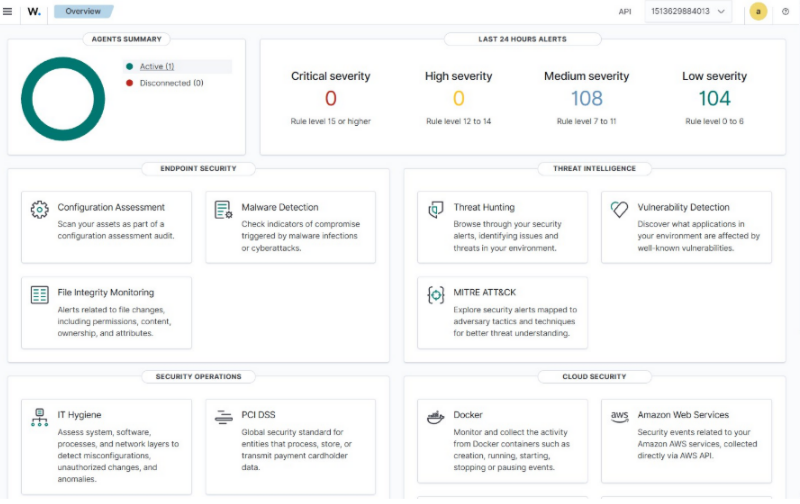
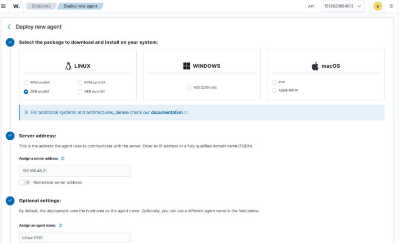
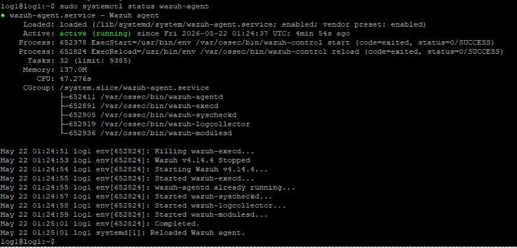
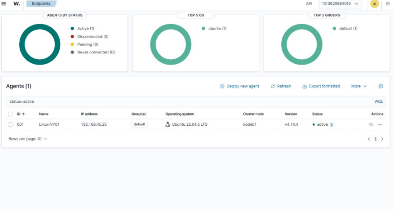

# Agent Deployment

## Overview

To set up Wazuh multi-tenant isolation you need at least two tenants (e.g. Tenant A and Tenant B), each with at least one endpoint. This section covers deploying agents to those endpoints.

---

## Prerequisites — Verify Docker Status

Go to the VM where Wazuh Docker images are installed and check that all three Docker containers are running before proceeding.

---

## 3.1 Deploying a New Wazuh Agent (Linux)

### Step 1 — Generate the deployment command from the Wazuh Dashboard

In the Wazuh Dashboard, navigate to the **New Agent** deployment form. Fill in the appropriate details. The dashboard will generate the install command for you.




### Step 2 — Run the command on the endpoint VM

SSH into the new endpoint VM and run the generated command. It will look like this:

```bash
wget https://packages.wazuh.com/4.x/apt/pool/main/w/wazuh-agent/wazuh-agent_4.14.4-1_amd64.deb \
  && sudo WAZUH_MANAGER='192.168.45.21' \
     WAZUH_AGENT_NAME='Linux-<TENANT-NAME>01' \
     dpkg -i ./wazuh-agent_4.14.4-1_amd64.deb
```



!!! note "Note"
    Replace `<TENANT-NAME>` with the actual tenant identifier for this agent (e.g. `Linux-TenantA01`).

### Step 3 — Enable and start the agent

```bash
sudo systemctl daemon-reload
sudo systemctl enable wazuh-agent
sudo systemctl start wazuh-agent
```

### Step 4 — Verify the agent is running

```bash
sudo systemctl status wazuh-agent
```



---

## 3.2 Wazuh Dashboard Verification

After starting the agent, go back to the Wazuh Dashboard and confirm the new agent appears in the agent list with status **Active**.



---

## Deploying Additional Agents (Linux)

Repeat all steps in section 3.1 for each additional endpoint. Each agent must be given a unique name and assigned to the correct tenant.

---

!!! success "Checkpoint"
    Once all agents are active in the dashboard, proceed to [Agent Configuration](../04-agent-configuration/agent_config.md) to apply FIM settings and tenant label mapping.