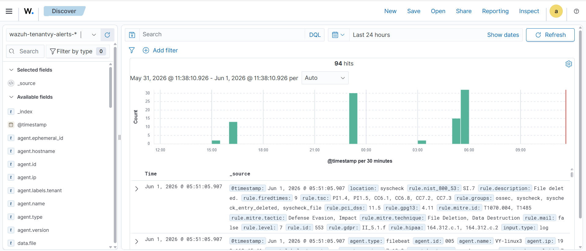

# Agent Configuration: FIM & Tenant Label Mapping

## Overview

These changes are made to `/var/ossec/etc/ossec.conf` on each agent VM. There are 5 changes in total. Apply them in order.

!!! warning "Always take a backup first"

```bash
sudo cp /var/ossec/etc/ossec.conf /var/ossec/etc/ossec.conf.bak
```

Open the file for editing:

```bash
sudo nano /var/ossec/etc/ossec.conf
```

---

## Change 1 — Add Docker Ignore Paths to rootcheck

### What to find

```xml

    ...
    yes

```

### What to add

Immediately after `<skip_nfs>yes</skip_nfs>`, before `</rootcheck>`:

```xml
    /var/lib/containerd
    /var/lib/docker/overlay2
```

### Result after change

```xml
    yes
    /var/lib/containerd
    /var/lib/docker/overlay2
  
```

### Why

Rootcheck continuously scans the filesystem for suspicious files and rootkits. Docker stores container image layers in `/var/lib/containerd` and `/var/lib/docker/overlay2`. These directories contain thousands of files that change constantly during normal container operations. Without ignoring them, rootcheck generates excessive false positive alerts and causes high CPU usage on the agent.

!!! note
    If Docker is not installed on this VM, these lines are harmless and can still be added.

### Verify

```bash
sudo grep -A5 'skip_nfs' /var/ossec/etc/ossec.conf | grep -E 'containerd|overlay2'
```

!!! success "Expected Output"

```xml
<ignore>/var/lib/containerd</ignore>
<ignore>/var/lib/docker/overlay2</ignore>
```

---

## Change 2 — Add Extra Inventory Collectors to syscollector

### What to find

```xml
<wodle name="syscollector">
    ...
    <processes>yes</processes>
</wodle>
```

### What to add

Immediately after `<processes>yes</processes>`, before `</wodle>`:

```xml
    <users>yes</users>
    <groups>yes</groups>
    <services>yes</services>
    <browser_extensions>yes</browser_extensions>
```

### Result after change

```xml
    <processes>yes</processes>
    <users>yes</users>
    <groups>yes</groups>
    <services>yes</services>
    <browser_extensions>yes</browser_extensions>

    <!-- Database synchronization settings -->
    <synchronization>
```

### Why

The default syscollector only collects hardware, OS, network, packages, ports, and processes. The additions serve the following purposes:

| Addition | Why |
|---|---|
| `users` | Detects new local user accounts created by attackers post-compromise |
| `groups` | Detects privilege escalation via unauthorized group membership changes |
| `services` | Identifies unexpected or malicious services installed on the system |
| `browser_extensions` | Useful on desktop/workstation VMs; harmless on headless servers |

### Verify

```bash
sudo grep -E 'users|groups|services|browser_extensions' /var/ossec/etc/ossec.conf
```

!!! success "Expected Output"

```xml
<users>yes</users>
<groups>yes</groups>
<services>yes</services>
<browser_extensions>yes</browser_extensions>
```

---

## Change 3 — Replace the Default syscheck Block Entirely

### What to find and remove

The entire default syscheck block:

```xml
<!-- File integrity monitoring -->
<syscheck>
  <disabled>no</disabled>
  <frequency>43200</frequency>
  <scan_on_start>yes</scan_on_start>
  <directories>/etc,/usr/bin,/usr/sbin</directories>
  <directories>/bin,/sbin,/boot</directories>
  <ignore>/etc/mtab</ignore>
  ...
</syscheck>
```

### Replace with this entire block

```xml
<!-- File integrity monitoring -->
<syscheck>
  <disabled>no</disabled>

  <!-- Scan every 6 hours -->
  <frequency>21600</frequency>
  <scan_on_start>yes</scan_on_start>

  <!-- Critical system dirs - realtime + change tracking -->
  <directories realtime="yes" report_changes="yes" check_all="yes">/etc</directories>
  <directories realtime="yes" report_changes="yes" check_all="yes">/usr/bin,/usr/sbin</directories>
  <directories realtime="yes" report_changes="yes" check_all="yes">/bin,/sbin,/boot</directories>

  <!-- User home directories -->
  <directories realtime="yes" report_changes="yes" check_all="yes">/home</directories>
  <directories realtime="yes" report_changes="yes" check_all="yes">/root</directories>

  <!-- Web and app directories -->
  <directories realtime="yes" report_changes="yes" check_all="yes">/var/www</directories>
  <directories realtime="yes" check_all="yes">/tmp</directories>
  <directories realtime="yes" check_all="yes">/var/tmp</directories>

  <!-- Ignore noisy files -->
  <ignore>/etc/mtab</ignore>
  <ignore>/etc/hosts.deny</ignore>
  <ignore>/etc/mail/statistics</ignore>
  <ignore>/etc/random-seed</ignore>
  <ignore>/etc/random.seed</ignore>
  <ignore>/etc/adjtime</ignore>
  <ignore>/etc/httpd/logs</ignore>
  <ignore>/etc/utmpx</ignore>
  <ignore>/etc/wtmpx</ignore>
  <ignore>/etc/cups/certs</ignore>
  <ignore>/etc/dumpdates</ignore>
  <ignore>/etc/svc/volatile</ignore>
  <ignore type="sregex">.log$|.swp$</ignore>

  <nodiff>/etc/ssl/private.key</nodiff>

  <skip_nfs>yes</skip_nfs>
  <skip_dev>yes</skip_dev>
  <skip_proc>yes</skip_proc>
  <skip_sys>yes</skip_sys>

  <process_priority>10</process_priority>
  <max_eps>50</max_eps>

  <synchronization>
    <enabled>yes</enabled>
    <interval>5m</interval>
    <max_eps>10</max_eps>
  </synchronization>
</syscheck>
```

### Why each part was changed or added

| What Changed | Default | Updated | Why |
|---|---|---|---|
| `frequency` | 43200 (12 hours) | 21600 (6 hours) | Fallback full scan happens twice as often |
| `realtime="yes"` | Not present | Added to all dirs | Detects changes instantly via inotify, not just at scan time |
| `report_changes="yes"` | Not present | Added to critical dirs | Shows the actual content diff of what changed inside the file |
| `check_all="yes"` | Not present | Added to all dirs | Checks MD5, SHA1, SHA256, permissions, ownership, size — default only checks a subset |
| `/home` | Not monitored | Added | Detects changes to user bash profiles, SSH authorized_keys, cron jobs |
| `/root` | Not monitored | Added | Same as above for the root account — highest priority |
| `/var/www` | Not monitored | Added | Web defacement detection |
| `/tmp` | Not monitored | Added | Common attacker staging area for malware and exploit scripts |
| `/var/tmp` | Not monitored | Added | Persistent across reboots unlike `/tmp`, frequently abused by attackers |

### Verify

```bash
sudo grep -E 'frequency|realtime|report_changes|check_all' /var/ossec/etc/ossec.conf
```

!!! success "Expected Output"

```xml
<frequency>21600</frequency>
<directories realtime="yes" report_changes="yes" check_all="yes">/etc</directories>
<directories realtime="yes" report_changes="yes" check_all="yes">/usr/bin,/usr/sbin</directories>
<directories realtime="yes" report_changes="yes" check_all="yes">/bin,/sbin,/boot</directories>
<directories realtime="yes" report_changes="yes" check_all="yes">/home</directories>
<directories realtime="yes" report_changes="yes" check_all="yes">/root</directories>
<directories realtime="yes" report_changes="yes" check_all="yes">/var/www</directories>
<directories realtime="yes" check_all="yes">/tmp</directories>
<directories realtime="yes" check_all="yes">/var/tmp</directories>
```

---

## Change 4 — Add Extra Log Sources

### What to find

Inside the second `<ossec_config>` block:

```xml
<localfile>
  <log_format>syslog</log_format>
  <location>/var/log/dpkg.log</location>
</localfile>

</ossec_config>
```

### What to add

Immediately after the `dpkg.log` block, before `</ossec_config>`:

```xml
<!-- Auth logs -->
<localfile>
  <log_format>syslog</log_format>
  <location>/var/log/auth.log</location>
</localfile>

<!-- Syslog -->
<localfile>
  <log_format>syslog</log_format>
  <location>/var/log/syslog</location>
</localfile>

<!-- Kernel messages -->
<localfile>
  <log_format>syslog</log_format>
  <location>/var/log/kern.log</location>
</localfile>
```

### Why

| Log File | Why |
|---|---|
| `/var/log/auth.log` | Records all SSH logins, sudo commands, failed authentication attempts, and PAM events. This is the most important log for detecting unauthorized access |
| `/var/log/syslog` | General system events including service starts and stops, daemon activity, and application messages |
| `/var/log/kern.log` | Kernel-level events including OOM kills, hardware errors, and driver issues. Important for detecting kernel exploits and system instability |

!!! note "Note"
    These paths are specific to **Ubuntu/Debian** systems. On RHEL/CentOS systems, use `/var/log/secure` instead of `auth.log` and `/var/log/messages` instead of `syslog`.

### Verify

```bash
sudo grep -E 'auth.log|syslog|kern.log' /var/ossec/etc/ossec.conf
```

!!! success "Expected Output"

```xml
<location>/var/log/auth.log</location>
<location>/var/log/syslog</location>
<location>/var/log/kern.log</location>
```

---

## Change 5 — Add Tenant Label *(Most Critical Change)*

### What to find

The very end of the second `<ossec_config>` block, after all localfile entries:

```xml
<localfile>
  <log_format>syslog</log_format>
  <location>/var/log/kern.log</location>
</localfile>

</ossec_config>
```

### What to add

Immediately before the closing `</ossec_config>`:

```xml
<labels>
  <label key="tenant">TENANT_NAME</label>
</labels>
```

Replace `TENANT_NAME` with the actual tenant identifier assigned to this agent:

- TenantA agents → `tenanta`
- TenantB agents → `tenantb`

### Why

This label is the foundation of the entire multi-tenant architecture. Every event generated by this agent gets stamped with the tenant field. Logstash reads this field and routes the event to the correct tenant pipeline. Without this label, Logstash cannot identify which tenant the event belongs to and the drop filter will silently discard all events from this agent — the agent will appear connected but no logs will reach OpenSearch.

### Verify

```bash
sudo grep -A2 'labels' /var/ossec/etc/ossec.conf
```

!!! success "Expected Output"

```xml
<labels>
  <label key="tenant">tenanta</label>
</labels>
```

---

## Final Step — Restart and Verify Agent

Restart the agent to apply all five changes:

```bash
sudo systemctl restart wazuh-agent
```

Verify the agent is running and connected:

```bash
sudo systemctl status wazuh-agent
```



---

!!! note "Repeat for all agents"
    Repeat all five changes for every agent VM. Each agent must have the correct `TENANT_NAME` in Change 5.

---

!!! success "Checkpoint"
    Once all agents are restarted and showing Active in the dashboard, verify that logs are appearing under the correct tenant indices (TenantA, TenantB, etc.) in OpenSearch.

    We are good with agent setup, tenant configuration, and indexer mapping per tenant.