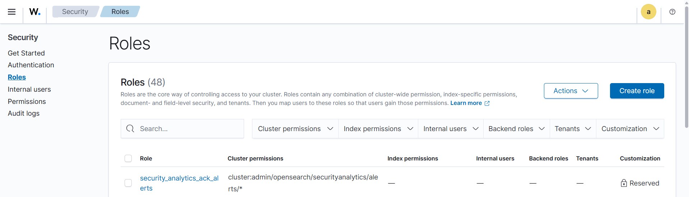
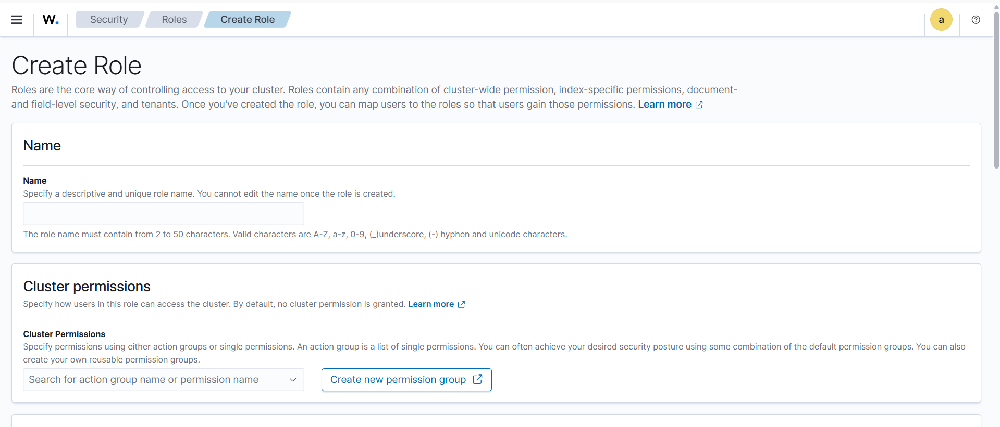
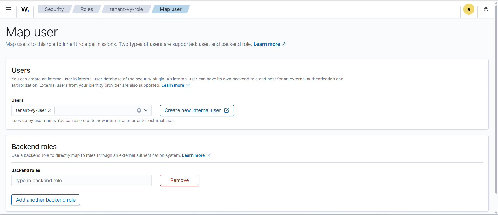
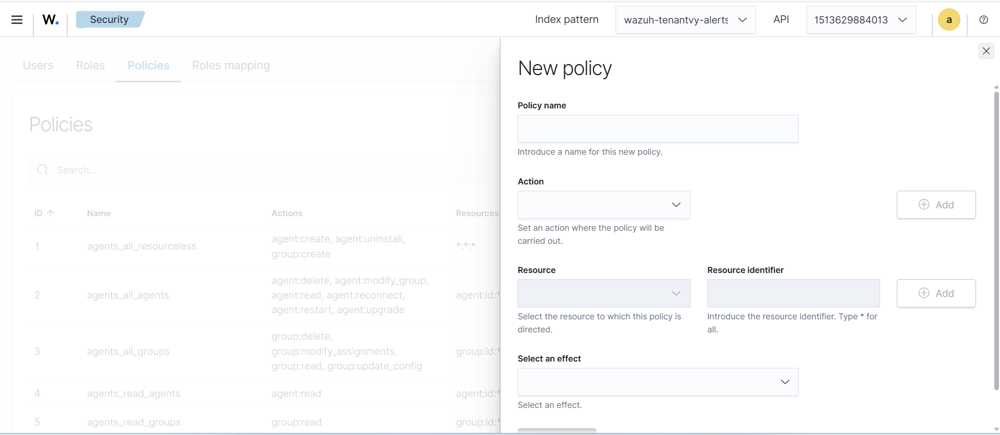

# RBAC for a Tenant

This process can be completed in four simple steps to define and configure role-based access for a tenant in Wazuh. Follow the sections below in sequence to create indexer roles, define API policies, create API roles, and map users to the appropriate roles.

- OpenSearch Indexer Layer
- Wazuh API Layer: Policy Creation
- Wazuh API Layer: Role Creation
- Wazuh API Layer: Role Mapping

---

## 1. OpenSearch Indexer Layer

Pre-requisite : 
Make sure to verify `opensearch_security.multitenancy.enabled: true` in open-search dashboard config file as shown in the below image. 

 

Log in Wazuh Dashboard UI and Follow these steps : 

1.Go to Index Management->Security->Tenants

2.Click on Create Tenant. Enter the Tenant Name

3.Click on Menu

4.Go to Dashboard Management->Index Pattern

5.Click on + Create Index Pattern and enter the Tenant-name-alerts

6.Click on Create tenant pattern

### 1.1 Create Role: tenant_a_admin_indexer_role

Log in to OpenSearch Dashboards. From the left navigation panel, go to Security under Indexer Management, then select Roles, and click Create role.

Enter the role name as `tenant_a_admin_indexer_role`.

Under Index Permissions, add the following index patterns one by one. For each pattern, click Add index permission, enter the index pattern, and select the listed actions.

- Index pattern `wazuh-tenant-<tenant-name>-alerts-*` — Actions: `read`, `write`, `delete`, `indices_monitor`, `manage`
- Index pattern `wazuh-states-vulnerabilities`,`wazuh-alerts-*` — Actions: `read`, `indices_monitor`. Under Document Level Security, enter the DLS query scoped to Tenant `<TENANT-NAME>` agents. Refer [Add the DLS query](../07-dls/dls.md#add-the-dls-query).
- Index pattern `wazuh-monitoring-*` — Actions: `read`, `indices_monitor`
- Index pattern `.kibana*` — Actions: `read`, `write`, `manage`
- Index pattern `.wazuh` — Actions: `read`, `write`, `manage`

Under Cluster Permissions, add the following: `cluster_composite_ops`, `cluster_monitor`, `cluster_manage_pipelines`.

Under Tenant Permissions, add `TenantSpecificWorkspace` and grant read and write access.

Click Create to save the role.

---

### Repeat the same process

### 1.2 Create Role: soc_analyst_indexer_role

From Security, go to Roles and click Create role.

Enter the role name as `soc_analyst_indexer_role`.

Under Index Permissions, add the following index patterns:

- Index pattern `wazuh-tenant-<tenant-name>-alerts-*` — Actions: `read`, `indices_monitor`
- Index pattern `wazuh-states-vulnerabilities`,`wazuh-alerts-*` — Actions: `read`, `indices_monitor`. Under Document Level Security, enter the DLS query scoped to Tenant `<TENANT-NAME>` agents. Refer [Add the DLS query](../07-dls/dls.md#add-the-dls-query).
- Index pattern `wazuh-monitoring-*` — Actions: `read`, `indices_monitor`
- Index pattern `.kibana*` — Actions: `read`, `write`, `manage`
- Index pattern `.wazuh` — Actions: `read`, `write`, `manage`

Under Cluster Permissions, add: `cluster_composite_ops`, `cluster_monitor`, `cluster_manage_pipelines`.

Under Tenant Permissions, add `TenantSpecificWorkspace` and grant read and write access.

Click Create to save the role.

### 1.3 Map Internal Users to OpenSearch Indexer Roles

For each role created above, you must map the corresponding internal user. Navigate to Security, then Roles. Open the role, go to the Mapped users tab, and click Manage mapping.

- Open `tenant_a_admin_indexer_role` → Mapped users → Add `<tenant-name>_admin` under Users → Click Map.
- Open `soc_analyst_indexer_role` → Mapped users → Add `<tenant-name>_soc_analyst` under Users → Click Map.

---

## 2. Wazuh API Layer: Policy Creation

Navigate to the Wazuh Server Management section. From the left navigation panel, go to Server Management, then select Security, and click Policies. Use the Create policy button for each policy below.

Click on Security 

### 2.1 Admin Policies

**Policy: `<TENANT-NAME>_ADMIN_AGENTS_POLICY`**

Enter the policy name as `<TENANT-NAME>_ADMIN_AGENTS_POLICY`. Add the following resource–action pairs:

- Resource `agent:id:002` — Actions: `agent:read`, `agent:create`, `agent:delete`, `agent:modify_group`, `agent:reconnect`, `agent:restart`, `agent:upgrade`, `agent:uninstall`
- Resource `group:id:*` — Actions: `group:read`, `group:create`, `group:delete`, `group:modify_assignments`, `group:update_config`
- Resource `agent:group: tenant-A`
- Resource `*:*:*` — Actions: `active-response:command`, `rootcheck:run`, `rootcheck:clear`, `syscheck:run`, `sca:read`, `syscollector:read`, `ciscat:read`

Click Save policy.

---

**Policy: `<TENANT-NAME>_ADMIN_RULESET_POLICY`**

Enter the policy name as `<TENANT-NAME>_ADMIN_RULESET_POLICY`. Add the following resource–action pairs:

- Resource `decoder:file:*` — Actions: `decoders:read`
- Resource `rule:file:*` — Actions: `rules:read`
- Resource `list:file:*` — Actions: `lists:read`
- Resource `*:*:*` — Actions: `mitre:read`,`logtest:run`

Click Save policy.

### 2.2 SOC Analyst Policies

**Policy: `SOC_ANALYST_AGENTS_POLICY`**

Enter the policy name as `SOC_ANALYST_AGENTS_POLICY`. Add the following resource–action pairs:

- Resource `agent:id:002` — Actions: `agent:read`, `syscheck:read`, `sca:read`, `syscollector:read`, `rootcheck:read`, `ciscat:read`
- Resource `group:id:*` — Actions: `group:read`
- Resource `agent:group: tenant-A`
- 

Click Save policy.

---

**Policy: `SOC_ANALYST_RULESET_POLICY`**

Enter the policy name as `SOC_ANALYST_RULESET_POLICY`. Add the following resource–action pairs:

- Resource `decoder:file:*` — Actions: `decoders:read`
- Resource `rule:file:*` — Actions: `rules:read`
- Resource `list:file:*` — Actions: `lists:read`

Click Save policy.

## 3. Wazuh API Layer: Role Creation

From Server Management, go to Security and select Roles. Click Create role for each role below.

### 3.1 Create Role: `<tenant-name>_admin_api_role`

Enter the role name as `<tenant-name>_admin_api_role`. In the policy assignment section, search for and attach the following three policies: `<TENANT-NAME>_ADMIN_AGENTS_POLICY`, `<TENANT-NAME>_ADMIN_RULESET_POLICY`. Click Save role.

### 3.2 Create Role: `soc_analyst_api_role`

Enter the role name as `soc_analyst_api_role`. Attach the following three policies: `SOC_ANALYST_AGENTS_POLICY`, `SOC_ANALYST_RULESET_POLICY`. Click Save role.

---

## 4. Wazuh API Layer: Role Mapping

From Server Management, go to Security and select Role Mappings. Click Create role mapping for each mapping below. In each mapping, select the target role and add the corresponding internal user under the Users field.

- Select role `<tenant-name>_admin_api_role` → Add user `<tenant-name>_admin` → Save mapping.
- Select role `soc_analyst_api_role` → Add user `<tenant-name>_soc_analyst` → Save mapping.
