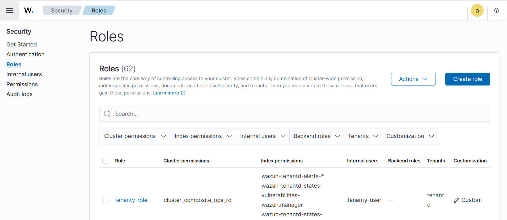
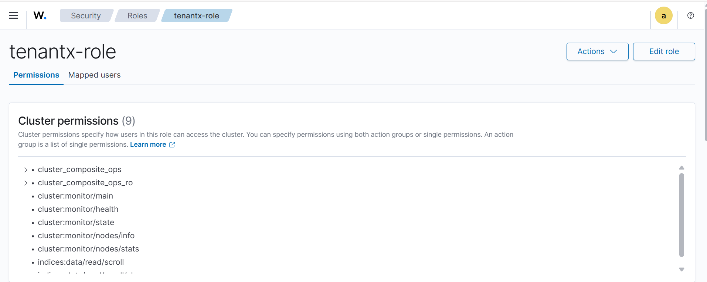
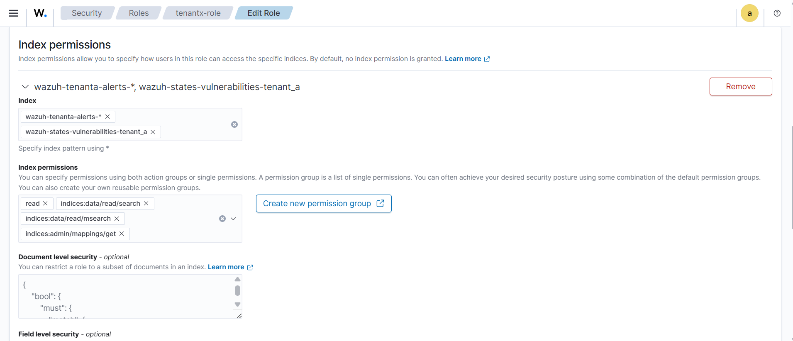

# Document Level Security (DLS)

## Overview

DLS restricts which documents within an index a tenant user can see. Even if two tenants share the same index pattern, DLS ensures each user only sees documents belonging to their own agent(s).

---

## Applying DLS via the Wazuh Dashboard

### Navigate to the role

1. Wazuh Dashboard → **Indexer Management** → **Security** → **Roles**



2. Select the required role (e.g. `tenanta-role`)



3. Click **Edit role**
4. Navigate to **Index permissions**



5. Under **Document level security** *(optional)*

### Add the DLS query

Paste the following into the Document level security field, replacing `<agent-id>` with the actual agent ID for this tenant:

```json
{
  "bool": {
    "must": {
      "match": {
        "agent.id": "<agent-id>"
      }
    }
  }
}
```

6. Click **Update**

!!! note "Note"
    The agent ID can be found in the Wazuh Dashboard under **Agents**. Each tenant's role should be scoped to only the agent IDs belonging to that tenant. If a tenant has multiple agents, use a `should` clause instead of `must`:

```json
    {
      "bool": {
        "should": [
          { "match": { "agent.id": "<agent-id-1>" } },
          { "match": { "agent.id": "<agent-id-2>" } }
        ],
        "minimum_should_match": 1
      }
    }
```

!!! warning "Warning"
    DLS operates at query time. If a user has index-level `read` permission but no DLS query is set, they will see all documents in that index. Always verify DLS is applied after any role edit.