# SSO — Microsoft Entra ID (SAML)

## Overview

This process can be completed in three simple steps to configure SSO and role-based access for Wazuh in Microsoft Entra ID. Follow the steps below in sequence to set up the application, define roles, and assign access to users.

- Configure SAML Application in Microsoft Entra ID
- Create Wazuh App Roles
- Add and Assign Users

*Go to Microsoft Azure Portal, sign up or sign in if you already have an Azure Portal account.*

---

## Prerequisite Information for Registering Wazuh Application in Microsoft Entra ID

Before registering and configuring the Wazuh application in the Azure portal, use the following details for the Microsoft Entra ID SAML setup.

| **Category** | **Details to Provide / Capture** | **Example / Notes** |
| --- | --- | --- |
| **Application name** | Name of the enterprise application to create in Microsoft Entra ID. | wazuh-sso |
| **Application type** | Select a non-gallery enterprise application. | Integrate any other application you do not find in the gallery. |
| **Wazuh dashboard URL** | Public or internal HTTPS URL used to access the Wazuh dashboard. | https://10.10.100.100/ |
| **Identifier / Entity ID** | Service Provider entity ID configured in Basic SAML Configuration. | wazuh-saml |
| **Reply URL / ACS URL** | Assertion Consumer Service URL for Wazuh SAML login. | https://10.10.100.100/_opendistro/_security/saml/acs |
| **Sign-on URL** | Main Wazuh dashboard URL. | https://10.10.100.100/ |
| **App role display name** | User-friendly role name shown in Microsoft Entra ID. | Tenant A Admin, Tenant A Analyst |
| **App role value** | Backend role value sent to Wazuh. This must match the Wazuh role mapping exactly. | indexer_role, soc_analyst_role |
| **App role description** | Description of what the role provides. | Tenant Level Administrative Permissions, Tenant Level Analyst Permissions |
| **Role enabled** | Confirm the app role is enabled before saving. | Enabled / checked |
| **Allowed member types** | Type of identities allowed to receive the role. | Users/Groups |
| **Users or groups** | Users or groups that should be assigned to the Wazuh enterprise application. | Internal: CISO, Users as needed. External: Shekark@vidyayug.com (admin), vineethreddy@vidyayug.com (Analyst), Tharun@vidyayug.com (Analyst) |
| **SAML claim name** | Name of the claim used to send assigned roles to Wazuh. | Roles |
| **SAML claim source attribute** | Source attribute for the role claim. | user.assignedroles |

---

## 1. Create an App in Microsoft Entra ID

- Go to **Microsoft Entra ID** > **Enterprise applications** > **New application** > **Create your own application**.

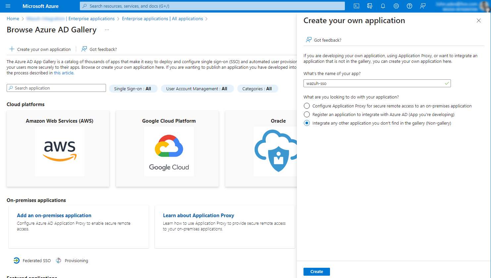

- Select **Integrate any other application you don't find in the gallery**.
- Give the application a name, for example `wazuh-sso`, and click **Add**.

---

## 2. Create a Role for Your Application

- Go to **Microsoft Entra ID** and click on **App registrations**.

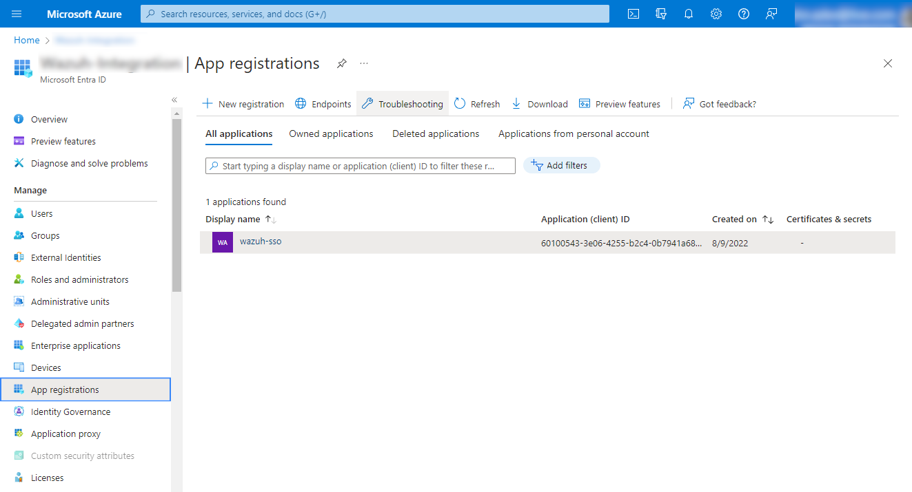

- Select your new app under **All applications** and click **App roles** > **Create app role**.

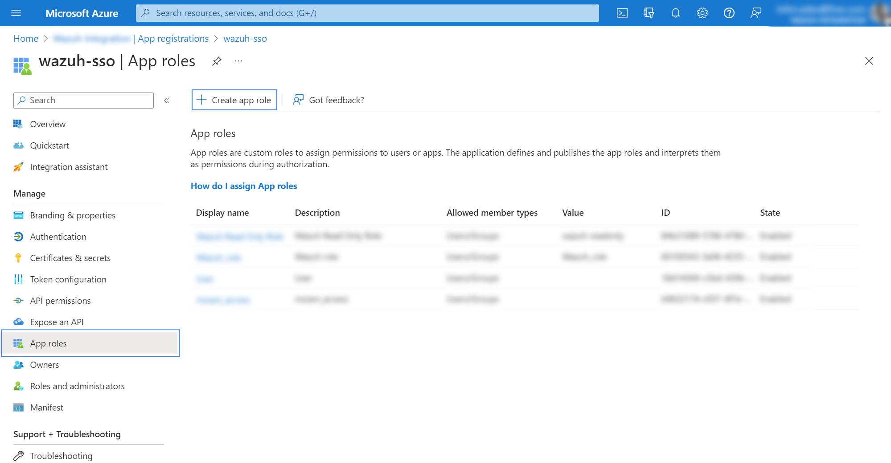

- Add the following details to your app role:
  - **Display name**: The role name we gave you.
  - **Allowed member types**: Select **Users/Groups**.
  - **Value**: The role name we gave you — typed exactly the same (case-sensitive, no spaces).
  - **Description**: Optional.
  - **Do you want to enable this app role**: Click the checkbox.

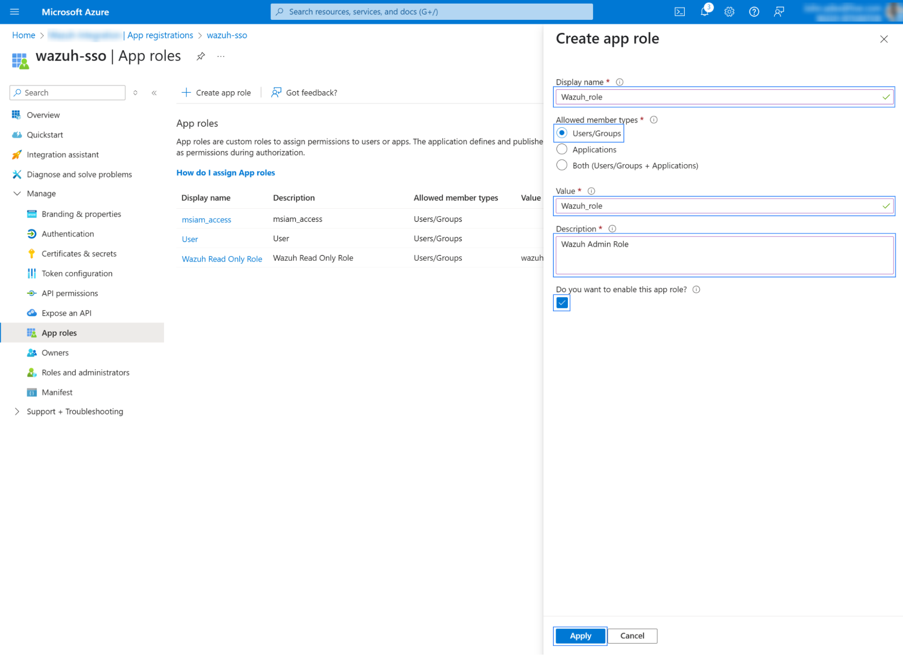

- Click **Apply** to save the changes.
- Return to **Azure Portal Home** → **Microsoft Entra ID**.

---

## 3. Configure Single Sign-On

- Click on **Enterprise applications** from the left menu, select your application, and then click **Set up single sign-on** > **SAML**.

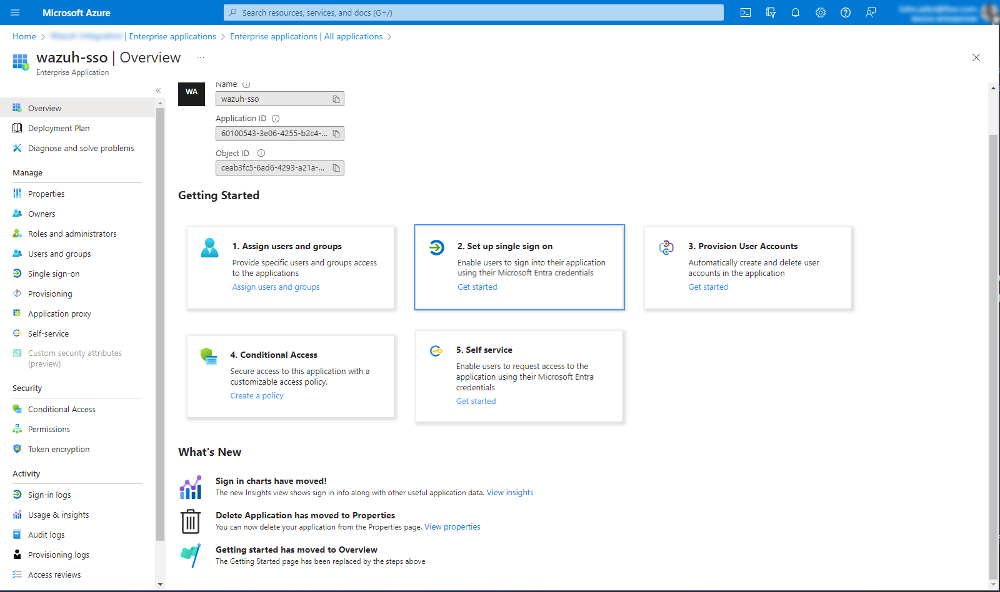

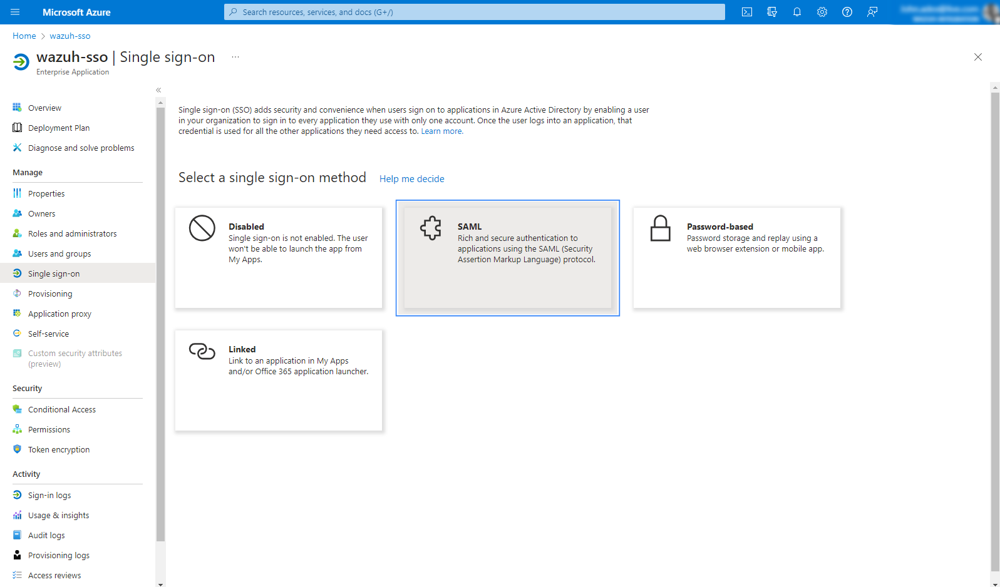

- In option 1, under **Basic SAML Configuration**, click **Edit** and set:
  - **Identifier (Entity ID)**: `wazuh-saml`
  - **Reply URL (Assertion Consumer Service URL)**: `https://<WAZUH_DASHBOARD_URL>/_opendistro/_security/saml/acs`
  - **Sign on URL (Optional)**: `https://<WAZUH_DASHBOARD_URL>`

  Replace `<WAZUH_DASHBOARD_URL>` with your actual dashboard URL.

- Save and proceed to the next step.

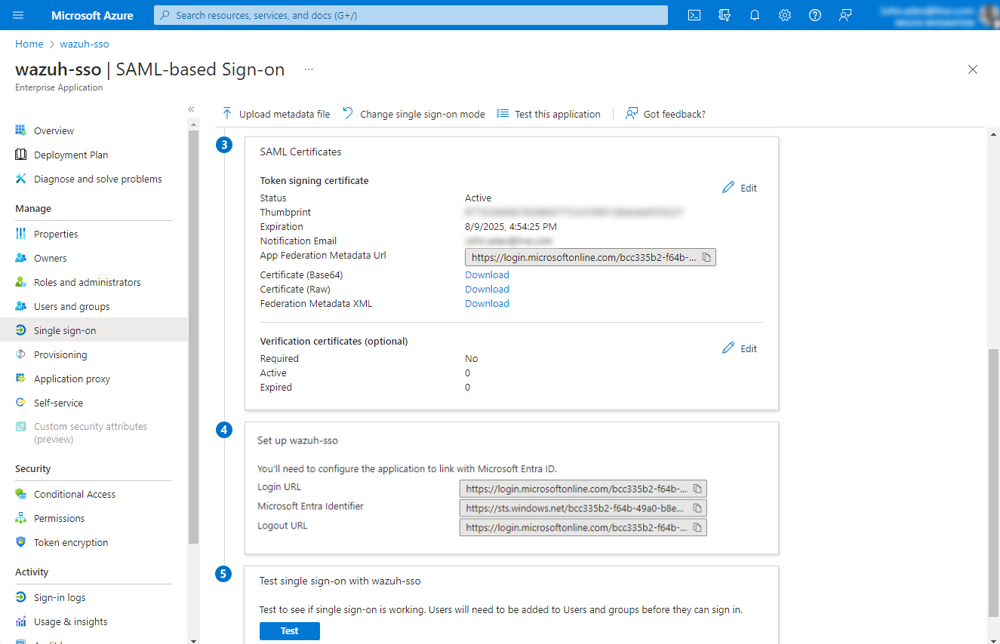

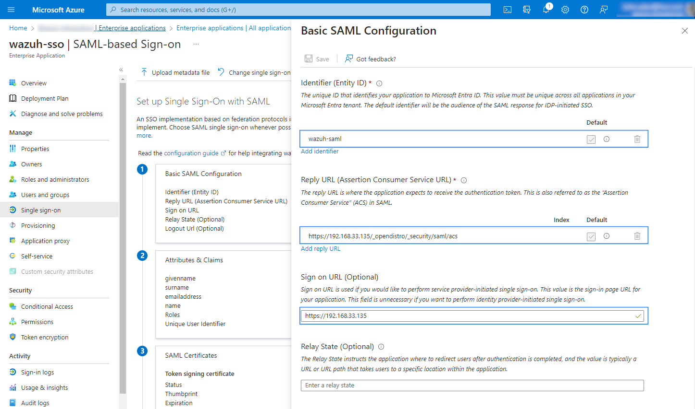

- In option 2, under **Attributes & Claims**, click **Edit** and add a new claim:
  - **Name**: `Roles`
  - **Source attribute**: `user.assignedroles`

  This claim will map to `roles_key` in the Wazuh indexer configuration.

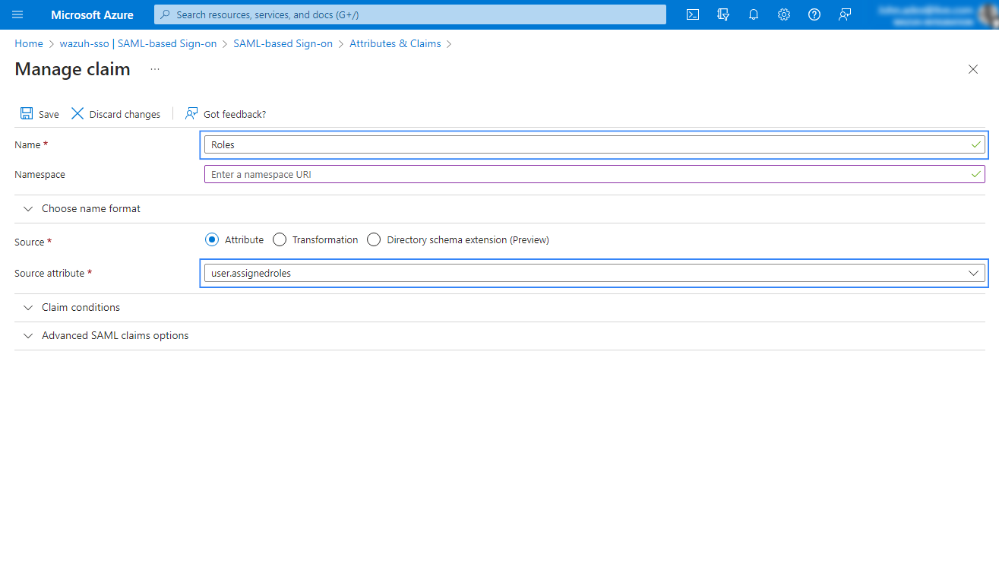

- Collect the following values and share them with the Wazuh implementation team:
  - **App Federation Metadata URL** → `idp.metadata_url`
  - **Microsoft Entra ID Identifier** → `idp.entity_id`

---

## 4. Add and Assign Users

- Open your application and click **Users and groups**.

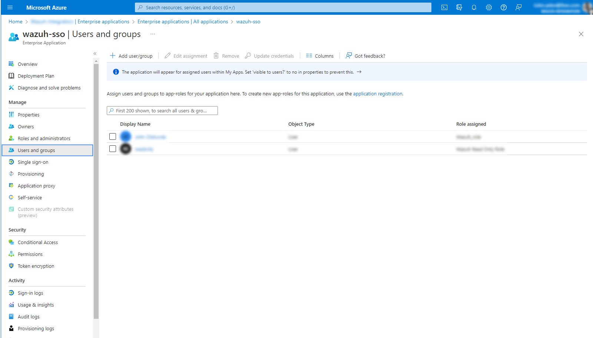

- Click **Add user/group** and assign tenant users or groups.

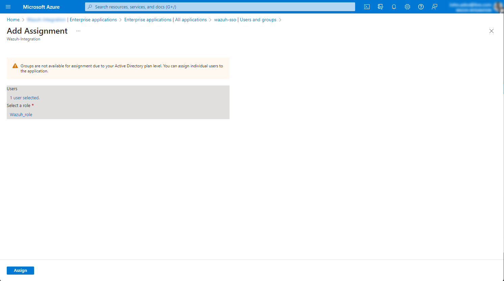

---

## 5. Azure Information Required to Configure in Wazuh

After the one-time SSO setup, collect these values from the Azure portal and send them to the Wazuh implementation team.

| **Parameter** | **Where to Find It in Azure** | **Example (Replace Values from Azure Setup)** |
| --- | --- | --- |
| **App Federation Metadata URL** (`idp.metadata_url`) | Enterprise app → Single sign-on → Option 3 SAML Certificates → App Federation Metadata Url | `https://login.microsoftonline.com/<tenant-id>/federationmetadata/2007-06/federationmetadata.xml?appid=<app-id>` |
| **Entity ID / Identifier** | Enterprise app → Single sign-on → Option 1 Basic SAML Configuration → Identifier | `wazuh-saml-sai` |
| `idp.entity_id` | Enterprise app → Single sign-on → Option 4 Set up `<App>` → Microsoft Entra ID Identifier | `https://sts.windows.net/<tenant-id>/` |
| **Tenant ID** | Microsoft Entra ID → Overview → Tenant ID | `4d327ebb-24ba-46d0-a50a-0e777e00e023` |
| **Client ID (Application ID)** | App registrations → our app → Overview → Application (client) ID | `73c4bf32-97b3-4268-a944-44b9986f0b3b` |

---

## 6. Wazuh Indexer Configuration

**Step — Run this command inside your VM:**

```bash
docker exec -it single-node-wazuh.indexer-1 bash
```

Back up the indexer security configuration before you make changes.

```bash
JAVA_HOME=/usr/share/wazuh-indexer/jdk /usr/share/wazuh-indexer/plugins/opensearch-security/tools/securityadmin.sh \
  -backup /tmp/security-backup \
  -icl \
  -nhnv \
  -cert /usr/share/wazuh-indexer/config/certs/admin.pem \
  -key /usr/share/wazuh-indexer/config/certs/admin-key.pem \
  -cacert /usr/share/wazuh-indexer/config/certs/root-ca.pem
```

Generate the `exchange_key`:

```bash
openssl rand -hex 32
```

Edit the indexer SAML configuration:

```bash
vim /usr/share/wazuh-indexer/config/opensearch-security/config.yml
```

Update the authc section:

```yaml
authc:
  basic_internal_auth_domain:
    description: "Authenticate via HTTP Basic against internal users database"
    http_enabled: true
    transport_enabled: true
    order: 0
    http_authenticator:
      type: "basic"
      challenge: false
    authentication_backend:
      type: "intern"
  saml_auth_domain:
    http_enabled: true
    transport_enabled: false
    order: 1
    http_authenticator:
      type: saml
      challenge: true
      config:
        idp:
          metadata_url: https://login.microsoftonline.com/...
          entity_id: https://sts.windows.net/...
        sp:
          entity_id: wazuh-saml
        kibana_url: https://<WAZUH_DASHBOARD_URL>
        roles_key: Roles
        exchange_key: 'b1d6dd32753374557dcf92e241.......'
    authentication_backend:
      type: noop
```

Replace the placeholder values with the ones from Section 5:

- `idp.metadata_url`
- `idp.entity_id`
- `sp.entity_id`
- `kibana_url`
- `roles_key`
- `exchange_key`

Load the configuration:

```bash
export JAVA_HOME=/usr/share/wazuh-indexer/jdk && \
  bash /usr/share/wazuh-indexer/plugins/opensearch-security/tools/securityadmin.sh \
  -f /usr/share/wazuh-indexer/config/opensearch-security/config.yml \
  -icl \
  -key /usr/share/wazuh-indexer/config/certs/admin-key.pem \
  -cert /usr/share/wazuh-indexer/config/certs/admin.pem \
  -cacert /usr/share/wazuh-indexer/config/certs/root-ca.pem \
  -h localhost \
  -nhnv
```

---

## 7. Wazuh Roles Mapping Configuration

Edit the roles mapping file:

```bash
vim /usr/share/wazuh-indexer/config/opensearch-security/roles_mapping.yml
```

Use this mapping example:

```yaml
all_access:
  reserved: false
  hidden: false
  backend_roles:
  - "admin"
  - "indexer_role"
  hosts: []
  users: []
  and_backend_roles: []
  description: "Maps admin to all_access"

readall:
  reserved: true
  hidden: false
  backend_roles:
  - "readall"
  - "soc_analyst_role"
  hosts: []
  users: []
  and_backend_roles: []

wazuh_soc_analyst_role:
  reserved: false
  hidden: false
  backend_roles:
  - "soc_analyst_role"
  hosts: []
  users: []
  and_backend_roles: []
```

Load the roles mapping:

```bash
export JAVA_HOME=/usr/share/wazuh-indexer/jdk && \
  bash /usr/share/wazuh-indexer/plugins/opensearch-security/tools/securityadmin.sh \
  -f /usr/share/wazuh-indexer/config/opensearch-security/roles_mapping.yml \
  -icl \
  -key /usr/share/wazuh-indexer/config/certs/admin-key.pem \
  -cert /usr/share/wazuh-indexer/config/certs/admin.pem \
  -cacert /usr/share/wazuh-indexer/config/certs/root-ca.pem \
  -h 127.0.0.1 \
  -nhnv
```

---

## 8. Wazuh Dashboard Configuration

**Step — Run this command inside your VM:**

```bash
docker exec -it single-node-wazuh.dashboard-1 bash
```

Verify `run_as` is enabled:

```bash
cat /usr/share/wazuh-dashboard/data/wazuh/config/wazuh.yml
```

The file should include:

```yaml
hosts:
  - default:
      url: https://localhost
      port: 55000
      username: wazuh-wui
      password: "<WAZUH_WUI_PASSWORD>"
      run_as: true
```

- Log in as admin to Wazuh dashboard.


---

## 9. Create Role: wazuh_soc_analyst_role

Log in to OpenSearch Dashboards. From the left menu, go to **Security** under **Indexer Management**, then select **Roles** and click **Create role**.

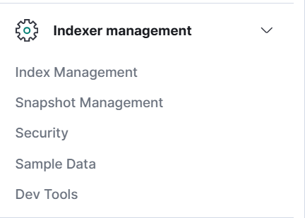

Enter the role name:

- `wazuh_soc_analyst_role`

Under **Index Permissions**, add these patterns:

```text
wazuh-alerts-*
wazuh-*
.kibana*
.wazuh*
```

And permissions:

```text
indices:data/read/search
indices:data/read/get
```

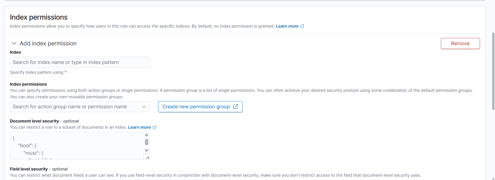

Under **Cluster Permissions**, add:

```text
cluster_composite_ops_ro
cluster:monitor/main
cluster:monitor/health
cluster:monitor/state
```

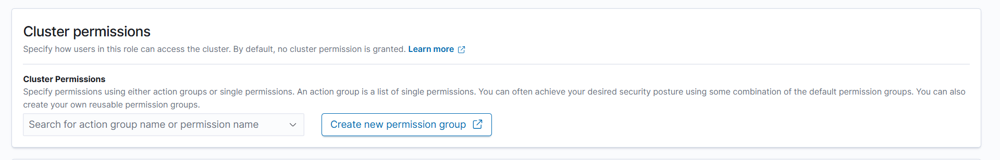

Under **Tenant Permissions**, add `global_tenant` and grant read-only access.

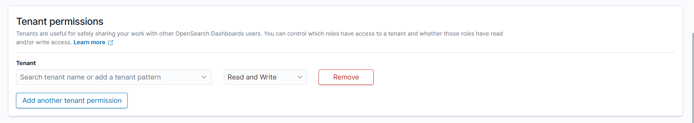

Click **Create**.

---

## 10. Role Mapping

Click **☰** to open the menu, then go to **Server management** > **Security** > **Roles mapping**.

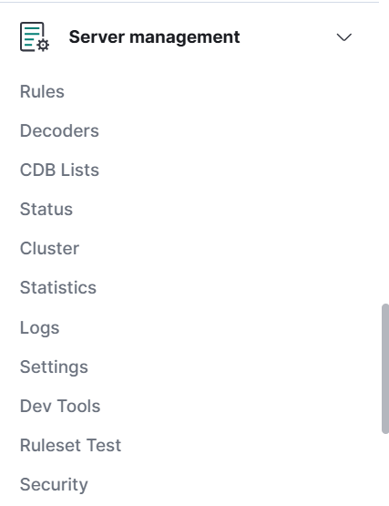

### Admin Role Mapping

- **Role mapping name**: `soc_admin`
- **Roles**: select `administrator`
- **Custom rules**:
  - **User field**: `backend_roles`
  - **Search operation**: `FIND`
  - **Value**: `indexer_role`

Save the mapping.

### Analyst Role Mapping

- **Role mapping name**: `soc_analyst`
- **Roles**: select `read only`
- **Custom rules**:
  - **User field**: `backend_roles`
  - **Search operation**: `FIND`
  - **Value**: `soc_analyst_role`

Save the mapping.

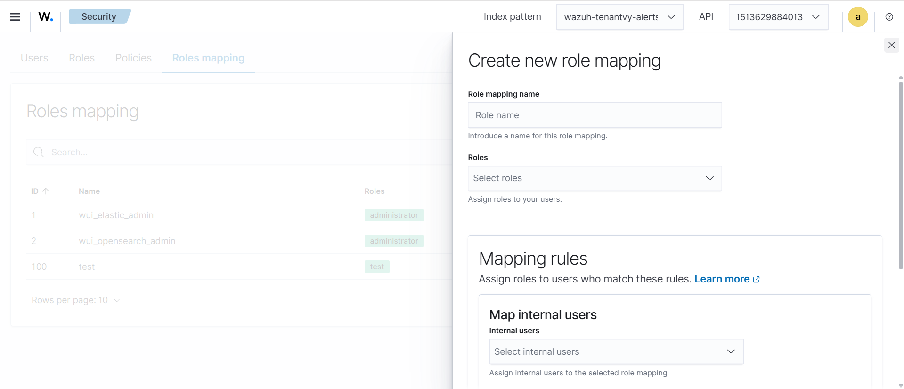

---

## 11. Final Dashboard Configuration

Edit the Wazuh dashboard settings:

```bash
vim /usr/share/wazuh-dashboard/config/opensearch_dashboards.yml
```

Ensure these settings exist:

```yaml
opensearch_security.auth.multiple_auth_enabled: true
opensearch_security.auth.type: ["basicauth","saml"]
server.xsrf.allowlist: ["/_opendistro/_security/saml/acs", "/_opendistro/_security/saml/logout", "/_opendistro/_security/saml/acs/idpinitiated"]
```

Restart the dashboard:

```bash
systemctl restart wazuh-dashboard
```

Test the configuration by opening the Wazuh dashboard and logging in with your Microsoft account.
