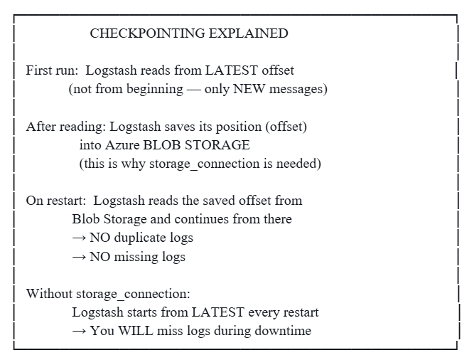

# Implementation Guide: Azure Activity Logs → Event Hub → Logstash → Wazuh

## Full Implementation Guide: Azure Activity Logs → Event Hub → Wazuh

### Is It Possible? Is It Recommended?


YES — It is 100% POSSIBLE
YES — It is RECOMMENDED for Wazuh-based SOCs
It needs a pipeline: Event Hub → Logstash → Wazuh

Wazuh does NOT natively consume Event Hub — so we use Logstash as the bridge.

#### Full Architecture (What We Are Building)


## STEP-BY-STEP IMPLEMENTATION

#### PHASE 1: Create Event Hub in Azure Portal

#### Step 1 — Create Event Hub Namespace


Azure Portal → Search "Event Hubs" → Create

Fill in:


→ Click Review + Create → Create

#### Step 2 — Create Event Hub (inside the Namespace)

Go to your Namespace → Click "+ Event Hub"

Fill in:

.png>)

→ Create

#### Step 3 — Create Shared Access Policy (for Logstash to authenticate)

Go to Event Hub (azure-activity-logs)

→ Shared Access Policies → + Add

.png>)

→ Create

COPY THESE (you'll need them later):
- Connection string–primary key
- Event Hub name: azure-activity-logs

#### Step 4 — Create Consumer Group

Go to Event Hub → Consumer Groups → + Add

Name: wazuh-consumer

(This ensures Logstash has its own read pointer
and doesn't conflict with other consumers)

### PHASE 2: Connect Azure Activity Logs → Event Hub

#### Step 5 — Set Up Diagnostic Settings


```
Azure Portal

→ Search "Monitor" → Activity Log

→ Click "Diagnostic Settings" (top menu)

→ Click "+ Add Diagnostic Setting"
```

Fill in:


→ Save

Now Azure Activity Logs are flowing into your Event Hub!

#### How and Where to Verify Activity Logs Inside Event Hub?

Azure Portal

→ Event Hubs → your namespace (soc-eventhub-ns)

→ Click your Event Hub (azure-activity-logs)

→ You will see these tabs:

| Tab | What you see |
|-----|---------------|
| **Overview** | Incoming messages graph, throughput |
| **Metrics** | Incoming vs Outgoing message count |
| **Process Data** | Preview actual raw messages (best for verification) |


#### Does Azure Write Immediately or Is There Delay?


So after you do an action in Azure (like create/delete a resource), wait 3-5 minutes before expecting to see it in Event Hub.

#### Where Are Logs Stored Inside Event Hub?

Event Hub internally works like this:


- Logs are stored inside Azure's internal distributed storage
- You cannot SSH into Event Hub — it's a managed service
- You access them only via AMQP protocol (what Logstash plugin uses)
- Each message is a JSON blob containing Azure activity log records

#### How Does Logstash Know Where to Read? New Logs Only or From Beginning?


This is the most important concept — CHECKPOINTING:



Blob Storage checkpoint file location (auto-created):

```
azure-webjobs-eventhub/ 
  └── soc-eventhub-ns/ 
        └── azure-activity-logs/ 
              └── wazuh-consumer/ 
                    └── checkpoint  ← offset saved here 
```

#### Step 6 — Install Logstash (on your server)

```
# If not installed:
sudo apt-get update
sudo apt-get install logstash -y
```

If logstash is already installed, then skip the step 6. In my case I already installed previously. So, I just modifying the existing logstash config file and installing the supported plugin.

### PHASE 3: Updated Logstash Config (Azure Added)

Here is your fully updated config — I only added the Azure Event Hub input block and updated the azure filter section. All your existing logic is 100% untouched:

Now let me build the full updated config and data flow diagram for you.

Now here is your fully updated logstash.conf — I only added the Event Hub input block and updated the Azure filter section. Every single line of your existing logic is preserved exactly.


logstash.config:

```
# ============================================
# INPUT SECTION
# ============================================
# INPUT 1: Receive logs FROM Filebeat (your existing input - UNCHANGED)
input {
  beats {
    port => 5044
    host => "0.0.0.0"
  }
}

# INPUT 2: NEW — Read Azure Activity Logs FROM Event Hub
input {
  azure_event_hubs {
    event_hub_connections => [
      "Endpoint=sb://YOUR_NAMESPACE.servicebus.windows.net/;SharedAccessKeyName=logstash-reader;SharedAccessKey=<YOUR_EVENT_HUB_SAS_KEY>;EntityPath=azure-activity-logs"
    ]
    threads              => 4
    decorate_events      => true
    consumer_group       => "wazuh-consumer"
    storage_connection   => "DefaultEndpointsProtocol=https;AccountName=YOUR_STORAGE_ACCOUNT;AccountKey=<YOUR_STORAGE_ACCOUNT_KEY>;EndpointSuffix=core.windows.net"
    # ↑ This enables checkpointing — Logstash remembers where it stopped reading
    # Without this, every restart reads from latest only (you lose logs during downtime)
  }
}

# ============================================
# FILTER: Transform/parse logs
# ============================================
filter {

  # ══════════════════════════════════════════
  # AZURE ACTIVITY LOG HANDLER
  # Runs ONLY for logs coming from Event Hub
  # (azure_event_hubs input sets type automatically)
  # Does NOT affect Filebeat logs at any cost
  # ══════════════════════════════════════════
  if [event][module] == "azure" or [@metadata][input] == "azure_event_hubs" {

    # STEP A: Event Hub wraps logs in a "records" array.
    # First parse the outer JSON message.
    json {
      source               => "message"
      target               => "azure_raw"
      skip_on_invalid_json => true
    }

    # STEP B: The real log data is inside azure_raw.records[0]
    # Extract the first record into azure_activity
    ruby {
      code => "
        raw = event.get('[azure_raw][records]')
        if raw.is_a?(Array) && raw.length > 0
          event.set('azure_activity', raw[0])
        elsif raw.is_a?(Hash)
          event.set('azure_activity', raw)
        end
      "
    }

    # STEP C: Build a clean readable single-line message.
    # This is what Wazuh will receive and match rules against.
    mutate {
      replace => {
        "message" => "AzureActivityLog operationName=%{[azure_activity][operationName]} caller=%{[azure_activity][caller]} resultType=%{[azure_activity][resultType]} resourceGroup=%{[azure_activity][resourceGroupName]} level=%{[azure_activity][level]}"
      }
    }

    # STEP D: Tag this log so you can filter in Wazuh dashboard
    mutate {
      add_tag   => [ "azure_activity_log" ]
      add_field => {
        "log_source" => "azure_eventhub"
        "[event][module]" => "azure"
      }
    }
  }

  # ══════════════════════════════════════════
  # END OF AZURE HANDLER
  # ALL your original logic below is UNCHANGED
  # ══════════════════════════════════════════

  # 1. CLEAN: Remove ANSI colors immediately
  mutate {
    gsub => [ "message", "\u001B\[[0-9;]*[mK]", "" ]
  }

  # 2. EXTRACT: A flexible Grok
  grok {
    match => { "message" => "(?:.*INFO )?%{GREEDYDATA:clean_msg}" }
  }

  # 3. REPLACE: Put the clean log into the main message field
  if [clean_msg] {
    mutate {
      replace => { "message" => "%{clean_msg}" }
    }
  }

  # --- TENANT TAGGING --- (UNCHANGED)
  mutate {
    replace => { "message" => "%{message}-tenantA" }
  }
  if [host][name] {
    mutate {
      update => { "[host][name]" => "%{[host][name]}-tenantA" }
    }
  }
  # ----------------------

  # 4. FINAL POLISH: Remove newlines and carriage returns
  mutate {
    gsub => [
      "message", "\n", " ",
      "message", "\r", ""
    ]
  }

  # 5. TRUNCATE: Prevent oversized packets from being dropped
  ruby {
    code => "
      msg = event.get('message')
      if msg && msg.length > 2000
        event.set('message', msg[0..1999])
      end
    "
  }
}

# ============================================
# OUTPUT: Forward logs TO Wazuh Manager (UNCHANGED)
# ============================================
output {
  tcp {
    host  => "<IP-address>"
    port  => 9065
    codec => line { format => "%{message}" }
  }
  stdout { codec => rubydebug }
}
```

#### Install the Plugin & Create Storage Account

#### Step 1 — Create Azure Storage Account (for checkpointing)

Azure Portal → Search "Storage Accounts" → Create

Fill in:

.png>)

→ Review + Create → Create

After creation:

→ Go to Storage Account

→ Access Keys → Copy "Connection string"

(paste this into storage_connection in your config)

```
#### Step 2 — Install the Azure Event Hub Logstash Plugin

```bash
sudo /usr/share/logstash/bin/logstash-plugin install \
    logstash-input-azure_event_hubs

# Verify it installed:
sudo /usr/share/logstash/bin/logstash-plugin list | grep azure
# Should show: logstash-input-azure_event_hubs
```

#### Step 3 — Fill In Your Config Values

Open your config and replace these 3 placeholders:

| **Placeholder** | **Where to find it** |
|-----------------|----------------------|
| `YOUR_NAMESPACE` | Azure Portal → Event Hubs → Your namespace name |
| `YOUR_KEY_HERE` | Event Hub → Shared Access Policies → `logstash-reader` → Primary Key |
| `YOUR_STORAGE_ACCOUNT` | Storage Account → Access Keys → Storage account name |
| `YOUR_STORAGE_KEY` | Storage Account → Access Keys → Key1 or Key2 |


#### Step 4 — Test Config & Restart Logstash

```
# Test config syntax first (important!):
sudo /usr/share/logstash/bin/logstash \
    -f /etc/logstash/conf.d/azure-activity-wazuh.conf \
    --config.test_and_exit

# If "Configuration OK" → restart:
sudo systemctl restart logstash

# Watch live logs:
sudo journalctl -u logstash -f
```

#### Who Actually Reads the Logs?

#### QUESTION: Does Logstash read Event Hub, or does the plugin?

Think of it like this:

```
Logstash = a CAR

Plugin    = the ENGINE inside the car

The car (Logstash) cannot move by itself.

The engine (plugin) does the actual work of reading from Event Hub.

But without the car body (Logstash), the engine is useless.

So the CORRECT answer:

→ The PLUGIN (logstash-input-azure_event_hubs) physically

connects to Event Hub via AMQP protocol and pulls messages.

→ Logstash receives those messages FROM the plugin

and passes them into your filter pipeline.
```

Step by step what happens internally:

```
1. Plugin authenticates to Event Hub using your connection string
2. Plugin opens AMQP connection to Event Hub partitions
3. Plugin reads new messages (JSON blobs) from each partition
4. Plugin hands each message to Logstash as an "event"

↓
5. Logstash sets event["message"] = the raw JSON string from Event Hub
6. Your filter block runs — json{}, ruby{}, mutate{}
7. Your output block sends the formatted message to Wazuh
```

#### Why Is Storage Account Needed?


What Storage Account saves (automatically, inside a blob container):

```
azure-webjobs-eventhub/ 
  └── nseventhub.servicebus.windows.net/ 
        └── activity-logs-event-hub/ 
              └── wazuh-consumer/ 
                    ├── 0        ← offset for partition 0 
                    └── 1        ← offset for partition 1 

```

Each file contains a number — the last message position read. That is your checkpoint.

### Phase 4: Wazuh Rules (paste into manager)

```
sudo nano /var/ossec/etc/rules/azure_activity_rules.xml
```

Local_file.xml:

```
<group name="azure,activity_log,">

  <!-- Base: any AzureActivityLog line received -->
  <rule id="100200" level="3">
    <match>AzureActivityLog</match>
    <description>Azure Activity Log event received from Event Hub</description>
    <group>azure_activity</group>
  </rule>

  <!-- DELETE operations — high severity -->
  <rule id="100201" level="10">
    <if_sid>100200</if_sid>
    <match>delete</match>
    <description>Azure: Resource DELETE operation detected</description>
    <mitre><id>T1485</id></mitre>
  </rule>

  <!-- Failed operations -->
  <rule id="100202" level="8">
    <if_sid>100200</if_sid>
    <match>Failed</match>
    <description>Azure: Failed operation in activity log</description>
  </rule>

  <!-- Role / privilege changes -->
  <rule id="100203" level="12">
    <if_sid>100200</if_sid>
    <match>roleAssignments</match>
    <description>Azure: Role assignment changed — privilege escalation risk</description>
    <mitre><id>T1078</id></mitre>
  </rule>

  <!-- Write/create operations -->
  <rule id="100204" level="3">
    <if_sid>100200</if_sid>
    <match>write</match>
    <description>Azure: Resource write/create operation</description>
  </rule>

</group>
```

```
sudo systemctl restart wazuh-manager

# Verify port 9065 is open:
sudo ss -tlnp | grep 9065
```

You can also add above custom rule from the wazuh UI. I did in that way only, but after saving the rule must reload wazuh, then only changes will apply.

### Phase 5: Verify the Full Flow End-to-End

```
# ── Step 1: Trigger an Azure event ──────────────────────────
# Go to Azure Portal → create or delete any small resource
# (e.g. add a tag to a resource group — lightweight action)
# Wait 3-5 minutes

# ── Step 2: Verify Event Hub received it ────────────────────
# Azure Portal → Event Hubs → your hub → Metrics
# Look at "Incoming Messages" chart — should show a spike

# ── Step 3: Verify Logstash is reading ──────────────────────
sudo journalctl -u logstash -f
# Look for: "azure_event_hubs"
# In stdout you will see rubydebug output of each event
```

If you want to see only azure activity logs then run,

```
sudo journalctl -u logstash -f | grep "AzureActivityLog"

# ── Step 4: Verify Wazuh received the log ───────────────────
sudo docker exec -it single-node-wazuh.manager-1 tail -f /var/ossec/logs/archives/archives.log

# ── Step 5: Verify alert was generated ──────────────────────
sudo docker exec -it single-node-wazuh.manager-1 tail -f /var/ossec/logs/alerts/alerts.json
```

#### Challenge:

I followed and implemented same as above, but when I observe logstash related logs in terminal. The azure activity logs are reaching logstash, but not passing to wazuh and there is no alerts generated in alerts.json file in wazuh manager for activity logs even I wrote custom rule.

### Solution:

The challenge was logstash filter logic, current logic is not filtering properly due to this wazuh can't understand properly and can't apply rules on it. Then I changed the logstash config file logic something like below.

logstash.config:

```
# ============================================
# INPUT: Receive logs FROM Filebeat
# ============================================
input { beats { port => 5044 host => "0.0.0.0" } }

# INPUT 2: Read Azure Activity Logs FROM Event Hub
input {
  azure_event_hubs {
    event_hub_connections => [
      "Endpoint=sb://nseventhub.servicebus.windows.net/;SharedAccessKeyName=logstash-reader;SharedAccessKey=<YOUR_EVENT_HUB_SAS_KEY>;EntityPath=activity-logs-event-hub"
    ]
    threads => 4
    decorate_events => true
    consumer_group => "wazuh-consumer"
    storage_connection => "DefaultEndpointsProtocol=https;AccountName=<YOUR_STORAGE_ACCOUNT_NAME>;AccountKey=<YOUR_STORAGE_ACCOUNT_KEY>;EndpointSuffix=core.windows.net"
  }
}

# ============================================
# FILTER: Transform/parse logs
# ============================================
filter {

  # ══════════════════════════════════════════
  # AZURE ACTIVITY LOG HANDLER
  # HOW WE DETECT AZURE EVENTS:
  # Azure Event Hub messages always start with {"records":
  # Filebeat messages NEVER start with {"records":
  # This is the most reliable detection method based on
  # your actual log output.
  # ══════════════════════════════════════════
  if [message] =~ /^\s*\{"records"/ {

    # STEP A: Parse the outer JSON wrapper
    # Input:  '{"records": [{ "operationName": "...", ... }]}'
    # Output: azure_raw.records = array of log objects
    json {
      source               => "message"
      target               => "azure_raw"
      skip_on_invalid_json => true
    }

    # STEP B: Extract fields from first record in records[]
    # Based on your REAL logs, these fields exist directly:
    #   operationName, resultType, callerIpAddress, category,
    #   resourceId, level, correlationId
    # "caller" does NOT exist directly — it's inside identity.claims
    # "resourceGroupName" does NOT exist — extract from resourceId
    ruby {
      code => "
        begin
          raw = event.get('[azure_raw][records]')
          rec = nil
          if raw.is_a?(Array) && raw.length > 0
            rec = raw[0]
          elsif raw.is_a?(Hash)
            rec = raw
          end

          if rec
            event.set('azure_activity', rec)

            # Extract caller email from deep nested path
            # identity -> claims -> emailaddress
            email_key = 'http://schemas.xmlsoap.org/ws/2005/05/identity/claims/emailaddress'
            caller_email = nil
            begin
              claims = rec.dig('identity', 'claims')
              caller_email = claims[email_key] if claims
            rescue
            end
            event.set('[azure_activity][caller]', caller_email || rec.fetch('callerIpAddress', 'unknown'))

            # Extract resource group from resourceId
            # /SUBSCRIPTIONS/.../RESOURCEGROUPS/ACTIVITY_LOGS/...
            begin
              rid = rec['resourceId'] || ''
              rg_match = rid.match(/RESOURCEGROUPS\/([^\/]+)\//i)
              event.set('[azure_activity][resourceGroupName]', rg_match ? rg_match[1] : 'unknown')
            rescue
              event.set('[azure_activity][resourceGroupName]', 'unknown')
            end

            # Extract VM name from resourceId (last segment)
            begin
              rid = rec['resourceId'] || ''
              vm_match = rid.match(/VIRTUALMACHINES\/([^\/]+)$/i)
              event.set('[azure_activity][resourceName]', vm_match ? vm_match[1] : 'unknown')
            rescue
              event.set('[azure_activity][resourceName]', 'unknown')
            end
          end
        rescue => e
          event.set('[azure_parse_error]', e.message)
        end
      "
    }

    # STEP C: Build the clean one-line message Wazuh will match
    # This REPLACES the huge JSON blob with a clean readable line
    mutate {
      replace => {
        "message" => "AzureActivityLog operationName=%{[azure_activity][operationName]} caller=%{[azure_activity][caller]} resultType=%{[azure_activity][resultType]} resourceGroup=%{[azure_activity][resourceGroupName]} resource=%{[azure_activity][resourceName]} level=%{[azure_activity][level]} category=%{[azure_activity][category]} callerIp=%{[azure_activity][callerIpAddress]}"
      }
    }

    # STEP D: Tag so you can identify in dashboard
    mutate {
      add_tag   => [ "azure_activity_log" ]
      add_field => { "log_source" => "azure_eventhub" }
    }
  }

  # ══════════════════════════════════════════
  # END OF AZURE HANDLER
  # All original logic below is COMPLETELY UNCHANGED
  # ══════════════════════════════════════════

  # 1. CLEAN: Remove ANSI colors immediately
  mutate { gsub => [ "message", "\u001B[[0-9;]*[mK]", "" ] }

  # 2. EXTRACT: A flexible Grok
  grok { match => { "message" => "(?:.*INFO )?%{GREEDYDATA:clean_msg}" } }

  # 3. REPLACE: Put the clean log into the main message field
  if [clean_msg] { mutate { replace => { "message" => "%{clean_msg}" } } }

  # --- TENANT TAGGING --- (UNCHANGED)
  mutate { replace => { "message" => "%{message}-tenantA" } }
  if [host][name] { mutate { update => { "[host][name]" => "%{[host][name]}-tenantA" } } }
  # ----------------------

  # 4. FINAL POLISH: Remove newlines and carriage returns
  mutate { gsub => [ "message", "\n", " ", "message", "\r", "" ] }

  # 5. TRUNCATE: Prevent oversized packets from being dropped
  ruby {
    code => "
      msg = event.get('message')
      if msg && msg.length > 2000
        event.set('message', msg[0..1999])
      end
    "
  }
}

# ============================================
# OUTPUT: Forward logs TO Wazuh Manager (UNCHANGED)
# ============================================
output {
  tcp {
    host  => "<IP-address>"
    port  => 9065
    codec => line { format => "%{message}" }
  }
  stdout { codec => rubydebug }
}
```

#### Challenge:

After changing the logstash filter logic, now alerts are generating for the azure activity logs based on written custom rule in wazuh manager. But when I observe the generated alerts in alerts.json file in wazuh manager, all generated alerts are based on only one rule i.e rule id is 100200 this will look like another challenge. The challenge is, for different type of azure activity logs, only one rule is triggering even I wrote multiple child rules for different type of activity logs. You can see generated alerts in alerts.json file from the below image.

### Solution:

The current custom rule is not properly triggering the different type of activity logs due the the match is not properly defined, so I updated the current custom rule with the below one.

### Custom rule

```xml
<group name="custom,activity,azure_activity,">

  <!-- VM CREATE / UPDATE -->
  <rule id="100200" level="8">
    <match>AzureActivityLog operationName=MICROSOFT.COMPUTE/VIRTUALMACHINES/WRITE</match>
    <description>Azure VM Created/Updated - resource=$(resource) by $(caller)</description>
    <group>azure_vm_create</group>
  </rule>

  <!-- VM DELETE -->
  <rule id="100201" level="12">
    <match>AzureActivityLog operationName=MICROSOFT.COMPUTE/VIRTUALMACHINES/DELETE</match>
    <description>CRITICAL: Azure VM Deleted - resource=$(resource) by $(caller)</description>
    <group>azure_vm_delete</group>
  </rule>

  <!-- VM DEALLOCATE -->
  <rule id="100202" level="6">
    <match>AzureActivityLog operationName=MICROSOFT.COMPUTE/VIRTUALMACHINES/DEALLOCATE/ACTION</match>
    <description>Azure VM Deallocated - resource=$(resource)</description>
    <group>azure_vm_deallocate</group>
  </rule>

  <!-- DISK WRITE -->
  <rule id="100203" level="5">
    <match>AzureActivityLog operationName=MICROSOFT.COMPUTE/DISKS/WRITE</match>
    <description>Azure Disk Created/Updated - resourceGroup=$(resourceGroup)</description>
    <group>azure_disk_write</group>
  </rule>

  <!-- DISK DELETE -->
  <rule id="100204" level="8">
    <match>AzureActivityLog operationName=MICROSOFT.COMPUTE/DISKS/DELETE</match>
    <description>Azure Disk Deleted - resourceGroup=$(resourceGroup)</description>
    <group>azure_disk_delete</group>
  </rule>

  <!-- DEPLOYMENT VALIDATE -->
  <rule id="100205" level="3">
    <match>AzureActivityLog operationName=MICROSOFT.RESOURCES/DEPLOYMENTS/VALIDATE/ACTION</match>
    <description>Azure Deployment Validation Started</description>
    <group>azure_deployment_validate</group>
  </rule>

  <!-- DEPLOYMENT WRITE -->
  <rule id="100206" level="5">
    <match>AzureActivityLog operationName=MICROSOFT.RESOURCES/DEPLOYMENTS/WRITE</match>
    <description>Azure Deployment Started/Completed</description>
    <group>azure_deployment_write</group>
  </rule>

  <!-- NETWORK SECURITY GROUP -->
  <rule id="100207" level="5">
    <match>AzureActivityLog operationName=MICROSOFT.NETWORK/NETWORKSECURITYGROUPS/WRITE</match>
    <description>Azure NSG Created/Updated</description>
    <group>azure_network_nsg</group>
  </rule>

  <!-- PUBLIC IP -->
  <rule id="100208" level="5">
    <match>AzureActivityLog operationName=MICROSOFT.NETWORK/PUBLICIPADDRESSES/WRITE</match>
    <description>Azure Public IP Created/Updated</description>
    <group>azure_network_publicip</group>
  </rule>

  <!-- NETWORK INTERFACE -->
  <rule id="100209" level="5">
    <match>AzureActivityLog operationName=MICROSOFT.NETWORK/NETWORKINTERFACES/WRITE</match>
    <description>Azure Network Interface Created/Updated</description>
    <group>azure_network_nic</group>
  </rule>

  <!-- SSH KEY WRITE -->
  <rule id="100210" level="4">
    <match>AzureActivityLog operationName=MICROSOFT.COMPUTE/SSHPUBLICKEYS/WRITE</match>
    <description>Azure SSH Public Key Created</description>
    <group>azure_ssh_key</group>
  </rule>

  <!-- POLICY AUDIT (WARNING) -->
  <rule id="100211" level="7">
    <match>AzureActivityLog operationName=MICROSOFT.AUTHORIZATION/POLICIES/AUDIT/ACTION</match>
    <match>level=Warning</match>
    <description>Azure Policy WARNING - Non-compliant resource detected</description>
    <group>azure_policy_warning</group>
  </rule>

  <!-- POLICY AUDIT (INFO) -->
  <rule id="100212" level="3">
    <match>AzureActivityLog operationName=MICROSOFT.AUTHORIZATION/POLICIES/AUDIT/ACTION</match>
    <match>level=Information</match>
    <description>Azure Policy Audit - Compliant</description>
    <group>azure_policy_info</group>
  </rule>

</group>
```

Save the changes and restart or reload the wazuh to apply the changes.

Now I again generate the logs by creating and deleting the vm in azure cloud and observed those logs in logstash and wazuh terminal. Now alerts are triggering differently for different type of azure activity logs with different rule id and level. If you observe alerts.json file in wazuh manager, you will see generated alerts with different rule id and level and it is something like same as below image.

## Adding metadata to the Azure Activity logs

Update the existing logstash config file with the following metadata:

```ruby
# ==========================================
# AZURE METADATA ENRICHMENT
# ==========================================

if "azure_activity_log" in [tags] {

  mutate {

    add_field => {

      "source_platform" => "azure"
      "event_category" => "cloud_security"
      "environment" => "poc"
      "tenant" => "azure_poc"
      "non_agent_id" => "7001"
      "device_type" => "azure_activity_log"
      "cloud_provider" => "azure"

    }

  }

  mutate {

    replace => {

      "message" => "%{message} tenant=azure_poc non_agent_id=7001 source_platform=azure event_category=cloud_security environment=poc device_type=azure_activity_log cloud_provider=azure"

    }

  }

}
```

After adding metadata section to existing logstash config file restart the logstash to apply the changes using the following command:

```bash
systemctl restart logstash
```

#### Custom Decoder

Create the custom decoder in wazuh to extract the metadata from the incoming log as a fields.

You can create custom decoder either from wazuh browser UI or local_decoder file.

Custom decoder:

```
<decoder name="azure_activity_log_metadata">
  <prematch>tenant=azure_poc</prematch>
  <regex>tenant=(\S+) non_agent_id=(\S+) source_platform=(\S+) event_category=(\S+) environment=(\S+) device_type=(\S+) cloud_provider=(\S+)</regex>
  <order>tenant, non_agent_id, source_platform, event_category, environment, device_type, cloud_provider</order>
</decoder>
```

After adding custom decoder, restart the wazuh manager or reload if you added from the browser to apply the changes.

Now the metadata will be displayed as a fields same as shown in the below image.


