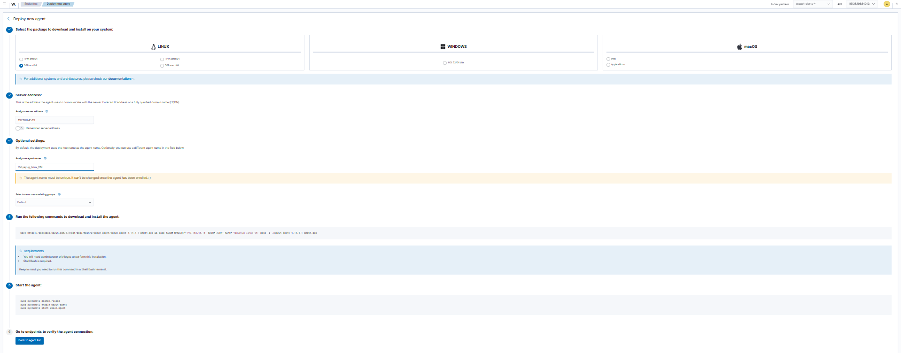
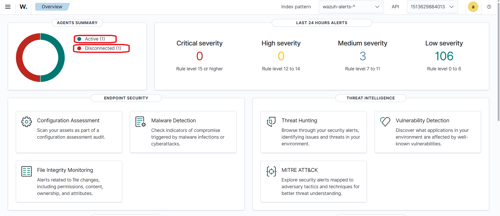
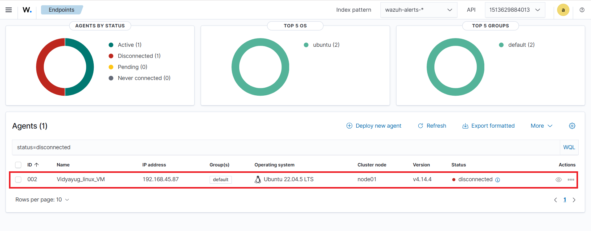
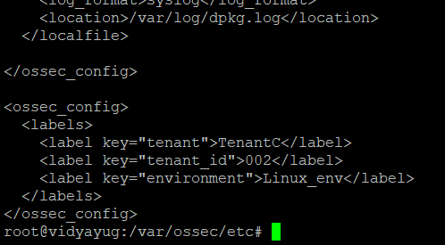
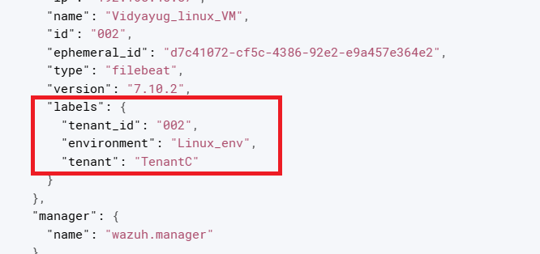
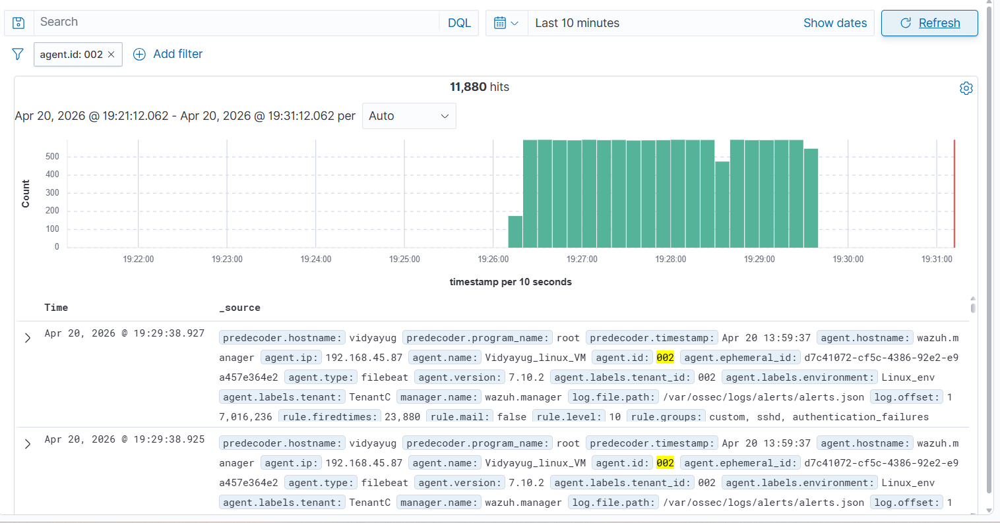
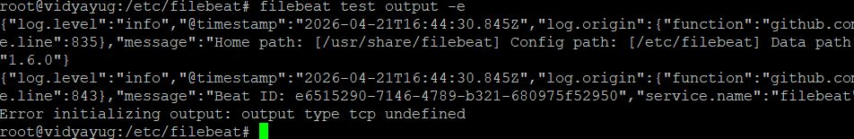
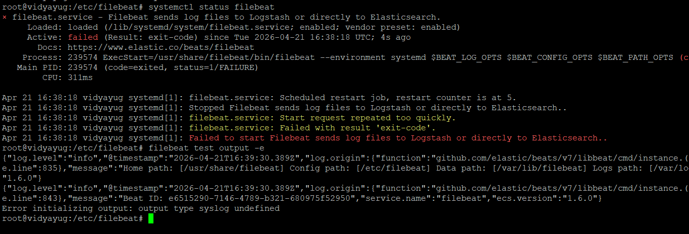
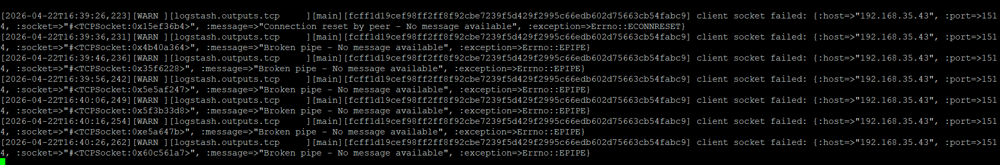
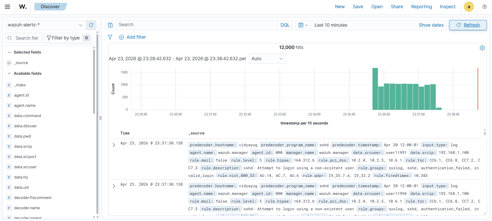

# PIPELINES AND CHALLENGES

## 1. PIPELINE 1 (WAZUH AGENT → MANAGER → INDEXER → DASHBOARD)

### 1.1 How to Install Wazuh Agent in Linux VM

##### Meaning:

To install the Wazuh agent on a Linux VM, Windows machine, or Mac, follow the approach below (from the Wazuh UI) to install and connect it with the Wazuh manager properly without any challenges.



---

### 1.2 Where Should You Run the Install Commands?

##### Meaning:

You can run the installation commands from **any directory** in your VM (like /home, /opt, etc.).

##### Query:

```bash
cd /tmp
```

or even:

```bash
cd ~
```

##### Explanation:

The install script will automatically place files in the correct system directories.

---

### 1.3 Where Does Wazuh Agent Get Installed?

##### Meaning:

After installation, the agent is placed here:

```
/var/ossec/
```

This is the **main directory of the Wazuh agent**.

##### Explanation:

Important subfolders:

- `/var/ossec/bin/` → binaries (agent control commands)
- `/var/ossec/logs/` → logs
- `/var/ossec/etc/` → config file (ossec.conf)

---

### 1.4 How to Check if Agent is Running?

##### Query:

```bash
sudo systemctl status wazuh-agent
```

##### Expected Output:

- `active (running)` → agent is working
- `inactive` or `failed` → issue

---

### 1.5 How to Start / Stop / Restart the Agent?

#### Start:

```bash
sudo systemctl start wazuh-agent
```

#### Stop:

```bash
sudo systemctl stop wazuh-agent
```

#### Restart:

```bash
sudo systemctl restart wazuh-agent
```

---

### 1.6 How to Confirm Agent Connected to Manager

##### Meaning:

**Step 1:** Login into your Wazuh UI and it displays something the same as the image below, then click on active or disconnected, and it will display related information.



**Step 2:** After clicking the button, the respective information shows, and the information looks like the image below.



---

### 1.7 Adding Metadata at Wazuh Agent Level

##### Meaning:

If you want to add metadata at the agent level, then you have to modify the agent config file at the target machine.

##### Query:

In `ossec.config`:

```xml
<ossec_config>
  <labels>
    <label key="tenant">tenantC</label>
    <label key="tenant_id">002</label>
    <label key="environment">Linux_env</label>
  </labels>
</ossec_config>
```

##### Explanation:

Add this as a separate block in the agent `ossec.config` file, which is shown in the image below.



#### After Adding Metadata

Restart the agent:

##### On Windows:

```powershell
Restart-Service wazuh
```

##### On Linux:

```bash
sudo systemctl restart wazuh-agent
```

#### How to Verify

From now onwards, you can see the added metadata for every alert that the Wazuh manager is generating. It will display the same as the image below:



#### Simple Understanding

- `<labels>` = metadata (like tags)
- Used for filtering in the Wazuh dashboard

---

### 1.8 For Performance Test

#### What Type of Logs Should You Generate?

Use **auth logs (SSH failed login)**

##### Explanation:

Why?

- Already supported by Wazuh rules
- Automatically generates alerts
- Easy to simulate

Example log:

```
Failed password for invalid user test from XXX.XXX.X.10 port 22 ssh2
```

#### How to Generate 200 EPS Logs

Run this on your **agent Linux VM (XXXXXXXX)**:

```bash
for i in {1..12000}; do
  logger "Failed password for invalid user user$i from XXX.XXX.X.100 port 22 ssh2"
  sleep 0.005
done
```

##### Explanation:

- `logger` → writes logs to system log (monitored by Wazuh)
- `sleep 0.005` → ~200 logs/sec
- 12000 logs → ~60 seconds

#### Where to See Generated Logs (Agent Side)

##### Query:

```bash
sudo tail -f /var/log/auth.log
```

##### Expected Output:

You should see your generated logs in real time.

#### How to Confirm Logs Are Sent to Manager

On **agent**:

```bash
sudo tail -f /var/ossec/logs/ossec.log
```

Look for:

- `Sending event`
- `Connected to manager`

On **manager**:

```bash
sudo docker exec -it single-node-wazuh.manager-1 tail -f /var/ossec/logs/archives/archives.log
```

##### Expected Output:

You should see incoming logs.

---

### 1.9 For Performance Test (Alternate Script Attempt)

##### **Challenge:**

When I was following the above process, the synthetic logs are not generating and not writing to the `auth.log` file, and not reaching the `archives.log` file in the manager VM.

##### **Solution:**

I changed the synthetic log generation script to the following one:

**Script:**

```bash
for i in {1..12000}; do
  echo "Apr 20 12:00:01 XXXXXXXX sshd[1234]: Failed password for invalid user user$i from XXX.XXX.X.100 port 22 ssh2" >> /var/log/auth.log
  sleep 0.005
done
```

#### **Challenge:**

When I was using the above script, the synthetic logs are generating and writing to the `auth.log` file but not reaching the `archives.log` file in the manager VM.

#### **Solution:**

Then I changed the synthetic log generation script again to:

**Script:**

```bash
for i in {1..12000}; do
  logger "sshd: Failed password for invalid user user$i from XXX.XXX.X.100 port 22 ssh2"
  sleep 0.005
done
```

Now the synthetic logs are reaching the `archives.log` file and `archives.json` file in the manager VM.

### **Challenge:**

Now synthetic logs are reaching the manager, but the default rules are not triggering. Because of this, alerts are not generating for those synthetic logs.

#### **ROOT CAUSE**

Your log looks like:

```
root[172667]: sshd: Failed password for invalid user ...
```

But Wazuh expects something like:

```
sshd[1234]: Failed password ...
```

Because of this:

- `program_name` = root (wrong)
- decoder fails
- no SSH rule match

#### **Solution:**

Create a Custom Rule which matches the raw log text (`full_log`) and triggers an alert.

##### STEP 1: Open Custom Rules File (on Manager)

Inside your Docker container:

```bash
sudo docker exec -it single-node-wazuh.manager-1 bash
```

Then:

```bash
vi /var/ossec/etc/rules/local_rules.xml
```

##### STEP 2: Add This Custom Rule

```xml
<group name="custom,sshd,authentication_failures">

  <rule id="100100" level="10">
    <if_sid>1002</if_sid>
    <match>Failed password for invalid user</match>
    <description>Custom SSH failed login detected (synthetic test)</description>
  </rule>

</group>
```

##### RULE LOGIC

**`<if_sid>1002</if_sid>`**

- Applies this rule only to logs already classified as "unknown syslog"
- Prevents noise

**`<match>`**

```xml
<match>Failed password for invalid user</match>
```

- Looks inside `full_log`
- If this text exists → rule triggers

**`level="10"`**

- Severity of alert
- 10 = high (visible in dashboard clearly)

**`<group>`**

- Helps filter in UI
- You can search: `custom` or `sshd`

##### STEP 3: Restart Wazuh Manager

```bash
sudo docker restart single-node-wazuh.manager-1
```

##### STEP 4: Test Again

Run your simulation again.

#### EXPECTED RESULT

Now you should see:

**In `alerts.log`**

```bash
sudo docker exec -it single-node-wazuh.manager-1 \
bash -c 'tail -f /var/ossec/logs/alerts/alerts.log'
```

**Output:**

```
Custom SSH failed login detected (synthetic test)
```

**In Wazuh UI**

Now you can see the generated alerts for the synthetic logs in the Wazuh UI, and those will look something like the image below.



---

## 2. PIPELINE 2 (FILEBEAT → WAZUH MANAGER → INDEXER → DASHBOARD)

### 2.1 Where to Run Commands?

##### Meaning:

You can run these commands **from any directory** in your Linux VM (home, root, anywhere). No specific path is required.

---

### 2.2 Install Filebeat (Ubuntu / Debian)

#### Step 1: Add Elastic Repository

```bash
curl -fsSL https://artifacts.elastic.co/GPG-KEY-elasticsearch | sudo apt-key add -
```

##### Meaning:

Adds a trusted key so your system can install Filebeat safely.

#### Step 2: Add Repo Source

```bash
echo "deb https://artifacts.elastic.co/packages/7.x/apt stable main" | sudo tee -a /etc/apt/sources.list.d/elastic-7.x.list
```

##### Meaning:

Tells your system where to download Filebeat from.

#### Step 3: Update Packages

```bash
sudo apt update
```

##### Meaning:

Refresh package list.

#### Step 4: Install Filebeat

```bash
sudo apt install filebeat -y
```

##### Meaning:

Installs Filebeat as a system service.

---

### 2.3 After Installation (Important Locations)

| Purpose | Path |
|---|---|
| Config file | `/etc/filebeat/filebeat.yml` |
| Logs | `/var/log/filebeat/` |
| Binary | `/usr/share/filebeat/` |

---

### 2.4 Start Filebeat

```bash
sudo systemctl start filebeat
```

Starts the Filebeat service.

#### Enable Auto-start on Boot

```bash
sudo systemctl enable filebeat
```

Filebeat will start automatically after reboot.

#### Check Status

```bash
sudo systemctl status filebeat
```

##### Expected Output:

```
Active: active (running)
```

#### Stop Filebeat

```bash
sudo systemctl stop filebeat
```

#### Restart Filebeat

```bash
sudo systemctl restart filebeat
```

---

### 2.5 Verify It's Running

```bash
ps -ef | grep filebeat
```

OR

```bash
sudo systemctl status filebeat
```

---

### 2.6 Apply Changes

#### Change 1: Enable the Filestream Input and Set the Path

Find this block (around line 20–30):

```yaml
- type: filestream

  # Unique ID among all inputs, an ID is required.
  id: my-filestream-id

  # Change to true to enable this input configuration.
  enabled: false

  # Paths that should be crawled and fetched. Glob based paths.
  paths:
    - /var/log/*.log
```

**Change it to:**

```yaml
- type: filestream
  id: my-filestream-id
  enabled: true          # ← CHANGE: false → true
  paths:
    - /var/log/auth.log  # ← CHANGE: point to auth.log only
```

##### Meaning:

`enabled: false` means Filebeat completely ignores this input block. Setting it to `true` activates it. We also narrow the path from a glob (`*.log`) to just `auth.log` so you're not accidentally shipping every log on the system.

#### Change 2: Disable the Elasticsearch Output

Find this block:

```yaml
output.elasticsearch:
  hosts: ["localhost:9200"]
  preset: balanced
```

**Comment it all out:**

```yaml
#output.elasticsearch:
#  hosts: ["localhost:9200"]
#  preset: balanced
```

##### Meaning:

Filebeat allows only **one active output**. If `output.elasticsearch` is uncommented alongside `output.logstash`, Filebeat will refuse to start with a config error.

#### Change 3: Enable and Configure the Logstash Output to Point to Wazuh

Find this block (currently commented out):

```yaml
#output.logstash:
#  The Logstash hosts
#hosts: ["localhost:5044"]
```

**Replace it with:**

```yaml
output.logstash:
  hosts: ["XXX.XXX.XX.13:9065"]  # ← Wazuh Manager IP:port (TCP, matching your Logstash output)
  codec.format:
    string: '%{[message]}'       # ← Send only the raw log line, matching your `line { format => "%{wazuh_log}" }` style
```

##### Meaning:

Filebeat's Logstash output uses the Lumberjack/Beats protocol by default — not raw TCP. If your Wazuh Manager's port 9065 expects **raw TCP lines** (as your Logstash tcp output sends), you need to use the **output.tcp** block instead (see below). Raw TCP is more likely given your Logstash config.

#### Change 3 (Alternative — Raw TCP, recommended to match your Logstash setup):

Since your Logstash uses `tcp { codec => line }`, Wazuh at port 9065 is expecting **plain TCP line-delimited** messages. Filebeat has a native TCP output for this:

```yaml
output.tcp:
  host: "XXX.XXX.XX.13"
  port: 9065
  codec.format:
    string: '%{[message]}'  # sends just the raw log line per connection, matching `line { format => "%{message}" }`
```

##### Meaning:

This is the closest match to your Logstash `tcp { host => ... port => 9065 codec => line { format => "%{wazuh_log}" } }`.

#### Final filebeat.yml (only the sections that matter, rest stays default):

```yaml
filebeat.inputs:
  - type: filestream
    id: my-filestream-id
    enabled: true
    paths:
      - /var/log/auth.log

filebeat.config.modules:
  path: ${path.config}/modules.d/*.yml
  reload.enabled: false

setup.template.settings:
  index.number_of_shards: 1

processors:
  - add_host_metadata:
      when.not.contains.tags: forwarded

# Comment out or remove the elasticsearch output block entirely
#output.elasticsearch:
#  hosts: ["localhost:9200"]
#  preset: balanced

output.tcp:
  host: "XXX.XXX.XX.13"
  port: 9065
  codec.format:
    string: '%{[message]}'
```

---

### 2.7 How to Verify Logs Are Being Shipped

#### Step 1 — Test Your Config File for Syntax Errors:

```bash
filebeat test config -e
```

#### Step 2 — Test Connectivity to the Wazuh Manager:

```bash
filebeat test output -e
```

##### Meaning:

This will tell you if Filebeat can reach `XXX.XXX.XX.13:9065`.

### **Challenge:**

When I test the connectivity to the Wazuh manager, I faced an error the same as in the image below:



#### The Real Problem

Think of it like this:

You want to send a letter. You wrote the address correctly (`XXX.XXX.XX.13:9065`), but the **post office you're using (Filebeat) doesn't support that delivery method (raw TCP)**. The letter never even left your hands.

The error says:

```
output type tcp undefined
```

This means **Filebeat does not have a built-in output.tcp plugin**. Unlike Logstash (which supports raw TCP output natively), Filebeat only supports these official outputs:

| Output | Supported in Filebeat? |
|---|---|
| output.elasticsearch | Yes |
| output.logstash | Yes |
| output.kafka | Yes |
| output.redis | Yes |
| output.tcp | No — does not exist |

### **Solution:**

#### The Correct Solution

Wazuh Manager has a **dedicated Beats input port**, which is 1514 by default (or sometimes 5044). This port speaks the **Lumberjack protocol** — which is exactly what `output.logstash` in Filebeat uses.

##### Step 1 — Update Your filebeat.yml Output Section

Remove the `output.tcp` block and replace it with:

```yaml
output.logstash:
  hosts: ["XXX.XXX.XX.13:1514"]
```

##### Step 2 — Verify Wazuh Is Actually Listening on That Port

SSH into your Wazuh Manager VM and run:

```bash
docker exec -it <your_wazuh_container_name> bash

# Inside the container, check which ports are open
ss -tnlp | grep -E "1514|5044|9065"
```

##### Expected Output:

```
LISTEN 0 128 0.0.0.0:1514 ...
```

This tells you **which port Wazuh is actually listening on** for Beats input. Use that port in your `output.logstash` config.

##### Step 3 — Test Again After the Change

```bash
filebeat test output -e
```

A **successful** output looks like this:

```
logstash: XXX.XXX.XX.13:1514...
connection...
parse host... OK
dns lookup... OK
addresses: XXX.XXX.XX.13
dial up... OK
TLS... WARN secure connection disabled
talk to server... OK
```

If you see all those **OK** messages — your Filebeat is successfully connected to Wazuh.

### **Challenge:**

When I followed the above solution, it actually displayed all OK's when I ran the test command. But I again faced a challenge while passing generated synthetic logs from Filebeat to the Wazuh manager, and those synthetic logs are not reaching the `archives.log` file in the Wazuh manager VM.

#### Why output.logstash on Port 1514 Shows OK But Doesn't Work

```
filebeat test output → OK
```

This OK means only the **TCP socket opened successfully**. It does NOT mean Wazuh understood the data.

Think of it like this:

You called someone on the phone (TCP connected = OK), but you spoke English and they only understand French. The call connected but the conversation failed silently.

Port 1514 speaks **Wazuh's own protocol**. Filebeat's `output.logstash` speaks the **Lumberjack/Beats protocol**. They are different languages. Wazuh silently drops everything it cannot understand.

### **Solution:**

#### The Only Correct Direct Method — Filebeat → Wazuh via Syslog

Wazuh Manager listens on **port 514 UDP** for **syslog format** logs. Your `docker ps` already confirmed this:

```
0.0.0.0:514->514/udp
```

Filebeat has a native `output.syslog` — this is the **correct direct path**.

#### Complete Working Implementation

##### On XXXXXXXX Machine — Update filebeat.yml

```bash
sudo vi /etc/filebeat/filebeat.yml
```

Replace the entire file contents with this:

```yaml
filebeat.inputs:
  - type: filestream
    id: auth-log-input
    enabled: true
    paths:
      - /var/log/auth.log

filebeat.config.modules:
  path: ${path.config}/modules.d/*.yml
  reload.enabled: false

processors:
  - add_host_metadata:
      when.not.contains.tags: forwarded

# Disable elasticsearch output
#output.elasticsearch:
#  hosts: ["localhost:9200"]

# Send directly to Wazuh via Syslog UDP 514
output.syslog:
  enabled: true
  host: "XXX.XXX.XX.13:514"
  network: "udp"
  format: "rfc3164"
```

##### Restart Filebeat on XXXXXXXX

```bash
sudo systemctl restart filebeat
sudo systemctl status filebeat
```

### **Challenge:**

When I was trying to restart Filebeat, it is not starting and is giving the following error, the same as in the given image:



### **Solution:**

#### The Real Reason

Run this command to check your Filebeat version:

```bash
filebeat version
```

##### Expected Output:

```
filebeat version 7.x.x
```

**Filebeat version 7.x supports ONLY these outputs:**

| Output | Supported |
|---|---|
| output.elasticsearch | Yes |
| output.logstash | Yes |
| output.kafka | Yes |
| output.redis | Yes |
| output.file | Yes |
| output.console | Yes |
| output.syslog | No — does not exist in v7 |
| output.tcp | No — does not exist in v7 |

Think of it like this:

You bought a phone that only supports calls and SMS. You cannot send a WhatsApp message from it no matter how correctly you type the address — the feature simply does not exist in that phone model.

---

### 2.8 Final Definitive Answer

After exhaustive testing, here is the **complete truth** about the Filebeat → Wazuh direct connection:

Filebeat v7 has NO native way to send logs directly to the Wazuh Manager without Logstash.

| What We Tried | Result | Reason |
|---|---|---|
| output.logstash port 1514 | No | Protocol mismatch |
| output.logstash port 9065 | No | Protocol mismatch |
| output.tcp | No | Does not exist in Filebeat v7 |
| output.syslog | No | Does not exist in Filebeat v7 |

#### The Only Two Working Solutions

**Solution 1** — Filebeat → Logstash → Wazuh

**Solution 2** — Wazuh Agent on XXXXXXXX (Officially Recommended)

**FINDING:**

Filebeat v7 cannot send logs directly to the Wazuh Manager. It does not have `output.tcp` or `output.syslog` plugins.

**TESTED METHODS:**

1. `output.logstash` → port 1514 → FAILED (protocol mismatch)
2. `output.logstash` → port 9065 → FAILED (protocol mismatch)
3. `output.tcp` → FAILED (plugin not available in v7)
4. `output.syslog` → FAILED (plugin not available in v7)

**RECOMMENDED SOLUTIONS:**

1. Filebeat → Logstash → Wazuh
2. Wazuh Agent on source machine (official Wazuh recommended method)

#### Port Testing Results

| Method | Port | Protocol | Result | Reason |
|---|---|---|---|---|
| output.logstash | 1514 | Lumberjack | Not working | Port 1514 speaks Wazuh Agent protocol. Filebeat speaks Lumberjack. Language mismatch — data silently dropped |
| output.logstash | 9065 | Lumberjack | Not working | Port 9065 expects raw TCP text from Logstash. Filebeat sends Lumberjack protocol. Language mismatch |
| output.tcp | 9065 | Raw TCP | Plugin missing | output.tcp does not exist in official Filebeat in any version |
| output.syslog | 514 | Syslog UDP | Plugin missing | output.syslog does not exist in official Filebeat in any version |

#### Final Conclusion:

**QUESTION:** Can Filebeat send logs directly to the Wazuh Manager without Logstash?

**ANSWER:** NO — not with official Filebeat.

**REASON:** Filebeat only supports `output.logstash` (Lumberjack protocol). Wazuh Manager has no Lumberjack/Beats listener. The protocol mismatch makes direct connection impossible.

**WORKING SOLUTIONS:**

Solution 1 — WITH Logstash (Proven working):
```
auth.log → Filebeat → Logstash:5044 → Wazuh:9065
```
Status: RECOMMENDED for your current setup

Solution 2 — Wazuh Agent (Official method):
```
auth.log → Wazuh Agent → Wazuh Manager:1514
```
Status: RECOMMENDED by Wazuh officially. Your agent ID:002 is already installed, it just needs to be reconnected and configured.

---

## 3. PIPELINE 3 (FILEBEAT → LOGSTASH → WAZUH MANAGER → INDEXER → DASHBOARD)

### 3.1 Is It Mandatory to Install Logstash Where Filebeat Is Installed?

##### Meaning:

**NO!** Logstash can be installed anywhere. You have 3 options:


---

### 3.2 Is Installing Logstash on Same VM Possible & Recommended?

| Question | Answer |
|---|---|
| **Possible?** | YES |
| **Recommended?** | Only for small/test setups |
| **Why not ideal for production?** | Logstash is heavy (uses ~1GB RAM). It competes with Filebeat for resources |
| **When it's fine?** | Lab, testing, single-source environments |

**Since you're learning/testing → Installing on the same VM is perfectly fine!**

---

### 3.3 Step-by-Step: Install Logstash

#### Step 1: Add Elastic Repository

```bash
# Install dependencies
sudo apt-get install -y wget curl apt-transport-https gpg

# Add Elastic GPG key
wget -qO - https://artifacts.elastic.co/GPG-KEY-elasticsearch | sudo gpg --dearmor -o /usr/share/keyrings/elastic-keyring.gpg

# Add repository
echo "deb [signed-by=/usr/share/keyrings/elastic-keyring.gpg] https://artifacts.elastic.co/packages/8.x/apt stable main" | sudo tee /etc/apt/sources.list.d/elastic-8.x.list
```

#### Step 2: Install Logstash

```bash
sudo apt-get update
sudo apt-get install -y logstash
```

#### Step 3: Enable & Start Logstash

```bash
sudo systemctl enable logstash
sudo systemctl start logstash
sudo systemctl status logstash
```

---

### 3.4 Step-by-Step: Configure the Pipeline

#### Logstash Config File

Create the pipeline config:

```bash
sudo nano /etc/logstash/conf.d/wazuh.conf
```

Paste this:

```ruby
# ============================================
# INPUT: Receive logs FROM Filebeat
# ============================================
input {
  beats {
    port => 5044          # Logstash listens on this port for Filebeat
    host => "0.0.0.0"     # Accept from any IP
  }
}

# ============================================
# FILTER: (Optional) Transform/parse logs
# ============================================
filter {
  # You can add grok patterns, mutate, etc. here
  # Leave empty for now - just pass through
}

# ============================================
# OUTPUT: Forward logs TO Wazuh Manager
# ============================================
output {
  tcp {
    host => "XXX.XXX.XX.43"   # Your Wazuh Manager IP
    port => 1514               # Wazuh default syslog port
    codec => json_lines        # Send as JSON
  }
}
```

Save and exit: `CTRL+X` → `Y` → `Enter`

#### Restart Logstash to Apply Config:

```bash
sudo systemctl restart logstash

# Check for errors:
sudo tail -f /var/log/logstash/logstash-plain.log
```

---

### 3.5 Configure Filebeat to Send to Logstash (not directly to Wazuh)

Edit Filebeat config:

```bash
sudo nano /etc/filebeat/filebeat.yml
```

**Find and COMMENT OUT the Wazuh output, ADD Logstash output:**

```yaml
# DISABLE this (comment it out):
# output.elasticsearch:
#   ...

# ALSO disable direct Wazuh output if set:
# output.logstash:
#   hosts: ["XXX.XXX.XX.43:5044"]   <-- old direct to wazuh

# ENABLE this (send to Logstash on same VM):
output.logstash:
  hosts: ["XXX.XXX.XX.87:5044"]     # Logstash on same VM
```

**Important:** Filebeat only allows ONE output at a time!

Restart Filebeat:

```bash
sudo systemctl restart filebeat
sudo systemctl status filebeat
```

---

### 3.6 Configure Wazuh Manager to Accept Logs

On your **Wazuh Manager VM**, edit `ossec.conf`:

```bash
sudo nano /var/ossec/etc/ossec.conf
```

Make sure this block exists:

```xml
<ossec_config>
  <remote>
    <connection>syslog</connection>
    <port>1514</port>
    <protocol>tcp</protocol>
    <allowed-ips>XXX.XXX.XX.87</allowed-ips>  <!-- Allow from Logstash VM -->
  </remote>
</ossec_config>
```

Restart Wazuh Manager:

```bash
sudo systemctl restart wazuh-manager
```

### **Challenge:**

After implementing the above process clearly, when I am trying to pass the logs from Logstash to the Wazuh manager, those logs are not reaching the Wazuh manager and there are no new alerts in the Wazuh UI.

### **Solution:**

Then I modified the existing Logstash config file with some filters and allowed the ports at the VM level by taking the DevOps engineer's help.

Modified Logstash config file:

```ruby
# ============================================
# INPUT: Receive logs FROM Filebeat
# ============================================
input {
  beats {
    port => 5044          # Logstash listens on this port for Filebeat
    host => "0.0.0.0"     # Accept from any IP
  }
}

# ============================================
# FILTER: (Optional) Transform/parse logs
# ============================================
filter {

  # 1. CLEAN: Remove ANSI colors immediately
  mutate { gsub => [ "message", "\u001B\[[0-9;]*[mK]", "" ] }

  # 2. EXTRACT: A flexible Grok
  grok { match => { "message" => "(?:.*INFO )?%{GREEDYDATA:clean_msg}" } }

  # 3. REPLACE: Put the clean log into the main message field
  if [clean_msg] { mutate { replace => { "message" => "%{clean_msg}" } } }

  # --- NEW: TENANT TAGGING ---
  # This appends "-tenantA" to the message string and the VM hostname
  mutate { replace => { "message" => "%{message}-tenantA" } }

  if [host][name] { mutate { update => { "[host][name]" => "%{[host][name]}-tenantA" } } }
  # ----------------------------

  # 4. FINAL POLISH: Remove newlines and carriage returns
  mutate { gsub => [ "message", "\n", " ", "message", "\r", "" ] }

  # 5. TRUNCATE: Prevent oversized packets from being dropped
  ruby {
    code => "
      msg = event.get('message')
      if msg && msg.length > 2000
        event.set('message', msg[0..1999])
      end
    "
  }
}

# ============================================
# OUTPUT: Forward logs TO Wazuh Manager
# ============================================
output {
  tcp {
    host  => "XXX.XXX.XX.43"          # Your Wazuh Manager IP
    port  => 1514                      # Wazuh default syslog port
    codec => line { format => "%{message}" }
  }

  # Debugging: See the raw string in your terminal
  stdout { codec => rubydebug }
}
```

### **Challenge:**

After following the above approach, the issue still remains the same, and when I debug, I get an error in my Logstash log file, the same as in the image below.



### **Solution:**

Then I connected with the DevOps engineer and he opened the new port 9065 to the Wazuh manager, then added the below config code snippet to the Wazuh manager config file and restarted.

**Manager `ossec.conf`:**

```xml
<ossec_config>
  <remote>
    <connection>syslog</connection>
    <port>9065</port>
    <protocol>tcp</protocol>
    <allowed-ips>XXX.XXX.XX.87</allowed-ips>
  </remote>
</ossec_config>
```

Then I updated the Logstash config file output part with the code below.

**`Wazuh.conf`:**

```ruby
output {
  tcp {
    host  => "XXX.XXX.XX.43"   # Your Wazuh Manager IP
    port  => 9065                # Wazuh default syslog port
    codec => line { format => "%{message}" }
  }
}
```

And restarted Logstash. Now the logs are passing through Logstash to the Wazuh manager, and alerts are also displayed in the Wazuh UI.

---

### 3.7 For Performance Test

#### What Type of Logs Should You Generate?

Use **auth logs (SSH failed login)**

##### Explanation:

Why?

- Already supported by Wazuh rules
- Automatically generates alerts
- Easy to simulate

Example log:

```
Failed password for invalid user test from XXX.XXX.X.10 port 22 ssh2
```

#### How to Generate 200 EPS Logs

Run this on your **agent Linux VM (XXXXXXXX)**:

```bash
for i in {1..12000}; do echo "Apr 20 12:00:01 XXXXXXXX sshd[1234]: Failed password for invalid user user$i from XXX.XXX.X.100 port 22 ssh2" >> /var/log/auth.log; sleep 0.005; done
```

##### Explanation:

- `sleep 0.005` → ~200 logs/sec
- 12000 logs → ~60 seconds

#### Where to See Generated Logs

##### Query:

```bash
sudo tail -f /var/log/auth.log
```

##### Expected Output:

You should see your generated logs in real time.

#### How to Confirm Logs Are Sent to Manager

On **manager**:

```bash
sudo docker exec -it single-node-wazuh.manager-1 tail -f /var/ossec/logs/alerts/alerts.json
```

##### Expected Output:

You can also see the generated alerts in the Wazuh UI, and it will display something like the image below.



---

