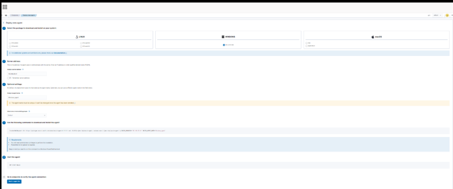
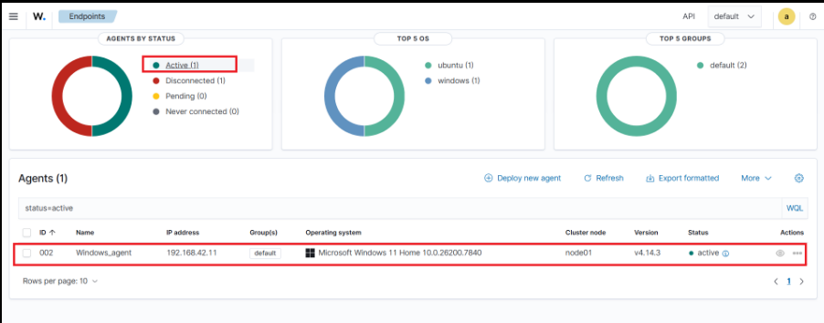
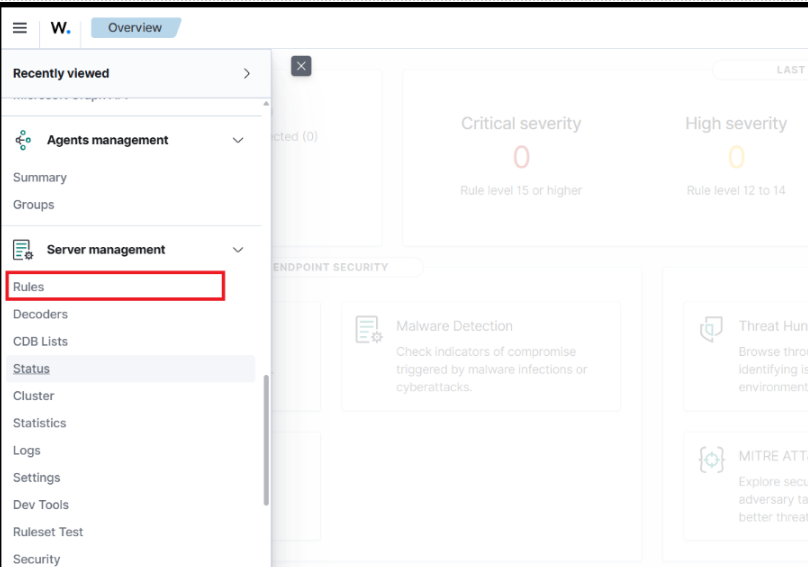
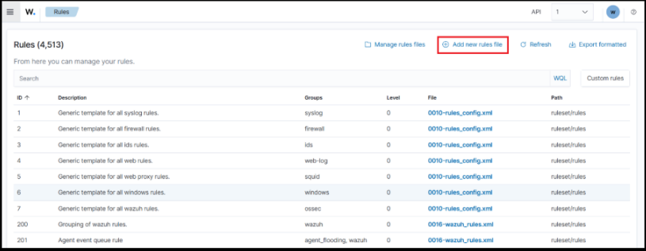
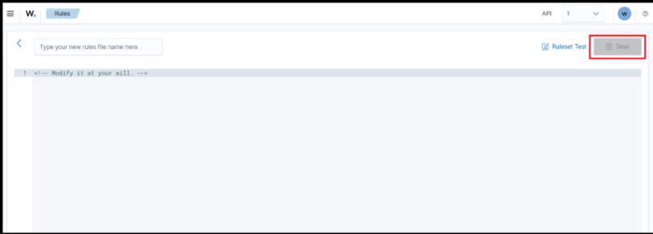
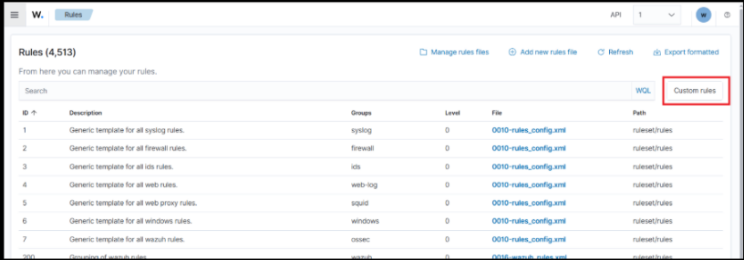
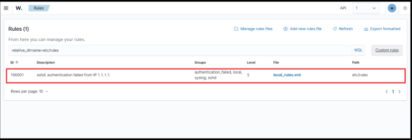

# Second use case of XDR

### Use Case:

Detect and Block Malware Execution (Suspicious Process)

### Real Time Scenario

- A user downloads a suspicious file from the internet.
- The user executes the file (malware.exe or suspicious script).
- The system starts a malicious process.
- The Wazuh agent detects the suspicious process.
- The Wazuh manager triggers an alert.
- Active Response automatically kills the malicious process.

### Step 1: Install Wazuh Agent on Windows

First we have to install the agent on your Windows machine.

Go to the Wazuh manager in the browser and navigate to the agent's section and click on add new agent and select Windows machine and fill all the required fields and follow the implementation process. In Wazuh browser you will see the steps same as below figure 1.



### Step 2: Verify Agent on Manager

Login to the wazuh manager in the browser if not login and nagivate to the agents section and verify that the agent is successfully installed or not. If it is successfully installed and connected with wazuh manager you can see that agent as active and it is same as below figure 2.



### Step 3: Configure Process Monitoring on Windows Agent

Now we configure the Windows agent to send running process information.

Open this file on Windows:

```
C:\Program Files (x86)\ossec-agent\ossec.conf
```

Add inside `<ossec_config>`:

```xml
<localfile>
  <log_format>command</log_format>
  <command>tasklist</command>
  <frequency>10</frequency>
</localfile>
```

Explanation:

| Tag | Meaning |
|-----|---------|
| localfile | log source configuration |
| log_format | command output |
| command | Windows process list command |
| frequency | run every 10 seconds |

#### What tasklist does

tasklist shows running processes in Windows.

Example output:

```
Image Name        PID
chrome.exe        4200
notepad.exe       3300
malware.exe       5200
```

The agent sends this to the manager.

#### Restart Windows Agent

Run:

```powershell
Restart-Service WazuhSvc
```

Or

You can restart wazuh agent from the services of windows machine.

### Step 4: Create Detection Rule on Manager

Login to the manager VM.

Open:

```
sudo nano /var/ossec/etc/rules/local_rules.xml
```

Add:

```xml
<group name="malware_detection">

<rule id="100500" level="12">
  <match>malware.exe</match>
  <description>Suspicious Malware Process Detected on Windows</description>
</rule>

</group>
```

Explanation:

| Tag | Meaning |
|-----|---------|
| `group` | organize rules |
| `rule` | detection logic |
| `id` | unique rule identifier |
| `level` | severity |
| `match` | keyword to detect |
| `description` | alert message |


Save file.

Then

Restart manager:

```
sudo systemctl restart wazuh-manager
```

Otherwise, we can add custom rule from the UI also, and it will look same as below images.

Step 1: login into wazuh in the browser and navigate to rules secton and it will look same as below figure 3.



Step 2: Then it will open something as below and then click on the add new rule button which is shown in the below figure 4.



Step 3: After clicking it will open an editor window, there we write our custom rule logic in xml format then click on save button which is shown in the below figure 5.



Step 4: After saving the custom rule you will be redirected one step back or you need to come one step back and then click on custom rule button which is shown in the below figure 6.



Step 5: After that you will find your custom rule which will be looks something same as below figure 7.



### Step 5: Configure Active Response

Open manager config:

```
sudo nano /var/ossec/etc/ossec.conf
```

Add:

```xml
<active-response>
  <command>kill-process</command>
  <location>local</location>
  <rules_id>100500</rules_id>
</active-response>
```

Explanation:

| Tag | Meaning |
|-----|---------|
| `active-response` | automated action |
| `command` | action to execute |
| `location` | where action runs |
| `rules_id` | trigger rule |


Meaning:

```
If rule 100600 triggers
kill the malicious process on the endpoint
```

Restart manager:

```
sudo systemctl restart wazuh-manager
```

### Step 6: Create Malware Simulation in Windows

Now we simulate malware.

Open Notepad.

Write:

```powershell
while($true){Start-Sleep 5}
```

Save as:

```
malware.ps1
```

Or easier:

Create a fake executable name.

Example:

```
Malware.exe
```

### Step 7: Run Malware Process

Open PowerShell in Administration mode and Run:

```powershell
.\malware.exe
```

#### Challenge

When I run the above command, I got the error something as given below:

```
Program 'malware.exe' failed to run: The specified executable is not a valid application for this OS platform.At line:1 char:1
+ .\malware.exe
+ ~~~~~~~~~~~~~.
At line:1 char:1
+ .\malware.exe
+ ~~~~~~~~~~~~~
    + CategoryInfo          : ResourceUnavailable: (:) [], ApplicationFailedException
    + FullyQualifiedErrorId : NativeCommandFailed
```

#### Solution

The error is because the specified executable is not a valid application for this OS platform.

Then I convert the PowerShell script into Executable by installing the PS2EXE module from the PowerShell Gallery and I installed by running the below command in PowerShell and I give the required permissions to successfully install.

Command:

```powershell
Install-Module -Name ps2exe -Scope CurrentUser
```

After instaling the ps2exe module, I again faced challenge while converting .ps to .exe. Then I followed the below approach to convert and run the malware.exe file in the windows machine.

##### Step 1: Find where the module is installed

Run:

```powershell
Get-InstalledModule ps2exe | Select-Object InstalledLocation
```

You will see something like:

```
InstalledLocation
-----------------
C:\Users\sai87\Documents\WindowsPowerShell\Modules\ps2exe\1.0.17
```

##### Step 2: Import module using full path

Use the location you got above.

Example:

```powershell
Import-Module "C:\Users\sai87\Documents\WindowsPowerShell\Modules\ps2exe\1.0.17\ps2exe.psm1"
```

Now verify:

```powershell
Get-Command Invoke-PS2EXE
```

If successful, it will display the command details.

##### Step 3: Convert your script

Navigate to your script location:

```
cd D:\Test
```

Run:

```powershell
Invoke-PS2EXE .\malware.ps1 .\malware.exe
```

This will create:

```
malware.exe
```

##### Step 4: Run and verify

Run:

```powershell
.\malware.exe
```

Check process:

```powershell
tasklist | findstr malware
```

Now it should appear like:

```
malware.exe   24560 Console   1   8000 K
```

### Step 8: Check alerts in the browser

#### Challenge

Now open Wazuh manager in the browser and navigate to the discover section to verify the generated alerts. But when I open discover section, I cannot see any generated alerts for running malware process.

#### Solution

Then I change my custom rule logic like:

```xml
<group name="malware_detection">

 <rule id="100500" level="12">
 <if_sid>530</if_sid>
 <match>malware.exe</match>
 <description>Suspicious Malware Process Detected on Windows</description>
 </rule>

</group>
```

Because rule 530 is commonly used as a base rule for command outputs.

Then I restart the Wazuh manager. After that change, I can see generated alerts based on custom rule in the discover section.


### Step 9: Check the active response

#### Challenge

When I observe the alert is triggering correctly, but the Active Response is not executed on the Windows agent. This usually happens because of location settings, missing agent configuration, or command mismatch in Wazuh. Then I check for the solution in different cases like:

##### Case 1: Problem in your Active Response configuration

Current configuration:

```xml
<active-response>
  <command>kill-process</command>
  <location>local</location>
  <rules_id>100500</rules_id>
</active-response>
```

location controls where the response runs.

##### Case 2: Active response must also exist in the Windows agent config

On the Windows agent, open:

```
C:\Program Files (x86)\ossec-agent\ossec.conf
```

Check for:

```xml
<active-response>
  <disabled>no</disabled>
</active-response>
```

This ensures the agent accepts active response commands from the manager.

##### Case 3: Verify the kill-process script exists on the agent

On Windows agent check:

```
C:\Program Files (x86)\ossec-agent\active-response\bin
```

You should see:

```
kill-process.exe
```

or

```
kill-process.cmd
```

If the script is missing, the response will never execute.

After verifying all this cases one by one, finally, I found that the kill-process.cmd file does not exist at specified location.

#### Solution

Then I followed the below approach step by step:

##### Step 1: Create the Active Response Script on Windows Agent

Go to the agent active-response directory:

```
C:\Program Files (x86)\ossec-agent\active-response\bin
```

Create a new file named:

```
kill-malware.cmd
```

##### File content

Open Notepad and paste:

```bat
@echo off
taskkill /IM malware.exe /F
```

Save the file.

This command will forcibly terminate the process named malware.exe.

##### Step 2: Verify file location

The folder should now contain something like:

```
C:\Program Files (x86)\ossec-agent\active-response\bin\
    kill-malware.cmd
```

##### Step 3: Configure command in Wazuh Manager

On the Wazuh manager, edit:

```
/var/ossec/etc/ossec.conf
```

Add or update this inside the wazuh manager config file:

```xml
<command>
  <name>kill-malware</name>
  <executable>kill-malware.cmd</executable>
  <timeout_allowed>no</timeout_allowed>
</command>
```

##### Step 4: Configure Active Response in Manager

Still in the manager ossec.conf, add or update:

```xml
<active-response>
  <command>kill-malware</command>
  <location>all</location>
  <rules_id>100500</rules_id>
</active-response>
```

Explanation:

| Field | Meaning |
|-------|---------|
| `command` | script name |
| `location` | run on agent machines |
| `rules_id` | trigger when rule `100500` fires |


##### Step 5: Restart Wazuh Manager

Run:

```
sudo systemctl restart wazuh-manager
```

For better response restart the wazuh agent in windows

##### Step 6: Test the setup

- Start the malware process:

```
malware.exe
```

- Wait about 10 seconds (because tasklist runs every 10 seconds).
- Wazuh should detect it and generate rule 100500.
- Active response will run:

```
taskkill /IM malware.exe /F
```

- The process should stop automatically.

##### Step 7: Confirm process stopped

Run:

```
tasklist | findstr malware
```

Expected result:

```
Empty
```

or

```
INFO: No tasks are running which match the specified criteria.
```

### Architecture of This Use Case

```
User runs malware.exe
        │
        ▼
Wazuh Agent detects new process
        │
        ▼
Log sent to Wazuh Manager
        │
        ▼
Custom Rule matches malicious process
        │
        ▼
Alert generated
        │
        ▼
Active Response triggered
        │
        ▼
Kill the process automatically
```
