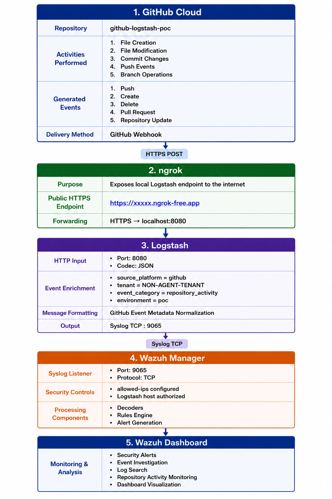

# Full Implementation Guide: GitHub Events → Webhook → ngrok → Logstash → Wazuh

## Is It Possible? Is It Recommended?

YES — It is possible.
YES — It is recommended for collecting cloud repository activity logs without installing Wazuh agents.

1. GitHub generates cloud events.
2. Webhook delivers those events.
3. Logstash acts as collector and processor.
4. Wazuh performs detection and alerting.

---

## Architecture Overview



---

## Phase 1 — Creating GitHub Repository

### Why We Create a Repository

GitHub generates events only when activities occur inside a repository. To test the integration with Logstash and Wazuh, a repository was created where different actions such as file creation, file modification, commits, and pushes could be performed. These activities generate GitHub events that can later be captured through webhooks and forwarded to the monitoring pipeline.

| **Activity** | **Event Generated** |
|---|---|
| Push Code | Push Event |
| Create Branch | Branch Event |
| Delete Branch | Branch Delete Event |
| Open Pull Request | Pull Request Event |
| Update Repository | Repository Event |

### Step 1: Login to GitHub

GitHub is a cloud-based source code management platform used for storing and managing repositories.

Open: `https://github.com`

Login using your GitHub account.

### Step 2: Create Repository

After logging in, a new repository was created to generate test events. This repository serves as the environment where different actions can be performed and observed. The generated events will later be sent to Logstash using GitHub Webhooks.

| **Field** | **Value** |
|---|---|
| Repository Name | github-logstash-poc |
| Visibility | Public |
| Initialize README | Yes |
```

Click: + → New Repository

Then click: Create Repository

Repository Created: github-logstash-poc

```
### Why This Repository?

The repository acts as the primary source of GitHub cloud events for this proof of concept. Any activity performed inside the repository generates event data that GitHub can send through a webhook. These events are later collected by Logstash and forwarded to Wazuh for analysis and alert generation.

Examples of activities performed: Create File, Update File, Delete File, Push Changes. All these actions generate GitHub events, which become the log source for this integration project.

---

## Phase 2 — Configure Webhook

### What is a Webhook?

A webhook is a mechanism that automatically sends event information from GitHub to another application whenever a specific activity occurs. It enables real-time communication between GitHub and external systems without manual intervention.

### Why Are We Using a Webhook?

We use a webhook to send GitHub repository events such as pushes, commits, and pull requests to Logstash. Whenever an activity occurs in the repository, GitHub automatically sends the event details as an HTTPS POST request to the configured webhook URL, allowing Logstash to receive and process the events in real time.

**Without a webhook:**
```

GitHub Repository

↓

Event Generated

↓

No Delivery Mechanism

↓

Logstash Never Receives Event

```
**With a webhook:**
```

GitHub Repository

↓

Event Generated

↓

Webhook Triggered

↓

HTTPS POST Request

↓

Logstash Endpoint

```
### Why Did We Use a Webhook in This POC?

In this implementation, Logstash was configured to receive GitHub events through an HTTP input plugin on port 8080. The GitHub webhook was configured to send repository events to the public ngrok URL, which forwards the requests to Logstash.

This enables real-time collection of GitHub activity logs without requiring any agent installation on GitHub.
```

User Action in GitHub

↓

GitHub Generates Event

↓

Webhook Triggered

↓

HTTPS POST Request Sent

↓

ngrok URL

↓

Logstash HTTP Input (Port 8080)

↓

Event Processing

↓

Wazuh Manager

```
---

## Phase 3 — ngrok Installation and Configuration

### What is ngrok?

ngrok is a tunneling tool that creates a public HTTPS URL and forwards incoming requests to a local application running on your machine. It allows external services such as GitHub to access applications that are running on localhost.

### Why Are We Using ngrok?

GitHub Webhooks require a publicly accessible URL, but Logstash is running locally on port 8080 and cannot be accessed directly from the internet. ngrok provides a public HTTPS URL that forwards GitHub webhook requests to Logstash, enabling real-time event delivery.

**Problem:** Logstash is listening on `localhost:8080`. GitHub cannot access localhost.

**Solution:**

```bash
ngrok http 8080
```

This command creates a public URL such as `https://nibble-stricken-smudgy.ngrok-free.dev` and automatically connects it to `http://localhost:8080`.

**Flow:**
```

GitHub Webhook

↓

[https://nibble-stricken-smudgy.ngrok-free.dev](https://nibble-stricken-smudgy.ngrok-free.dev)

↓

ngrok Tunnel

↓

localhost:8080

↓

Logstash HTTP Input

```
---

### Step 1: Check Snap Availability

```bash
snap version
```

Snap is Ubuntu's package management system used to install software packages. When `sudo apt install ngrok` was attempted, Ubuntu could not find the package and suggested `snap install ngrok`. Therefore Snap was used.

### Step 2: Install ngrok

```bash
sudo snap install ngrok
```

Expected Output:
```

ngrok (v3/stable) installed

```
### Step 3: Verify Installation

```bash
ngrok version
```

Expected Output:
```

ngrok version 3.39.6

```
### Step 4: Create ngrok Account

Open: `https://dashboard.ngrok.com`

Create an account.

### Step 5: Obtain Authtoken

Navigate:
```

Dashboard

↓

Getting Started

↓

Your Authtoken

```
ngrok provides a token similar to:
```

YOUR_NGROK_AUTHTOKEN

```
### Step 6: Configure ngrok Authentication

```bash
ngrok config add-authtoken YOUR_NGROK_AUTHTOKEN
```

Links the local ngrok installation to your ngrok account.

Expected Output:
```

Authtoken saved to configuration file

```
### Step 7: Verify Configuration

```bash
cat ~/.config/ngrok/ngrok.yml
```

Shows stored configuration.

### Step 8: Verify Logstash Port

Before starting ngrok, verify Logstash is listening:

```bash
sudo ss -tlnp | grep 8080
```

Expected:
```

LISTEN 0 128 *:8080 *:* users:(("java",pid=3795453,fd=112))

```
### Step 9: Start ngrok Tunnel

```bash
ngrok http 8080
```

Exposes the Logstash HTTP endpoint to GitHub.

---

### Challenge: ngrok Dependency

#### Current Approach

To receive GitHub webhook events, ngrok must be running continuously on the Logstash VM. When ngrok is started, it creates a public HTTPS URL. GitHub sends webhook events to this URL and ngrok forwards them to Logstash on `localhost:8080`.

#### Limitation Identified

In the current implementation, ngrok is started manually using `ngrok http 8080`. This requires an active terminal session. If the terminal is closed or the VM is restarted, the ngrok process stops, causing GitHub webhook deliveries to fail and preventing logs from reaching Logstash and Wazuh.

#### Improvement Implemented

As a permanent solution, ngrok can be configured as a Linux systemd service. In this approach, ngrok runs as a background service managed by the operating system instead of a terminal session.

**Benefits:**

1. No need to keep a terminal window open.
2. Automatically starts after VM reboot.
3. Automatically restarts if the process crashes.
4. Ensures continuous GitHub webhook connectivity.
5. Improves reliability and stability of the integration.

**Commands:**

Create service file:

```bash
sudo nano /etc/systemd/system/ngrok.service
```

Reload services:

```bash
sudo systemctl daemon-reload
```

Enable auto start:

```bash
sudo systemctl enable ngrok
```

Start service:

```bash
sudo systemctl start ngrok
```

Verify status:

```bash
sudo systemctl status ngrok
```

---

## Phase 4 — Logstash Configuration

```ruby
input {
  http {
    port => 8080
    codec => json
  }
}

filter {
  mutate {
    add_field => {
      "source_platform" => "github"
      "event_category"  => "repository_activity"
      "environment"     => "poc"
      "tenant"          => "NON-AGENT-TENANT"
    }
  }
  mutate {
    replace => {
      "message" => "GitHub event=%{[headers][x-github-event]} action=%{[action]} repo=%{[repository][full_name]} user=%{[sender][login]} branch=%{[ref]} tenant=NON-AGENT-TENANT"
    }
  }
}

output {
  file {
    path  => "/tmp/github-events.log"
    codec => rubydebug
  }
  syslog {
    host     => "<IP-address>"
    port     => 9065
    protocol => "tcp"
    facility => "local0"
    severity => "notice"
    appname  => "github"
    msgid    => "github-webhook"
  }
}
```

### Input Section

```ruby
input {
  http {
    port => 8080
    codec => json
  }
}
```

**Why HTTP Input?** GitHub Webhooks send events as HTTP POST requests. Therefore the HTTP input plugin is used to receive webhook data.

**Why Port 8080?** Port 8080 was configured as the listening port for Logstash. ngrok forwards all GitHub webhook requests to this port.

**Why `codec => json`?** GitHub sends webhook payloads in JSON format. The JSON codec automatically parses the incoming data into fields that Logstash can process.

### Filter Section

```ruby
filter {
  mutate {
    add_field => {
      "source_platform" => "github"
      "event_category"  => "repository_activity"
      "environment"     => "poc"
      "tenant"          => "NON-AGENT-TENANT"
    }
  }
}
```

**Why Mutate Filter?** The mutate filter is used to modify or enrich events in Logstash. In this implementation it was used to add custom fields to GitHub events before forwarding them to Wazuh.

**Why Was Mutate Used?** No complex parsing was required, no field extraction was required, and only additional metadata needed to be added. Therefore the mutate filter was sufficient.

**Why Not Use Grok?** Grok is mainly used for parsing and extracting data from unstructured text logs. In this implementation, GitHub already sends structured JSON data — no pattern matching or text extraction was required. Therefore using Grok would add unnecessary complexity.

### Added Fields

| **Field** | **Purpose** |
|---|---|
| `source_platform` | Identifies GitHub as the log source |
| `event_category` | Categorizes the event as repository activity |
| `environment` | Identifies the environment (POC) |
| `tenant` | Identifies the project or customer generating the event |

### Why Add Fields When GitHub Already Sends Metadata?

GitHub includes metadata inside the webhook payload. However, adding important fields explicitly in Logstash makes searching, filtering, dashboard creation, and rule development easier within Wazuh. These fields become easily searchable and help analysts quickly identify GitHub-related events.

### Tenant Field Explanation

`tenant = NON-AGENT-TENANT`

1. Identifies which project, customer, or environment generated the event.
2. Helps separate logs when multiple projects share the same monitoring platform.
3. Improves log organization and event tracking.

---

## Phase 5 — Logstash Output

```ruby
output {
  file {
    path  => "/tmp/github-events.log"
    codec => rubydebug
  }
  syslog {
    host     => "<IP-address>"
    port     => 9065
    protocol => "tcp"
    facility => "local0"
    severity => "notice"
    appname  => "github"
    msgid    => "github-webhook"
  }
}
```

### Why Output Section?

The output section defines where the processed GitHub events should be sent after Logstash receives and enriches them. In this implementation, events were sent to a local file for verification and to the Wazuh Manager through Syslog.

### File Output

```ruby
file {
  path  => "/tmp/github-events.log"
  codec => rubydebug
}
```

The file output was used to store received GitHub events locally. This helped verify that Logstash was successfully receiving and processing webhook events before forwarding them to Wazuh.

Verification command:

```bash
tail -f /tmp/github-events.log
```

Purpose: validate webhook event reception, troubleshoot parsing issues, and verify event enrichment before forwarding.

### Syslog Output

```ruby
syslog {
  host     => "<IP-address>"
  port     => 9065
  protocol => "tcp"
}
```

**Why Syslog Output?** The Syslog output plugin was used to forward processed GitHub events to the Wazuh Manager. Since GitHub and Logstash are not Wazuh agents, Syslog was used as the communication method between Logstash and Wazuh.

**Why Port 9065?** Port 9065 was configured as a dedicated Syslog listener on the Wazuh Manager. Logstash sends events to this port, and Wazuh receives and processes them.

**Why TCP?** TCP was selected because it provides reliable log delivery and ensures events reach Wazuh without packet loss.

---

## Phase 6 — Wazuh Manager Configuration

To enable Wazuh to receive and process GitHub events forwarded by Logstash, several configuration changes were made to the Wazuh Manager and Docker deployment.

### Wazuh Configuration

```xml
<global>
  <jsonout_output>yes</jsonout_output>
  <alerts_log>yes</alerts_log>
  <logall>yes</logall>
  <logall_json>yes</logall_json>
</global>

<remote>
  <connection>secure</connection>
  <port>1514</port>
  <protocol>tcp</protocol>
  <queue_size>131072</queue_size>
</remote>

<remote>
  <connection>syslog</connection>
  <port>9065</port>
  <protocol>tcp</protocol>
  <allowed-ips><IP-address></allowed-ips>
</remote>
```

### Why Was a Syslog Listener Added?

```xml
<remote>
  <connection>syslog</connection>
  <port>9065</port>
  <protocol>tcp</protocol>
</remote>
```

By default, Wazuh accepts events from Wazuh agents using the secure agent protocol on port 1514. However, GitHub and Logstash are not Wazuh agents. To receive events from Logstash, Wazuh was configured with a dedicated Syslog listener on TCP port 9065.

**Benefits:**

1. Allows Wazuh to receive external Syslog events.
2. Enables Logstash to forward GitHub events directly to Wazuh.
3. Provides a dedicated ingestion path for non-agent log sources.

### Why Was allowed-ips Configured?

```xml
<allowed-ips><IP-address></allowed-ips>
```

The `allowed-ips` setting restricts which systems are permitted to send Syslog events to Wazuh.

**Benefits:**

1. Prevents unauthorized systems from sending logs.
2. Reduces the risk of log injection attacks.
3. Ensures only the authorized Logstash server can communicate with Wazuh.

In this implementation: `<IP-address>` = Logstash Server.

### Why Was Docker Port 9065 Exposed?

```yaml
ports:
  - "9065:9065"
```

The Wazuh Manager is running inside a Docker container. Even though Wazuh is listening on port 9065 inside the container, external systems cannot access that port unless it is published to the host.

**Benefits:**

1. Makes the Syslog listener reachable from outside the container.
2. Allows Logstash to establish a connection with Wazuh.
3. Enables end-to-end communication between Logstash and Wazuh.

**Traffic Flow:**
```

Logstash

↓

Host Port 9065

↓

Container Port 9065

↓

Wazuh Manager

```
### Why Was Port 1514 Not Used?

Port 1514 is reserved for communication between Wazuh Agents and the Wazuh Manager using the Wazuh secure protocol. Logstash does not use the Wazuh agent protocol — Logstash sends Syslog events, not the secure Wazuh agent protocol.
```

Logstash → Port 1514 (no)

Logstash → Port 9065 Syslog (yes)

```
### Global Configuration

```xml
<jsonout_output>yes</jsonout_output>
<alerts_log>yes</alerts_log>
<logall>yes</logall>
<logall_json>yes</logall_json>
```

These settings enable Wazuh to store alerts and received events in both standard and JSON formats.

**Benefits:**

1. Simplifies troubleshooting.
2. Allows verification of received GitHub events.
3. Provides structured data for analysis and dashboard visualization.

---

## End-to-End Event Flow
```

GitHub Repository

↓

GitHub Webhook

↓

ngrok URL

↓

Logstash HTTP Input (8080)

↓

Event Enrichment

↓

Syslog Output (9065)

↓

Wazuh Syslog Listener

↓

Decoders

↓

Rules Engine

↓

Alerts

↓

Wazuh Dashboard

```
