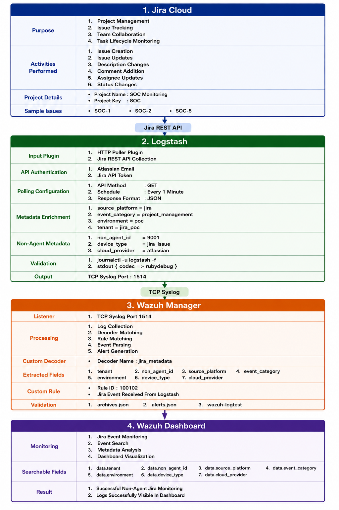
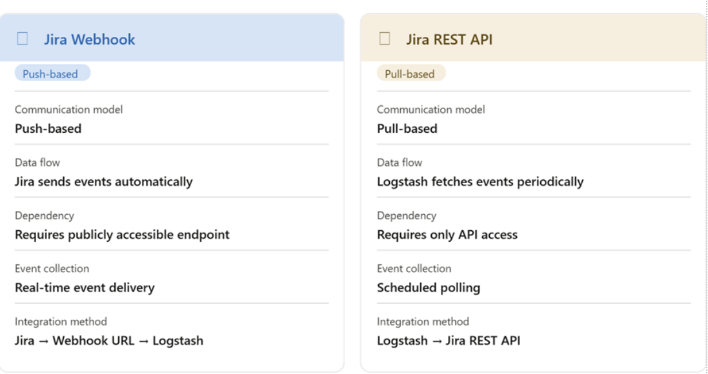
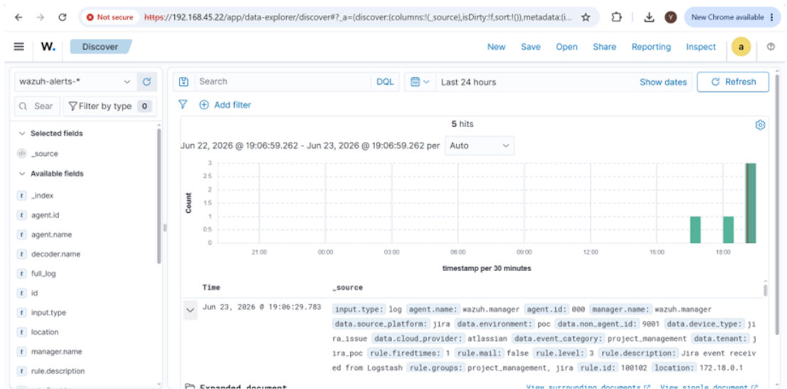

# Jira API → Logstash → Wazuh Integration for Non-Agent Monitoring

## Objective

The objective of this implementation is to integrate Jira Cloud as a Non-Agent log source and collect Jira issue activity through Jira REST APIs. The collected Jira data is processed using Logstash, enriched with custom metadata, forwarded to the Wazuh Manager through Syslog, decoded using custom Wazuh decoders, matched against custom rules, and finally visualized within the Wazuh Dashboard.

This implementation demonstrates how SaaS-based business applications can be monitored without installing Wazuh agents.

---

## Architecture Overview



---

## Understanding Jira Integration

### What is Jira?

Jira is a project management and issue tracking platform developed by Atlassian. It is widely used by software development teams to manage tasks, bugs, incidents, change requests, and project workflows. Organizations use Jira to track work items throughout the software development lifecycle.

Examples: Bug Tracking, Incident Management, Task Management, Agile Sprint Management, Change Requests.

Since Jira contains operational and business-critical information, monitoring Jira activity provides valuable visibility into organizational workflows.

### Why Jira Integration Was Required

The objective of the project was to demonstrate how non-agent data sources can be integrated with Wazuh. Unlike Linux or Windows systems, Jira is a SaaS platform and does not support Wazuh agent installation. Therefore Jira data was collected through REST APIs and processed using Logstash before being forwarded to Wazuh.

**Benefits:**

1. Non-Agent Monitoring
2. Centralized Visibility
3. Metadata Enrichment
4. Security Event Correlation
5. Multi-Tenant Monitoring

---

## Phase 1 — Atlassian Account Creation

### Purpose

Since Jira Cloud is a SaaS application hosted by Atlassian, an Atlassian account was required before creating Jira projects and generating Jira activities.

### Steps Performed

1. Open: `https://www.atlassian.com`
2. Click **Sign Up**
3. Register using email address
4. Verify email
5. Login to Atlassian Cloud

### Result

Successfully created Atlassian Cloud account and gained access to Jira Software.

---

## Phase 2 — Jira Project Creation

### Purpose

A Jira project was required to generate issue-related events that could later be collected through Jira APIs.

### Steps Performed

Created a Jira Software Project. Default project name was **My Software Team**, later renamed to **SOC Monitoring**. Project Key changed to **SOC**.

### Result

SOC Monitoring project was successfully created and became the primary source for Jira event generation.

---

## Phase 3 — Jira Issue Creation

### Purpose

Issues were required to generate Jira activity logs.

### Issues Created

| **Issue Key** | **Title** |
|---|---|
| SOC-1 | Task 1 |
| SOC-2 | Task 2 |
| SOC-5 | Jira API Integration |

### Result

Multiple Jira issues were available for testing API integration.

---

## Phase 4 — Jira Activity Generation

### Purpose

Simply creating issues is not sufficient. Actual activity must occur within Jira to generate meaningful events.

### Activities Performed

- **Description Added**: Testing Jira API integration with Logstash and Wazuh.
- **Comment Added**: Issue created for Jira API integration testing.
- **Assignee Updated**: Assigned issue to self.
- **Status Changed**: To Do → In Progress
- **Additional Comment Added**: Jira issue updated successfully for SOC monitoring testing.

### Why This Was Required

These actions generate Jira issue activity which can later be retrieved through Jira REST APIs.

### Result

Successfully generated Jira project activity.

---

## Phase 5 — Jira API Token Creation

### Purpose

Logstash requires authentication before accessing Jira Cloud APIs.

### Steps Performed
```

Profile Icon

↓

Manage Account

↓

Security

↓

API Tokens

↓

Create API Token

Token Name: logstash-jira

```
### Result

API token successfully generated and used for Logstash authentication.

---

## Phase 6 — Selecting Jira API Approach

### Why REST API Was Selected

The project objective was to implement a Non-Agent Integration using Logstash without exposing a public webhook endpoint. The REST API approach provided:

1. Direct integration with Logstash using the HTTP Poller plugin.
2. No requirement for a public webhook receiver.
3. Simple authentication using Atlassian Email and API Token.
4. Controlled polling and data collection.
5. Easier implementation within the Proof of Concept (POC) environment.



### Result

Jira REST API was selected as the primary integration mechanism for collecting Jira issue events and forwarding them to Wazuh through Logstash.

---

## Jira API Connectivity Validation

Before configuring Logstash, Jira API connectivity was validated manually to ensure successful communication between Jira Cloud and the local environment.

### Purpose

1. Verify Jira API accessibility.
2. Verify API token authentication.
3. Validate API response format.
4. Confirm Jira project data availability.

### Command Used

```bash
curl -u "jira_email:jira_api_token" \
  -H "Accept: application/json" \
  "https://your-domain.atlassian.net/rest/api/3/search/jql?jql=project=SOC"
```

### Response Received

The API returned an HTTP 200 success response along with JSON formatted issue data.

---

## Phase 7 — Jira Logstash Configuration

### Purpose

The Jira Logstash pipeline was developed to periodically connect to Jira Cloud APIs, retrieve issue information, enrich the data with custom metadata, and forward the processed events to the Wazuh Manager.

Configuration file:

```bash
sudo nano /etc/logstash/conf.d/jira.conf
```

Flow:
```

Jira Cloud

↓

HTTP Poller

↓

JSON Parsing

↓

Metadata Enrichment

↓

Message Standardization

↓

TCP Syslog Output

↓

Wazuh Manager

```
### Step 1 — Add Pipeline to pipelines.yml

```bash
sudo nano /etc/logstash/pipelines.yml
```

Add:

```yaml
- pipeline.id: jira-ingestion
  path.config: "/etc/logstash/conf.d/jira.conf"
```

---

### Complete Logstash Configuration File

```ruby
input {
  http_poller {
    urls => {
      jira => {
        method => get
        url => "https://yaseenkhan.atlassian.net/rest/api/3/search/jql?jql=project=SOC"
        headers => {
          Accept => "application/json"
        }
        user => "khanyaseenkhan2001@gmail.com"
        password => "<JIRA_API_TOKEN>"
      }
    }
    request_timeout => 60
    schedule => { every => "1m" }
    codec => "json"
  }
}

filter {
  mutate {
    add_field => {
      "source_platform" => "jira"
      "event_category"  => "project_management"
      "environment"     => "poc"
      "tenant"          => "jira_poc"
      "non_agent_id"    => "9001"
      "device_type"     => "jira_issue"
      "cloud_provider"  => "atlassian"
    }
  }
  mutate {
    replace => {
      "message" => "JiraActivity tenant=jira_poc non_agent_id=9001 source_platform=jira event_category=project_management environment=poc device_type=jira_issue cloud_provider=atlassian"
    }
  }
}

output {
  tcp {
    host => "100.80.13.125"
    port => 1514
    codec => line {
      format => "<134>%{message}"
    }
  }
  stdout {
    codec => rubydebug
  }
}
```

---

### Input Section Explanation

| **Parameter** | **Purpose** |
|---|---|
| `http_poller` | Used to fetch Jira data through REST APIs |
| `method => get` | Retrieves Jira issue information |
| `url` | Queries all issues belonging to the SOC project |
| `headers` | Requests JSON response format |
| `user` | Jira account email |
| `password` | Jira API token |
| `request_timeout => 60` | Waits up to 60 seconds for Jira response |
| `schedule => every 1m` | Polls Jira every minute |
| `codec => json` | Automatically parses JSON response |

### Filter Section Explanation

The original Jira response does not contain SOC-specific context. Therefore custom metadata was added.

| **Field** | **Purpose** |
|---|---|
| `source_platform` | Identifies Jira as the source platform |
| `event_category` | Categorizes the event as a Project Management activity |
| `tenant` | Used for tenant mapping and event segregation |
| `environment` | Identifies the Proof of Concept (POC) environment |
| `non_agent_id` | Unique identifier assigned to the non-agent source |
| `device_type` | Identifies the source as a Jira Issue |
| `cloud_provider` | Identifies Atlassian Cloud as the service provider |

### Message Standardization

```ruby
mutate {
  replace => {
    "message" => "JiraActivity tenant=jira_poc non_agent_id=9001 source_platform=jira event_category=project_management environment=poc device_type=jira_issue cloud_provider=atlassian"
  }
}
```

**Why This Was Required:** Initially Wazuh was receiving raw Jira JSON and custom decoders could not easily extract the required fields. To simplify parsing, a structured message format was created.

Example standardized message:
```

JiraActivity tenant=jira_poc non_agent_id=9001 source_platform=jira event_category=project_management environment=poc device_type=jira_issue cloud_provider=atlassian

```
### Verify Logstash is Receiving Jira Events

```bash
journalctl -u logstash -f
```

Displays live Logstash service logs.

---

## Phase 8 — Jira Decoder Development

After Logstash successfully collected Jira events and forwarded them to Wazuh, the next task was to extract individual metadata fields from the incoming Jira logs.

### Event Flow
```

Jira Cloud

↓

Logstash

↓

Wazuh Manager

```
Communication between Jira, Logstash, and Wazuh was successful. However, Wazuh stored the complete event as a plain text message and did not extract metadata fields individually.

**Example Event:**
```

JiraActivity tenant=jira_poc non_agent_id=9001 source_platform=jira event_category=project_management environment=poc device_type=jira_issue cloud_provider=atlassian

```
Fields such as `tenant`, `non_agent_id`, `source_platform`, `event_category`, `environment`, `device_type`, and `cloud_provider` were not searchable individually. Therefore a custom Wazuh decoder was required.

### Step 1 — Access Wazuh Manager Container

```bash
docker exec -it single-node-wazuh.manager-1 bash
```

### Step 2 — Add Jira Decoder

Decoder file: `/var/ossec/etc/decoders/local_decoder.xml`

Append the decoder:

```bash
cat >> /var/ossec/etc/decoders/local_decoder.xml << 'EOF'
<decoder name="jira_metadata">
  <prematch>tenant=jira_poc</prematch>
  <regex>tenant=(\S+) non_agent_id=(\S+) source_platform=(\S+) event_category=(\S+) environment=(\S+) device_type=(\S+) cloud_provider=(\S+)</regex>
  <order>tenant, non_agent_id, source_platform, event_category, environment, device_type, cloud_provider</order>
</decoder>
EOF
```

### Step 3 — Verify Decoder

```bash
cat /var/ossec/etc/decoders/local_decoder.xml
```

### Step 4 — Restart Wazuh Manager

```bash
/var/ossec/bin/wazuh-control restart
```

### Step 5 — Test Decoder

```bash
/var/ossec/bin/wazuh-logtest
```

Paste the following test event:
```

JiraActivity tenant=jira_poc non_agent_id=9001 source_platform=jira event_category=project_management environment=poc device_type=jira_issue cloud_provider=atlassian

```
Expected output:
```

Phase 1: Completed pre-decoding

Phase 2: Completed decoding

name: jira_metadata

tenant: jira_poc

non_agent_id: 9001

source_platform: jira

event_category: project_management

environment: poc

device_type: jira_issue

cloud_provider: atlassian

```
### Decoder Result

The decoder successfully extracted all seven Jira metadata fields, confirming the decoder was functioning correctly.

---

## Phase 9 — Jira Rule Development

### Problem Identified

Although the decoder successfully extracted metadata fields, Jira events were not appearing in the Wazuh Dashboard. Investigation showed that decoder extraction was working but alerts were not being generated.

Reason: A decoder only parses logs. A decoder does not create alerts. A Wazuh rule is required to generate alerts.

### Step 1 — Check Existing Rules

```bash
grep -Ri "jira" /var/ossec/etc/rules/
```

Result: No Jira rule was found.

### Step 2 — Add Jira Rule

Rule file: `/var/ossec/etc/rules/local_rules.xml`

Append the Jira rule:

```bash
cat >> /var/ossec/etc/rules/local_rules.xml << 'EOF'
<group name="project_management,jira,">
  <rule id="100102" level="3">
    <decoded_as>jira_metadata</decoded_as>
    <description>Jira event received from Logstash</description>
  </rule>
</group>
EOF
```

### Step 3 — Verify Rule

```bash
cat /var/ossec/etc/rules/local_rules.xml
```

### Step 4 — Restart Wazuh

```bash
/var/ossec/bin/wazuh-control restart
```

### Rule Explanation

| **Element** | **Value** | **Purpose** |
|---|---|---|
| `id` | `100102` | Unique identifier for Jira events |
| `level` | `3` | Generates a low-severity informational alert |
| `decoded_as` | `jira_metadata` | Rule triggers only when the Jira decoder successfully matches the log |

### Step 5 — Verify Alerts

```bash
tail -f /var/ossec/logs/alerts/alerts.json
```

Jira events started appearing successfully.

### Dashboard Verification



Open Wazuh Dashboard: `https://<IP-address>`

Search:
```

rule.id:100102

```
Index: `wazuh-alerts-*`

**Verified Fields:**
```

data.tenant

data.non_agent_id

data.source_platform

data.event_category

data.environment

data.device_type

data.cloud_provider

```
---

## Final Result

1. Logstash forwarded Jira events to Wazuh successfully.
2. Custom decoder extracted all Jira metadata fields.
3. Custom rule generated Wazuh alerts.
4. Alerts became visible in `alerts.json`.
5. Jira events appeared in the Wazuh Dashboard.
6. All metadata fields became searchable and filterable.

The Jira Non-Agent Integration was completed successfully. Jira events were collected through the Jira REST API, processed by Logstash, parsed using custom Wazuh decoders and rules, and visualized successfully in the Wazuh Dashboard.
