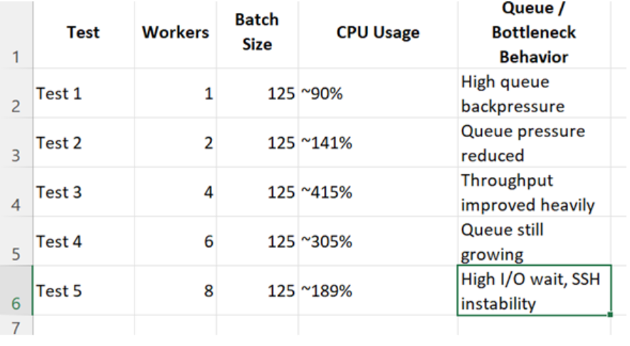

# Complete Logstash Pipeline Workers & Batch Size Performance Testing

## Objective

This task was performed to understand how Logstash behaves under heavy realtime SOC log processing conditions. The main objective was to test Logstash pipeline performance by tuning important processing parameters such as:

1. Pipeline workers
2. Batch size
3. Persistent queue behavior
4. CPU utilization
5. Queue backpressure
6. JVM heap usage
7. Pipeline bottlenecks

The testing was done using continuously generated realtime logs sent through Filebeat into Logstash multi-pipeline architecture.

---

## Step 1 — Understanding Pipeline Workers

### What Are Pipeline Workers

Pipeline workers are parallel processing threads inside Logstash. These workers are responsible for processing events through filters and outputs. Each worker processes batches of events independently. Increasing workers allows Logstash to process more events simultaneously.

Example:
```

pipeline.workers: 4

```
This means:

1. 4 parallel worker threads process events
2. Workload is distributed across multiple CPU cores
3. Throughput increases

### Why We Used Pipeline Workers in Logstash

We used pipeline workers because under heavy realtime log ingestion:

1. A single worker becomes slow
2. Queues start increasing
3. Bottlenecks occur

By increasing workers:

1. Processing speed improves
2. Queue pressure reduces
3. Pipelines become more scalable

However, very high worker counts can also create:

1. CPU saturation
2. Thread contention
3. VM instability

So worker tuning was required to identify the best balance between throughput and system stability.

---

## Step 2 — Understanding Batch Size

### What is Batch Size

Batch size defines how many events a worker processes at one time before sending them to outputs.

Example:
```

pipeline.batch.size: 125

```
Instead of processing:
```

1 event → output

```
Logstash processes:
```

125 events → output together

```
This improves processing efficiency.

### Why We Used Batch Size Tuning

Batch size directly affects: throughput, heap memory usage, garbage collection, and CPU efficiency.

**Small batch sizes:**

1. Workers process very small event groups
2. CPU overhead increases
3. Throughput becomes inefficient

**Very large batch sizes:**

1. Increase heap memory usage
2. Increase JVM garbage collection
3. Create latency spikes

Balanced tuning is required for stable performance. Proper batch tuning helps:

1. Improve throughput
2. Stabilize memory usage
3. Reduce pipeline latency
4. Improve processing efficiency

The goal was to identify the most stable batch size for continuous SOC log processing.

---

## Realtime Log Generation Used During Testing

During performance testing, realtime logs were generated continuously to simulate SOC traffic. The purpose was: stress testing, throughput validation, queue pressure simulation, and realtime ingestion testing.

### Realtime Log Generation Command

```bash
nohup bash -c '
while true; do
  echo "ERROR: DB failed $RANDOM" >> /home/vahandjango/test_eps.log
  echo "INFO: session started from <IP-address>.$((RANDOM%255))" >> /home/vahandjango/test_eps.log
  echo "DEBUG: connection attempt from <IP-address>.$((RANDOM%255))" >> /home/vahandjango/test_eps.log
  echo "ERROR: auth failed from <IP-address>.$((RANDOM%255))" >> /home/vahandjango/test_eps.log
  sleep 0.5
done
' &
```

### Why nohup Was Used

`nohup` was used so the log generation process continues even after terminal disconnect. This helped maintain:

1. Continuous EPS generation
2. Uninterrupted pipeline stress testing
3. Stable realtime traffic simulation

### Purpose of Generated Logs

The generated logs simulated: failed authentication attempts, application errors, debug activity, and user session events. This created realistic SOC-style continuous ingestion traffic.

### Log Flow During Testing
```

Generated Logs (realtime)

↓

Filebeat Monitoring

↓

Logstash Input

↓

Pipeline Processing

↓

Output & Monitoring

```
### Filebeat Role During Testing

Filebeat continuously monitored `/home/vahandjango/test_eps.log` and forwarded logs to Logstash in realtime. Purpose: lightweight log shipping, realtime forwarding, and continuous ingestion testing.

### Logstash Configuration File Used for Tuning

All tuning changes were performed inside:
```

/etc/logstash/pipelines.yml

```
### Monitoring Performed During Testing

During testing the following were continuously monitored:

1. CPU utilization
2. Memory usage
3. Queue behavior
4. JVM heap
5. Garbage collection
6. Throughput
7. SSH responsiveness
8. Pipeline stability

### Commands Used for Monitoring

**CPU & Resource Monitoring:**

```bash
top
```

Purpose: monitor realtime CPU utilization, observe Logstash process load, detect system saturation.

**Advanced Resource Monitoring:**

```bash
htop
```

Purpose: monitor per-core CPU utilization, visualize worker impact, monitor process-level resource consumption.

### What Was Observed in top Command

While increasing worker count:

1. Logstash CPU utilization increased heavily
2. Worker threads consumed multiple CPU cores
3. High worker values caused resource saturation

---

## Phase 1 — Pipeline Workers Testing

In this phase batch size was kept fixed at 125 and only worker count was changed.

### Workers = 1
```

pipeline.workers: 1

```
Tested first to understand how Logstash behaves with minimal parallel processing. Only one worker thread processed all incoming logs.

**Results observed:**

1. CPU utilization remained around ~90%
2. Queue buildup increased rapidly
3. High backpressure observed
4. Event processing became delayed
5. Pipeline throughput remained low

**Meaning:** One worker was unable to handle continuous realtime SOC traffic efficiently.

---

### Workers = 2
```

pipeline.workers: 2

```
Two worker threads processed logs simultaneously.

**Results observed:**

1. CPU utilization increased to ~141%
2. Queue pressure reduced
3. Pipeline responsiveness improved
4. Event throughput increased
5. Processing delay reduced

**Meaning:** Adding an additional worker improved processing speed and reduced backlog pressure.

---

### Workers = 4
```

pipeline.workers: 4

```
Four worker threads processed logs in parallel across multiple CPU cores.

**Results observed:**

1. Stable throughput achieved
2. Minimal queue buildup observed
3. Pipeline processing became smooth
4. CPU utilization reached ~415%

**Meaning:** Linux calculates CPU usage per core. 415% means Logstash was heavily utilizing around 4 CPU cores simultaneously. This configuration achieved the best balance between throughput and system stability.

### Why CPU Became 415% When Workers = 4

When `pipeline.workers: 4` was set, Logstash created 4 parallel worker threads where each worker used CPU independently.

In Linux, CPU percentage is calculated per core and multicore systems can exceed 100%:

- 100% = one full CPU core utilized
- 400% = four cores heavily utilized

So 415% CPU does **not** mean an error. It means:

1. Logstash was using around 4 CPU cores heavily
2. Throughput increased
3. Workers were processing events aggressively

That is why queue pressure reduced and pipelines processed logs faster. However, higher values caused context switching, I/O wait, SSH lag, and VM instability, which is why 4 workers became the balanced value.

---

### Workers = 6
```

pipeline.workers: 6

```
**Results observed:**

1. CPU overhead increased to ~305%
2. Queue still continued increasing
3. Thread contention increased
4. Performance improvement became minimal
5. Pipeline efficiency reduced

**Meaning:** Additional workers started creating processing overhead instead of improving throughput significantly.

---

### Workers = 8
```

pipeline.workers: 8

```
**Results observed:**

1. CPU utilization fluctuated around ~189%
2. High I/O wait observed
3. SSH lag started occurring
4. VM responsiveness reduced
5. Excessive context switching observed

**Meaning:** Too many workers overloaded VM resources and reduced overall system stability. Increasing workers further did not improve throughput efficiently.

---

### Conclusion of Worker Testing

Final optimized configuration selected:
```

pipeline.workers: 4

```
Reason:

1. Best throughput achieved
2. Stable pipeline processing
3. Reduced queue pressure
4. Balanced CPU utilization
5. Better VM stability

---

## Phase 2 — Batch Size Testing


After selecting `pipeline.workers: 4`, batch size testing was performed.

### Key Concepts

**What is JVM Heap Usage?**

JVM Heap Usage refers to the memory consumed internally by the Logstash Java Virtual Machine during event processing. It is used for temporary event storage, batching, filtering, and pipeline execution. Higher heap usage usually indicates larger memory allocation during heavy log processing. Excessive heap pressure can increase garbage collection activity and affect pipeline performance stability.

Higher batch sizes increase memory allocation and heap pressure.

**What is GC Behavior?**

GC (Garbage Collection) is the JVM memory cleanup process that automatically removes unused objects and frees heap memory. It helps maintain stable memory utilization during continuous event processing. High GC activity usually indicates heavy memory pressure or inefficient memory handling inside the pipeline. Excessive GC can reduce throughput and impact Logstash performance stability.

---

### Batch Size = 1
```

pipeline.batch.size: 1

```
**Results observed:**

1. Heap usage remained around ~22%
2. Very low garbage collection observed
3. CPU utilization increased to ~406%
4. Processing overhead increased heavily
5. Pipeline throughput remained inefficient

**Meaning:** Very small batches reduced memory usage but created excessive CPU overhead because workers processed events individually.

---

### Batch Size = 125
```

pipeline.batch.size: 125

```
125 is Logstash's commonly recommended balanced value.

**Results observed:**

1. Heap usage stabilized around ~41%
2. Garbage collection remained acceptable
3. CPU utilization reduced to ~106%
4. Processing throughput improved
5. Pipeline responsiveness became stable

**Meaning:** 125 batch size achieved the best balance between memory usage, CPU utilization, throughput, and pipeline stability.

---

### Batch Size = 500
```

pipeline.batch.size: 500

```
**Results observed:**

1. Heap usage increased to ~54%
2. Garbage collection activity increased
3. CPU spikes reached ~659%
4. Memory pressure increased
5. Pipeline instability started appearing

**Meaning:** Large batches consumed more JVM memory and increased garbage collection overhead significantly.

---

### Batch Size = 1000
```

pipeline.batch.size: 1000

```
**Results observed:**

1. Heap usage fluctuated around ~24%
2. Garbage collection reduced
3. CPU utilization dropped near ~7%
4. Pipeline behavior became inconsistent
5. Processing latency increased

**Meaning:** Very large batches caused delayed processing behavior and unstable batching efficiency.

---

## Final Optimized Configuration

After complete performance testing, the final stable configuration selected:
```

pipeline.workers: 4

pipeline.batch.size: 125

queue.type: persisted

```
Reason:

1. Stable throughput achieved
2. Balanced CPU utilization maintained
3. Controlled heap memory behavior
4. Acceptable garbage collection activity
5. Reduced queue backpressure
6. Better realtime SOC pipeline stability
