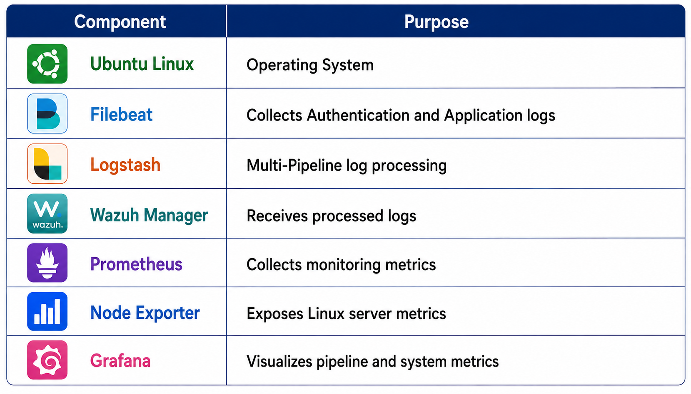
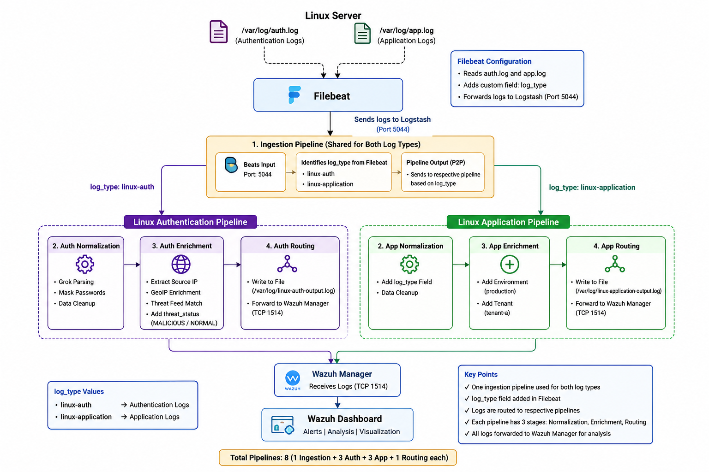
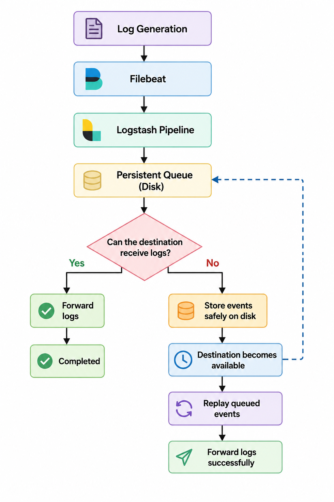
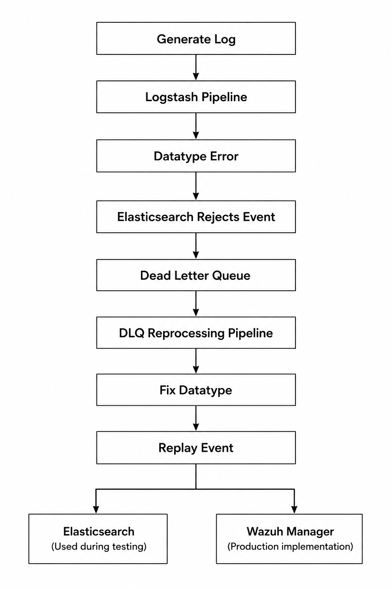
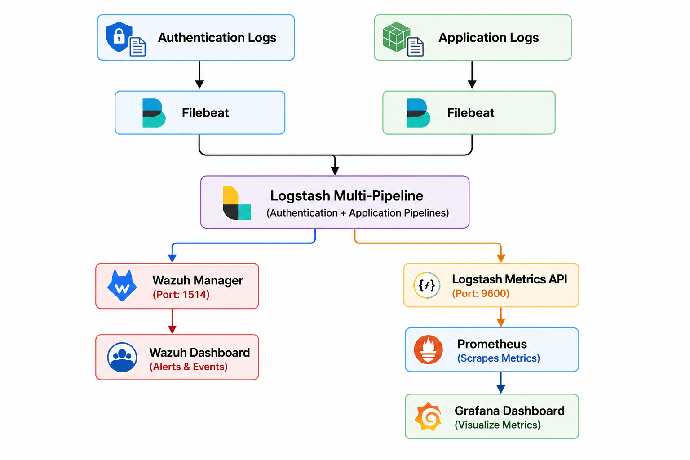
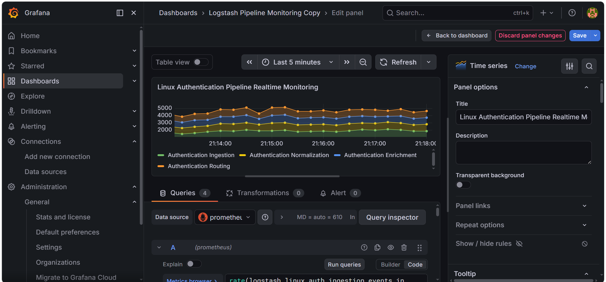
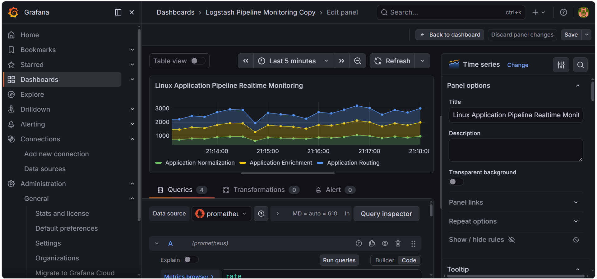

# Complete Step-by-Step SOC Logstash Multi-Pipeline Architecture Implementation Guide

---

## Introduction — Project Objective

The objective of this project is to implement a scalable Logstash Multi-Pipeline architecture that processes different categories of Linux logs independently. Instead of sending all logs through a single processing flow, Authentication logs and Application logs are separated into dedicated pipelines, allowing independent processing, monitoring, troubleshooting, and future scalability.

The architecture follows a Pipeline-to-Pipeline (P2P) approach, where each log type passes through four processing stages: Ingestion, Normalization, Enrichment, and Routing. This modular design improves maintainability, reduces processing complexity, and enables efficient monitoring using Grafana and Prometheus.

## Why Multi-Pipeline?

In the previous implementation, all Linux logs were processed through a common Pipeline-to-Pipeline architecture. Although functional, processing multiple log types through the same pipeline made monitoring and troubleshooting difficult. To overcome this limitation, the architecture was redesigned by separating Authentication logs and Application logs into dedicated processing pipelines.

**This approach provides the following benefits:**

1. Independent processing for each log category.
2. Better scalability for future log sources.
3. Easier troubleshooting and maintenance.
4. Improved monitoring and visualization.
5. Pipeline isolation, preventing one log type from affecting another.

## Multi-Pipeline Architecture Overview

The implementation consists of eight independent Logstash pipelines, divided into two groups.

**Linux Authentication Pipelines**
1. Authentication Ingestion
2. Authentication Normalization
3. Authentication Enrichment
4. Authentication Routing

**Linux Application Pipelines**
1. Application Ingestion
2. Application Normalization
3. Application Enrichment
4. Application Routing

**Each group processes only its corresponding log type from Filebeat.**

## Technologies Used



**End-to-End Architecture**



**End-to-End Multi-Pipeline (8 Pipeline) Architecture**

---

## Workflow

The complete workflow of the Multi-Pipeline architecture is illustrated below. Authentication and Application logs are collected separately by Filebeat, routed to dedicated Logstash pipelines based on the log_type field, processed through multiple Pipeline-to-Pipeline (P2P) stages, and finally forwarded to the Wazuh Manager for analysis and monitoring.

## Workflow Steps

1. Filebeat continuously monitors the configured Linux Authentication (auth.log) and Linux Application (app.log) log files.

2. Each incoming log is tagged with a custom log_type field: linux-auth and linux-application.

3. Filebeat forwards all collected logs to the Logstash Beats input on Port 5044.

4. The shared Logstash Ingestion Pipeline receives all incoming logs.

5. Based on the value of the log_type field, the Ingestion Pipeline routes logs to the appropriate processing pipeline: linux-auth → Linux Authentication Pipeline and linux-application → Linux Application Pipeline.

6. The Linux Authentication Pipeline processes Authentication logs through the following stages: Ingestion, Normalization, Enrichment, Routing.

7. The Linux Application Pipeline processes Application logs through the following stages: Ingestion, Normalization, Enrichment, Routing.

8. After processing, both pipelines forward the logs to the Wazuh Manager using the configured TCP output.

9. The Wazuh Manager analyzes the incoming logs, applies decoders and rules, and generates alerts whenever rule conditions are satisfied.

10. Prometheus collects Logstash and server metrics, while Grafana visualizes the health, performance, and status of all pipelines in real time.

**Next Step**
The next step is to configure Filebeat to collect Linux Authentication and Linux Application logs and assign the appropriate log_type field. This field is later used by the shared Logstash Ingestion Pipeline to route each log to its respective Multi-Pipeline processing flow.

---

## Step 1 — Filebeat Configuration

### Objective

The first step in implementing the Multi-Pipeline architecture was to configure **Filebeat** to collect Linux Authentication and Linux Application logs separately. Filebeat continuously monitors the configured log files and forwards them to Logstash for further processing. To enable log segregation, a custom field (log_type) was added to each input. This field is later used by the Logstash Ingestion Pipeline to identify the log category and route logs to their respective processing pipelines.

## Why Filebeat?

Filebeat is a lightweight log shipper that continuously monitors log files and forwards log events to Logstash with minimal system overhead. In this implementation, Filebeat was responsible for:
1. Collecting Linux Authentication logs
2. Collecting Linux Application logs
3. Tagging each log with its corresponding log_type
4. Forwarding all logs to Logstash over the Beats protocol

## Filebeat Configuration

The following configuration was added to the filebeat.yml file.

```
/etc/filebeat/filebeat.yml
```

```yaml
filebeat.inputs:
- type: log
  enabled: true
  paths:
  - /home/vahandjango/auth.log
  fields:
    log_type: "linux-auth"
  fields_under_root: false

- type: log
  enabled: true
  paths:
  - /home/vahandjango/app.log
  fields:
    log_type: "linux-application"
  fields_under_root: false

output.logstash:
  hosts: ["192.168.35.37:5044"]

logging.level: info
```

## Configuration Summary

The configuration creates two separate Filebeat inputs:

1. **Authentication Log Input** — Monitors `/home/vahandjango/auth.log` and assigns the linux-auth log type.
2. **Application Log Input** — Monitors `/home/vahandjango/app.log` and assigns the linux-application log type.

Both log streams are forwarded to the shared Logstash Beats input on **Port 5044**. The custom log_type field plays a key role in the Multi-Pipeline architecture, as it allows the Logstash Ingestion Pipeline to identify and route each log to the appropriate Authentication or Application processing pipeline.

---

## Configuration Testing

After configuring Filebeat, the configuration was validated by generating Authentication and Application logs simultaneously. Two separate terminal sessions were opened on the Linux server to simulate real-time log generation.

**Terminal 1:**

```bash
while true; do
echo "ERROR: Application failed $RANDOM" >> /home/vahandjango/app.log
echo "INFO: User login successful" >> /home/vahandjango/auth.log
sleep 1
done &
```

**Terminal 2:**

```bash
while true; do
echo "ERROR: Application failed $RANDOM" >> /home/vahandjango/app.log
echo "INFO: User login successful" >> /home/vahandjango/app.log
sleep 1
done &
```

1. **Terminal 1** was used to generate Linux Authentication logs by writing events to the auth.log file.
2. **Terminal 2** was used to generate Linux Application logs by writing events to the app.log file.

This approach ensured that both log streams were generated concurrently and allowed the complete Multi-Pipeline architecture to be verified under real-time conditions.

**Note:** *(Insert the log generation commands used during implementation here.)*

---

## Validation

The following validations were successfully completed after configuring Filebeat:

1. Authentication logs were successfully collected from `/home/vahandjango/auth.log`.
2. Application logs were successfully collected from `/home/vahandjango/app.log`.
3. Each log type was tagged with its corresponding log_type field.
4. Both log streams were successfully forwarded to the shared Logstash Ingestion Pipeline on **Port 5044**.
5. Log events were successfully prepared for routing into their respective Authentication and Application processing pipelines.

**Important Implementation Note**

During implementation, it was observed that the field names and field values must remain consistent across the entire logging pipeline.

The log_type field configured in **Filebeat** must exactly match the field referenced in the **Logstash filters** and any corresponding **Wazuh rules or decoders** that depend on this value.

```
For example:
Filebeat:  fields: log_type: "linux-auth"
Logstash:  if [fields][log_type] == "linux-auth"
```

If the field name or value is changed in one component without updating the others, log routing, filtering, and rule matching will fail, preventing logs from reaching the intended processing pipeline.

**Next Step**
After configuring Filebeat, the next step was to register all eight Logstash pipelines in the pipelines.yml file and enable Persistent Queue (PQ) for each pipeline to support reliable and independent log processing.

---

## Step 2 — Logstash Multi-Pipeline Registration

### Objective

After successfully configuring Filebeat to collect and forward Authentication and Application logs, the next step was to register multiple Logstash pipelines. Instead of processing all incoming logs through a single pipeline, separate Pipeline-to-Pipeline (P2P) processing flows were created for Linux Authentication and Linux Application logs.

Each log category was assigned four dedicated processing stages:
1. Ingestion
2. Normalization
3. Enrichment
4. Routing

This resulted in a total of eight independent pipelines, enabling modular log processing, easier maintenance, and improved scalability.

## Why Multi-Pipeline?

Initially, all logs were processed using a common processing flow. As different log sources increased, processing every log through the same pipeline made monitoring and troubleshooting difficult.

To overcome this limitation, the architecture was redesigned by creating dedicated pipelines for each log category. The Multi-Pipeline architecture provides the following benefits:
1. Independent processing of Authentication and Application logs
2. Better scalability for future log sources
3. Easier troubleshooting and maintenance
4. Improved monitoring of individual pipelines
5. Reduced impact of failures between unrelated pipelines

## Pipeline Registration

The following pipeline definitions were added to the pipelines.yml configuration file.

```
/etc/logstash/pipelines.yml
```

```yaml
## Linux Authentication Pipelines
- pipeline.id: linux-auth-ingestion
  path.config: "/etc/logstash/conf.d/linux-auth/ingestion.conf"
  queue.type: persisted
  queue.max_bytes: 1gb
  pipeline.workers: 2
  pipeline.batch.size: 125

- pipeline.id: linux-auth-normalization
  path.config: "/etc/logstash/conf.d/linux-auth/normalization.conf"
  queue.type: persisted
  queue.max_bytes: 1gb
  pipeline.workers: 2
  pipeline.batch.size: 125

- pipeline.id: linux-auth-enrichment
  path.config: "/etc/logstash/conf.d/linux-auth/enrichment.conf"
  queue.type: persisted
  queue.max_bytes: 1gb
  pipeline.workers: 2
  pipeline.batch.size: 125

- pipeline.id: linux-auth-routing
  path.config: "/etc/logstash/conf.d/linux-auth/routing.conf"
  queue.type: persisted
  queue.max_bytes: 1gb
  pipeline.workers: 2
  pipeline.batch.size: 125

## Linux Application Pipelines
- pipeline.id: linux-application-ingestion
  path.config: "/etc/logstash/conf.d/linux-application/ingestion.conf"
  queue.type: persisted
  queue.max_bytes: 1gb
  pipeline.workers: 2
  pipeline.batch.size: 125

- pipeline.id: linux-application-normalization
  path.config: "/etc/logstash/conf.d/linux-application/normalization.conf"
  queue.type: persisted
  queue.max_bytes: 1gb
  pipeline.workers: 2
  pipeline.batch.size: 125

- pipeline.id: linux-application-enrichment
  path.config: "/etc/logstash/conf.d/linux-application/enrichment.conf"
  queue.type: persisted
  queue.max_bytes: 1gb
  pipeline.workers: 2
  pipeline.batch.size: 125

- pipeline.id: linux-application-routing
  path.config: "/etc/logstash/conf.d/linux-application/routing.conf"
  queue.type: persisted
  queue.max_bytes: 1gb
  pipeline.workers: 2
  pipeline.batch.size: 125
```

**Persistent Queue Configuration**
Each pipeline was configured with a Persistent Queue (PQ). This allows Logstash to temporarily store events on disk if downstream components become unavailable or processing is delayed. Enabling Persistent Queue improves pipeline reliability, prevents data loss, and supports recovery after unexpected failures or service restarts.

## Verification

After updating the pipelines.yml configuration, the Logstash service was restarted to register all newly created pipelines. The pipeline status was verified using the Logstash Monitoring API.

```bash
curl -s localhost:9600/_node/pipelines?pretty
```

The output confirmed that all eight pipelines were successfully registered and running.

**Next Step**
After registering all pipelines, the next step was to configure the Linux Authentication Ingestion Pipeline, which receives all incoming logs from Filebeat, identifies the log_type field, and routes events to the appropriate Authentication or Application processing pipeline.

---

## Step 3 — Logstash Pipeline Configuration

After registering the eight pipelines in pipelines.yml, each pipeline was configured to perform a specific task in the Multi-Pipeline architecture. Authentication and Application logs follow independent processing flows while sharing a common Ingestion Pipeline.

## 3.1 Shared Ingestion Pipeline

**File:** `/etc/logstash/conf.d/linux-auth/ingestion.conf`

**Configuration**

```ruby
input {
  beats {
    port => 5044
  }
}
filter {
  if [fields][log_type] == "linux-auth" {
    mutate {
      add_field => {
        "pipeline_type" => "linux-auth"
      }
    }
  }
  else if [fields][log_type] == "linux-application" {
    mutate {
      add_field => {
        "pipeline_type" => "linux-application"
      }
    }
  }
}
output {
  if [fields][log_type] == "linux-auth" {
    pipeline {
      send_to => "linux-auth-normalization"
    }
  }
  else if [fields][log_type] == "linux-application" {
    pipeline {
      send_to => "linux-application-normalization"
    }
  }
}
```

**Explanation:**
The Shared Ingestion Pipeline is the common entry point for both Linux Authentication and Linux Application logs. Filebeat forwards all logs to this pipeline through the Beats input on Port 5044. Instead of creating separate Beats inputs, the pipeline reads the **fields.log_type value (linux-auth or linux-application)** added by Filebeat and routes the event to the corresponding Normalization Pipeline. No parsing or filtering is performed at this stage. The Ingestion Pipeline is responsible only for receiving and routing events, keeping the architecture modular and avoiding unnecessary processing at the entry point.

**Why wasn't Grok used here?**
The Ingestion Pipeline should remain lightweight because every incoming log passes through it. Performing Grok parsing here would increase processing overhead and reduce throughput. Therefore, parsing is deferred to the dedicated Normalization Pipelines after the logs are separated.

---

## 3.2 Linux Authentication Normalization Pipeline

**Configuration**

```ruby
input {
  pipeline {
    address => "linux-auth-normalization"
  }
}
filter {
  grok {
    match => {
      "message" => "%{GREEDYDATA:auth_message}"
    }
  }
  mutate {
    gsub => [
      "message", "password=[^ ]+", "password=MASKED",
      "auth_message", "password=[^ ]+", "password=MASKED"
    ]
  }
}
output {
  pipeline {
    send_to => "linux-auth-enrichment"
  }
}
```

**Explanation**
After routing, Authentication logs enter the **Normalization Pipeline**. Here, the **Grok filter** extracts structured information from the raw log message, and the **Mutate filter** masks sensitive information such as passwords. Normalization is performed in this dedicated stage because each log category can have a different format. Separating normalization from ingestion keeps the processing modular and simplifies future enhancements.

---

## 3.3 Linux Authentication Enrichment Pipeline

**Configuration**

```ruby
input {
  pipeline {
    address => "linux-auth-enrichment"
  }
}
filter {
  grok {
    match => {
      "message" => "from %{IP:source_ip}"
    }
  }
  geoip {
    source => "source_ip"
    target => "geoip"
  }
  if [source_ip] =~ /^192\.168\.1\.(5|7|10|15|20)$/ {
    mutate {
      add_field => {
        "threat_status" => "MALICIOUS"
      }
    }
  } else {
    mutate {
      add_field => {
        "threat_status" => "NORMAL"
      }
    }
  }
}
output {
  file {
    path => "/var/log/linux-auth-output.log"
    codec => rubydebug
  }
  pipeline {
    send_to => "linux-auth-routing"
  }
}
```

**Explanation**

1. The Enrichment Pipeline adds contextual information to the Authentication logs
2. It extracts the source IP address and performs GeoIP enrichment to determine geographical details
3. It compares the IP against a predefined list of malicious addresses
4. Based on the comparison, a threat_status field is added (MALICIOUS or NORMAL)
5. This provides additional security context before the logs are forwarded to the Routing Pipeline

---

## 3.4 Linux Authentication Routing Pipeline

**Configuration**

```ruby
input {
  pipeline {
    address => "linux-auth-routing"
  }
}
output {
  file {
    path => "/var/log/linux-auth-output.log"
    codec => rubydebug
  }
  tcp {
    host => "100.80.13.125"
    port => 1514
    codec => line {
      format => "<134>%{[@timestamp]} %{[host][name]} logstash-auth: %{message}"
    }
  }
}
```

**Explanation**

1. The Routing Pipeline is the final processing stage for Authentication logs
2. Processed events are written to a local file for validation
3. Logs are forwarded to the Wazuh Manager over TCP
4. Wazuh performs rule matching and alert generation

---

## 3.5 Linux Application Normalization Pipeline

**Configuration**

```ruby
input {
  pipeline {
    address => "linux-application-normalization"
  }
}
filter {
  mutate {
    add_field => {
      "log_type" => "linux-application"
    }
  }
}
output {
  pipeline {
    send_to => "linux-application-enrichment"
  }
}
```

**Explanation**

1. The Application Normalization Pipeline prepares Application logs for further processing
2. It assigns the appropriate log metadata and maintains a consistent event structure
3. Logs are forwarded to the Enrichment Pipeline
4. No Grok parsing is performed because the application logs already have a simple structure
5. Additional parsing rules can be added in the future if the log format becomes more complex

---

## 3.6 Linux Application Enrichment Pipeline

**Configuration**

```ruby
input {
  pipeline {
    address => "linux-application-enrichment"
  }
}
filter {
  mutate {
    add_field => {
      "environment" => "production"
    }
    add_field => {
      "tenant" => "tenant-a"
    }
  }
}
output {
  pipeline {
    send_to => "linux-application-routing"
  }
}
```

**Explanation**

1. The Enrichment Pipeline adds business-specific metadata such as deployment environment (production)
2. It adds tenant information (tenant-a)
3. This additional context helps categorize and filter application logs more effectively during analysis

---

## 3.7 Linux Application Routing Pipeline

**Configuration**

```ruby
input {
  pipeline {
    address => "linux-application-routing"
  }
}
output {
  file {
    path => "/var/log/linux-application-output.log"
    codec => rubydebug
  }
  tcp {
    host => "100.80.13.125"
    port => 1514
    codec => line {
      format => "<134>%{[@timestamp]} %{[host][name]} logstash-app: %{message}"
    }
  }
}
```

**Explanation**

1. The Routing Pipeline is the final stage of the Application log flow
2. Processed logs are written to a local file for verification
3. Logs are forwarded to the Wazuh Manager over TCP
4. This completes the Application processing pipeline

---

## Validation

The Multi-Pipeline configuration was validated by generating Authentication and Application logs simultaneously from separate terminal sessions. The Shared Ingestion Pipeline correctly identified the log_type field and routed each log to its corresponding processing pipeline. Both log categories completed all processing stages successfully and were forwarded to the Wazuh Manager without any routing conflicts.

---

## Step 4 — Pipeline Testing and Validation

### Objective

After configuring all eight Logstash pipelines, end-to-end testing was performed to verify that Authentication and Application logs were processed independently through their respective pipeline stages and successfully forwarded to the Wazuh Manager.

## Testing Procedure

The validation was performed by generating Authentication and Application logs simultaneously from two separate terminal sessions.

**Terminal 1**
Generated Linux Authentication logs continuously and wrote them to the auth.log file.

```bash
while true; do
echo "ERROR: Application failed $RANDOM" >> /home/vahandjango/app.log
echo "INFO: User login successful" >> /home/vahandjango/auth.log
sleep 1
done &
```

**Terminal 2**
Generated Linux Application logs continuously and wrote them to the app.log file.

```bash
while true; do
echo "ERROR: Application failed $RANDOM" >> /home/vahandjango/app.log
echo "INFO: User login successful" >> /home/vahandjango/app.log
sleep 1
done &
```

Filebeat collected both log files, added the corresponding log_type field, and forwarded them to the Logstash Shared Ingestion Pipeline. Based on the log_type value, Logstash automatically routed each event to the appropriate Authentication or Application pipeline.

## Validation

The following validations were successfully completed:

1. Authentication logs were routed to the Linux Authentication Pipeline
2. Application logs were routed to the Linux Application Pipeline
3. All pipeline stages Ingestion Normalization Enrichment and Routing executed successfully
4. Processed logs reached the Wazuh Manager without routing conflicts
5. Authentication and Application logs remained completely isolated throughout processing

**Result**
The Multi-Pipeline architecture successfully processed both log categories independently, confirming correct routing, pipeline isolation, and end-to-end data flow.

## Next Step

After validating the Multi-Pipeline architecture, Persistent Queue (PQ) was configured to improve reliability and prevent log loss during downstream failures.

---

## Step 5 — Persistent Queue (PQ)

### Objective

Persistent Queue (PQ) was enabled for each Logstash pipeline to ensure reliable event processing and prevent log loss during temporary output failures or high event rates.

## Why Persistent Queue?

By default, Logstash stores events only in memory. If Logstash crashes or the downstream destination becomes unavailable, in-memory events may be lost.

Persistent Queue stores events on disk before forwarding them to the next stage, allowing Logstash to recover queued events after the destination becomes available again.

## Configuration

Persistent Queue was enabled for **every pipeline** inside the pipelines.yml configuration.

```yaml
queue.type: persisted
queue.max_bytes: 1gb
pipeline.workers: 2
pipeline.batch.size: 125
```

**Purpose of Persistent Queue**

1. Prevent event loss during failures.
2. Store events temporarily on disk.
3. Handle downstream failures safely.
4. Improve pipeline reliability.
5. Support recovery after service restart.
6. Handle sudden spikes in log volume.

**Persistent Queue Working Flow**



## Testing Performed

To validate Persistent Queue functionality, one of the downstream pipelines was intentionally stopped during log generation.

While the destination pipeline remained unavailable:
1. Filebeat continued sending logs.
2. Logstash continued accepting events.
3. Events were stored inside the Persistent Queue.
4. No logs were lost.

After restarting the pipeline, Logstash automatically processed all queued events and forwarded them successfully.

This confirmed that Persistent Queue protected the pipeline against temporary failures.

**Typical reasons PQ is used:**
- Elasticsearch/Wazuh destination is temporarily unavailable.
- Network interruption between Logstash and the destination.
- Destination is slow or overloaded.
- Logstash is restarted unexpectedly.
- Temporary spike in incoming logs (backpressure). The event is valid. It is simply waiting until delivery becomes possible.

## Validation

The following observations confirmed successful PQ operation:
- Log collection continued during failures.
- Events accumulated inside the Persistent Queue.
- No data loss occurred.
- Queued events were automatically forwarded after recovery.

## Result

Persistent Queue significantly improved the fault tolerance of the Multi-Pipeline architecture by buffering events during temporary failures and ensuring reliable log delivery.

**Next Step**
While Persistent Queue protects events during temporary failures, permanently failed events require separate handling. Therefore, Dead Letter Queue (DLQ) was configured.

---

## Step 6 — Dead Letter Queue (DLQ)

## Objective

Dead Letter Queue (DLQ) was enabled to capture events that could not be processed successfully due to configuration or output errors. This prevents problematic events from blocking the normal processing pipeline.

## Why Dead Letter Queue?

Some events cannot be processed because of:
- Mapping conflicts
- Invalid field formats
- Output failures
- Filter exceptions
- Pipeline configuration error

Instead of discarding these events, Logstash stores them in the Dead Letter Queue for later analysis and recovery.

## Dead Letter Queue Configuration

**DLQ was enabled in the logstash.yml configuration.**

```yaml
dead_letter_queue.enable: true
path.dead_letter_queue: /var/lib/logstash/dead_letter_queue
```

**Purpose of Dead Letter Queue**

1. Capture failed events.
2. Prevent data loss caused by processing failures.
3. Isolate problematic events.
4. Allow failed events to be reprocessed later.
5. Simplify troubleshooting.
6. Store events that fail due to mapping conflicts.

## Testing Performed

DLQ functionality was validated by intentionally generating events that could not be processed successfully. The failed events were automatically written to the Dead Letter Queue instead of being discarded.

**A separate DLQ Reprocessing Pipeline was later configured to read these failed events, process them again, and forward them to the destination after correcting the issue.**

## Validation

The following validations confirmed correct DLQ operation:

1. Failed events were successfully captured.
2. Normal event processing continued without interruption.
3. Failed events remained available for later reprocessing.
4. No valid events were affected by DLQ operations.

## Result

Dead Letter Queue improved the resilience of the Logstash Multi-Pipeline architecture by safely isolating failed events while allowing the remaining pipelines to continue processing normally.

---

## Step 6 — Dead Letter Queue (DLQ)

### Objective

After implementing Persistent Queue (PQ), the next step was to configure the Dead Letter Queue (DLQ) to capture events that Elasticsearch rejects due to processing errors such as mapping conflicts or invalid field datatypes. Unlike PQ, which handles temporary delivery failures, DLQ stores only those events that cannot be indexed successfully.

## Why Dead Letter Queue?

Even when Logstash and Elasticsearch are running normally, some events may still fail during indexing. Common reasons include:
1. Invalid datatype (e.g., string instead of integer)
2. Mapping conflicts
3. Malformed events
4. Filter/output processing errors

Instead of dropping these failed events, Logstash stores them safely inside the Dead Letter Queue so they can be corrected and reprocessed later.

## Persistent Queue vs Dead Letter Queue

| **Persistent Queue (PQ)** | **Dead Letter Queue (DLQ)** |
|---|---|
| Handles temporary delivery failures | Handles permanently failed events |
| Stores valid events waiting for delivery | Stores rejected events |
| Retries automatically | Requires reprocessing pipeline |
| Used during network/output failures | Used during mapping or datatype failures |

## DLQ Configuration

DLQ was enabled inside **logstash.yml**.

```yaml
dead_letter_queue.enable: true
path.dead_letter_queue: /var/lib/logstash/dead_letter_queue
dead_letter_queue.max_bytes: 2gb
```

**Why We Tested DLQ**
To verify DLQ functionality, an invalid datatype was intentionally introduced in the Enrichment Pipeline.

**Example:**

```ruby
mutate {
  add_field => {
    "user_id" => "abcd"
  }
}

# However, Elasticsearch expected:
# user_id → integer

# Instead, Logstash sent:
# user_id → string ("abcd")

# As a result, Elasticsearch rejected the event due to a mapping conflict.
```

## DLQ Working Flow

```
Application Generates Log
│
▼
Filebeat
│
▼
Logstash Pipeline
│
▼
Enrichment Pipeline
(Add invalid datatype)
│
▼
Elasticsearch
│
▼
Datatype / Mapping Error
│
▼
Event Rejected
│
▼
Dead Letter Queue (DLQ)
(/var/lib/logstash/dead_letter_queue/routing)
```

## Where Failed Events Were Stored

The rejected events were automatically written to:

```
/var/lib/logstash/dead_letter_queue/routing
```

**The routing pipeline DLQ size increased to approximately: 2.1 GB**

This confirmed that failed events were safely stored instead of being lost.

## Verifying DLQ Storage

The DLQ storage was verified using:

```bash
sudo du -sh /var/lib/logstash/dead_letter_queue/*
```

**Example Output**

```
8.0K   elastic-agent-to-wazuh
8.0K   enrichment
8.0K   ingestion
8.0K   normalization
2.1G   routing
```

The **routing** directory contained the failed events because Elasticsearch rejected them during the Routing Pipeline output stage.

---

## Step 7 — DLQ Reprocessing Pipeline

### Objective

After confirming that failed events were stored successfully inside the Dead Letter Queue (DLQ), a dedicated DLQ Reprocessing Pipeline was created to recover the failed events, correct the invalid datatype, and resend the corrected events back to the destination.

## Implementation Note

During development, the reprocessing pipeline was initially validated using Elasticsearch as the destination because it provides immediate visibility of indexing failures and successful recovery. After validating the recovery workflow, the same approach can be extended to Wazuh Manager by changing the output plugin to the Wazuh destination.

## DLQ Reprocessing Pipeline Configuration

**File:** `/etc/logstash/conf.d/dlq_reprocess.conf`

```ruby
# Example configuration:
input {
  dead_letter_queue {
    path => "/var/lib/logstash/dead_letter_queue"
    pipeline_id => "routing"
    commit_offsets => true
    clean_consumed => true
  }
}
filter {
  #
  # Correct the invalid datatype
  #
  mutate {
    convert => {
      "user_id" => "integer"
    }
  }
}
output {
  elasticsearch {
    hosts => ["http://localhost:9200"]
    index => "dlq-restored-%{+YYYY.MM.dd}"
  }
}
```

## Register the Pipeline

The pipeline was added inside: `/etc/logstash/pipelines.yml`

```yaml
- pipeline.id: dlq-reprocess
  path.config: "/etc/logstash/conf.d/dlq_reprocess.conf"
```

---

## Why Elasticsearch Was Used First

During testing, Elasticsearch was selected as the destination because it clearly reports indexing failures caused by datatype or mapping conflicts.

This allowed verification that:
1. Failed events were stored inside the DLQ.
2. The reprocessing pipeline correctly read the failed events.
3. The datatype issue was resolved.
4. Corrected events were indexed successfully.
5. DLQ size reduced after successful replay.

Once this workflow was validated, the same reprocessing concept could be used to forward recovered events to the Wazuh Manager instead of Elasticsearch.

**How to Send Reprocessed Events to Wazuh**

Instead of using the Elasticsearch output, replace the output section with a TCP output that forwards events to the Wazuh Manager.

```ruby
# Example:
output {
  tcp {
    host => "100.80.13.125"
    port => 1514
    codec => line {
      format => "<134>%{[@timestamp]} %{[host][name]} dlq-reprocess: %{message}"
    }
  }
}
```

## Implementation Flow



After validating the DLQ recovery process in Elasticsearch, the Logstash output was integrated with the Wazuh Manager. The processed events were successfully received and displayed in the Wazuh Dashboard, confirming successful end-to-end log collection and alert generation.

---

## Step 8 — Infrastructure Monitoring Setup

After successfully implementing the Logstash Pipeline-to-Pipeline architecture along with Persistent Queue (PQ) and Dead Letter Queue (DLQ), the next requirement was to monitor the health and performance of the Logstash server.

To achieve this, a complete monitoring stack consisting of Node Exporter, Prometheus, and Grafana was implemented. This monitoring stack provides real-time visibility into system resources and Logstash performance.

### Components Used

1. Node Exporter
2. Prometheus
3. Grafana

### Monitoring Objectives

1. Monitor CPU utilization.
2. Monitor Memory utilization.
3. Monitor Disk usage.
4. Monitor Network statistics.
5. Monitor Logstash performance.
6. Monitor Pipeline throughput.
7. Monitor Events Per Second (EPS).
8. Monitor JVM utilization.

### Monitoring Architecture

```
Linux VM (Logstash Server)
│
▼
Node Exporter
│
▼
Exposes Metrics (:9100)
│
▼
Prometheus
│
▼
Scrapes Metrics Periodically
│
▼
Grafana
│
▼
Real-Time Monitoring Dashboard
```

During the setup, four separate terminal windows were used to independently run and verify each monitoring component.

| Terminal   | Purpose                                    |
|------------|--------------------------------------------|
| Terminal 1 | Node Exporter                              |
| Terminal 2 | Prometheus                                 |
| Terminal 3 | Logstash Monitoring / Metrics Verification |
| Terminal 4 | Grafana Dashboard                          |

Next Step: The first component of the monitoring stack is Node Exporter, which collects infrastructure metrics from the Linux server.

---

## Step 9 — Node Exporter Installation and Configuration

Node Exporter is an open-source monitoring agent developed by Prometheus. It collects operating system metrics from the Linux server where Logstash is installed. These metrics are exposed through an HTTP endpoint and later collected by Prometheus.

### Why Node Exporter?

Node Exporter was installed to monitor the infrastructure resources of the Logstash server, including CPU utilization, memory utilization, disk usage, network statistics, filesystem usage, and system load.

Without Node Exporter, Prometheus cannot collect operating system metrics.

### Installation Commands

**Install Node Exporter**

```bash
cd /opt
wget https://github.com/prometheus/node_exporter/releases/download/v1.8.1/node_exporter-1.8.1.linux-amd64.tar.gz
```

**Extract**

```bash
tar -xvf node_exporter-1.8.1.linux-amd64.tar.gz
```

**Move Binary**

```bash
sudo mv node_exporter-1.8.1.linux-amd64/node_exporter /usr/local/bin/
```

**Create Service User**

```bash
useradd --no-create-home --shell /bin/false node_exporter
```

**Create Service**

```
/etc/systemd/system/node_exporter.service
```

```ini
[Unit]
Description=Node Exporter

[Service]
User=node_exporter
ExecStart=/usr/local/bin/node_exporter

[Install]
WantedBy=multi-user.target
```

**Reload**

```bash
sudo systemctl daemon-reload
```

**Enable**

```bash
sudo systemctl enable node_exporter
```

**Start**

```bash
sudo systemctl start node_exporter
```

**Verify**

```bash
sudo systemctl status node_exporter
```

**Open Browser**

```
http://<SERVER-IP>:9100/metrics
```

Thousands of metrics should be displayed, confirming that Node Exporter is successfully exposing server metrics.

**Next Step:** After successfully exposing infrastructure metrics using Node Exporter, the next step is to install Prometheus to collect and store these metrics.

---

## Step 16 — Install Prometheus

**Why Prometheus?**
Node Exporter only exposes metrics and does not store them. Prometheus periodically collects (scrapes) these metrics and stores them in its time-series database. These stored metrics are later visualized in Grafana.

**Download**

```bash
cd /opt
wget https://github.com/prometheus/prometheus/releases/download/v2.53.0/prometheus-2.53.0.linux-amd64.tar.gz
```

**Extract**

```bash
tar -xvf prometheus-2.53.0.linux-amd64.tar.gz
```

**Move**

```bash
mv prometheus-2.53.0.linux-amd64 /opt/prometheus
```

**Open Configuration**

```bash
sudo nano /opt/prometheus/prometheus.yml
```

Add the Node Exporter target:

```yaml
scrape_configs:
  - job_name: "node_exporter"
    static_configs:
      - targets:
          - localhost:9100
```

**Start Prometheus**

```bash
cd /opt/prometheus
./prometheus \
  --config.file=prometheus.yml
```

**Open**

```
http://<SERVER-IP>:9090
```

**Verify**

```
Status → Targets
Expected: node_exporter UP
```

This confirms Prometheus is successfully collecting metrics from Node Exporter.

**Next Step:** After Prometheus begins collecting metrics, the next step is to install Grafana to visualize these metrics through dashboards.

---

## Step 17 — Grafana Installation and Configuration

## Why Grafana?

Although Prometheus stores metrics, it cannot provide rich visual dashboards. Grafana connects to Prometheus and displays the collected metrics through graphs, gauges, and monitoring panels. This enables administrators to monitor Logstash and overall server health in real time.

## Install Grafana

Updates the package repository.

**Command**

```bash
sudo apt update
```

Installs the Grafana package from the Ubuntu repository.

**Command**

```bash
sudo apt install grafana -y
```

**Enable Grafana Service**
Enables the Grafana service so it starts automatically after every system reboot.

**Command**

```bash
sudo systemctl enable grafana-server
```

**Start Grafana Service**
Starts the Grafana service immediately without requiring a server restart.

**Command**

```bash
sudo systemctl start grafana-server
```

## Verify Grafana Service

Checks the current status of the Grafana service and confirms that it is running successfully.

**Command**

```bash
sudo systemctl status grafana-server
```

---

## Step 19 — Connect Grafana with Prometheus

After installing Grafana, it must be connected to Prometheus so that infrastructure metrics can be visualized through dashboards.

### Navigation

```
Connections
↓
Data Sources
↓
Add Data Source
↓
Prometheus
```

### Configuration

| Field      | Value                  |
|------------|------------------------|
| Server URL | http://localhost:9090  |

Click **Save & Test**.

### Expected Result

```
Data source is working
```

This confirms that Grafana has successfully connected to Prometheus and can retrieve metrics.

---

## Step 20 — Logstash Pipeline Monitoring Using Grafana

**Objective**
After successfully installing Node Exporter, Prometheus, and Grafana, the next objective was to monitor the Logstash Pipeline-to-Pipeline (P2P) architecture in real time.

Instead of checking Logstash logs manually, Grafana was configured to visualize pipeline metrics collected by Prometheus. This allowed real-time monitoring of every Logstash pipeline, making it easier to verify pipeline health, identify failures, and analyze performance.

## Why We Used Grafana?

Grafana was implemented to provide a centralized dashboard for monitoring Logstash pipeline performance. The dashboard enables administrators to:
1. Monitor each pipeline independently.
2. Detect pipeline failures immediately.
3. Observe event flow through every processing stage.
4. Verify that all pipelines are processing logs correctly.
5. Analyze throughput and pipeline performance.

Without Grafana, pipeline statistics would have to be checked manually using the Logstash Metrics API.

### Monitoring Architecture

```
Linux Logstash Server
↓
Node Exporter
↓
Prometheus
↓
Collects Metrics
↓
Grafana
↓
Visualizes Pipeline Metrics
```

**Metrics Collected**

Prometheus continuously collected Logstash pipeline metrics such as:
- Events Received
- Events Processed
- Events Output
- Pipeline Throughput
- Pipeline Health
- Pipeline Status
- Worker Performance
- Queue Utilization

These metrics were visualized inside Grafana using Time Series graphs.

**Creating the Pipeline Monitoring Dashboard**
After connecting Grafana with Prometheus, a new dashboard named Logstash Pipeline Monitoring was created. Inside this dashboard, separate visualization panels were configured to monitor every Logstash pipeline.

### Creating the Panel

**Navigate to:**

```
Grafana
↓
Dashboards
↓
New Dashboard
↓
Add Visualization
↓
Select Prometheus Data Source
```

The visualization type selected was: **Time Series** because pipeline metrics continuously change over time.

## Configuring the Prometheus Query

To monitor the number of events entering every Logstash pipeline, the following PromQL query was configured.

**Query**

```
rate(logstash_linux_auth_ingestion_events_in[1m])
rate(logstash_linux_auth_normalization_events_in[1m])
rate(logstash_linux_auth_enrichment_events_in[1m])
rate(logstash_linux_auth_routing_events_in[1m])
```

### Why This Query Was Used?

`logstash_` — Selects only Logstash metrics.

`.*` — Matches every Logstash pipeline.

`events_in` — Displays the number of events entering each pipeline. Therefore, one PromQL query automatically monitors every pipeline without creating separate queries for each stage.

## Result

Grafana automatically displayed four different metrics:
1. logstash_ingestion_events_in
2. logstash_normalization_events_in
3. logstash_enrichment_events_in
4. logstash_routing_events_in

Each metric appeared as a separate line on the graph. This allowed real-time comparison of pipeline activity.

## Application Dashboard Queries

```
Application Normalization
rate(logstash_linux_application_normalization_events_in[1m])

Application Enrichment
rate(logstash_linux_application_enrichment_events_in[1m])

Application Routing
rate(logstash_linux_application_routing_events_in[1m])
```

## Understanding the Graph

The Grafana dashboard displays separate time-series graphs for each stage of the **Linux Authentication** and **Linux Application** pipelines. Each colored line represents the number of events processed by a specific pipeline stage.

### Linux Authentication Pipeline

| Color  | Pipeline                       |
|--------|--------------------------------|
| Green  | Authentication Ingestion        |
| Yellow | Authentication Normalization    |
| Blue   | Authentication Enrichment       |

### Linux Application Pipeline

| Color  | Pipeline                  |
|--------|---------------------------|
| Green  | Application Normalization  |
| Yellow | Application Enrichment     |
| Blue   | Application Routing        |

As Authentication and Application logs are continuously generated, each pipeline processes events independently, causing the corresponding graphs to increase over time. Continuous graph movement indicates that the respective pipeline stages are actively processing events.

## Pipeline Failure Testing

To verify monitoring accuracy, one pipeline was intentionally stopped.

**Pipeline Stopped:** Enrichment Pipeline

After stopping the pipeline:
1. Ingestion Pipeline continued processing logs.
2. Normalization Pipeline continued processing logs.
3. Routing Pipeline continued processing logs.
4. Enrichment Pipeline stopped receiving events.

## Observation

Inside Grafana, the Enrichment Pipeline graph immediately became a straight horizontal line. The remaining pipeline graphs continued increasing. This confirmed that Grafana was successfully monitoring each pipeline independently.

### Why This Test Was Performed?

The objective of this validation was to verify that:
1. Every pipeline is monitored separately.
2. Pipeline failures can be identified immediately.
3. Monitoring is independent for each processing stage.
4. Administrators can quickly locate failed pipelines.

## Verification

The following conditions were successfully verified during monitoring:

**Linux Authentication Pipeline**
- Authentication Ingestion Pipeline received incoming events successfully.
- Authentication Normalization Pipeline processed incoming Authentication logs.
- Authentication Enrichment Pipeline successfully enriched Authentication events.
- Authentication Routing Pipeline forwarded processed Authentication logs to the Wazuh Manager.

### Linux Application Pipeline
- Application Normalization Pipeline processed Application logs.
- Application Enrichment Pipeline successfully added environment and tenant metadata.
- Application Routing Pipeline forwarded processed Application logs to the Wazuh Manager.

### Monitoring Validation
- Grafana displayed real-time metrics for both Authentication and Application pipelines.
- Prometheus continuously collected Logstash metrics.
- Each pipeline stage was monitored independently.
- During failure testing, stopping a pipeline immediately resulted in a flat graph for that pipeline while the remaining pipelines continued processing events.

## Benefits

Using Grafana for pipeline monitoring provides several advantages:
1. Real-time monitoring.
2. Easy visualization.
3. Immediate failure detection.
4. Pipeline performance analysis.
5. Historical metric analysis.
6. Simplified troubleshooting.
7. Better operational visibility.

### Overall Monitoring Flow



---



**The Grafana dashboard displays the real-time event flow through the Linux Authentication Pipeline. Separate graphs monitor the Authentication Ingestion, Normalization, Enrichment, and Routing stages. Continuous graph movement confirms that logs are successfully passing through every processing stage. If any pipeline stops processing events, its graph immediately becomes flat, allowing quick identification of pipeline failures.**

---



**This dashboard monitors the Linux Application Pipeline. Each graph represents a separate processing stage within the Application pipeline. The dashboard provides real-time visibility into event processing, helping administrators verify pipeline health, monitor throughput, and identify failures without manually checking Logstash logs.**
